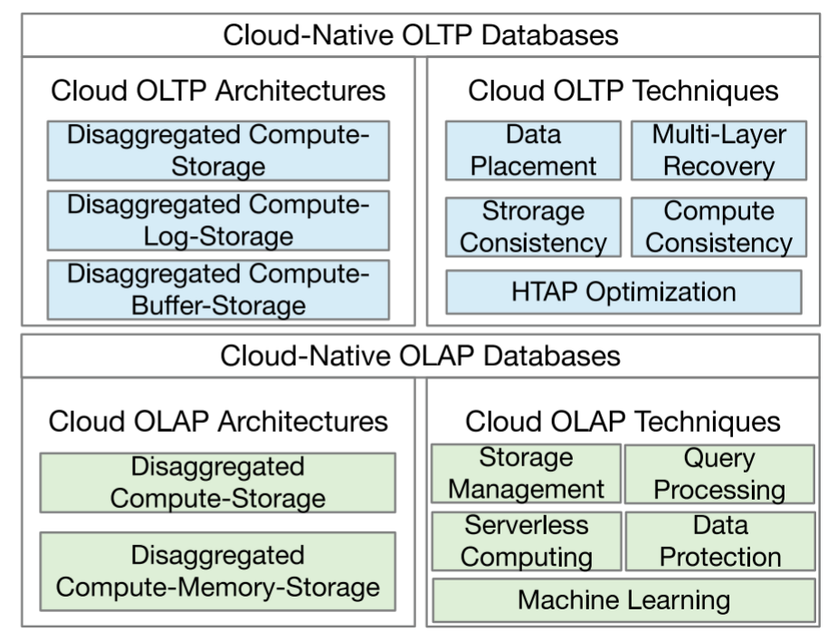
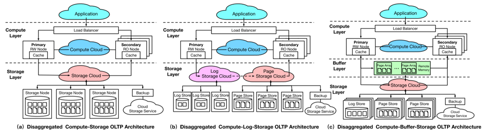
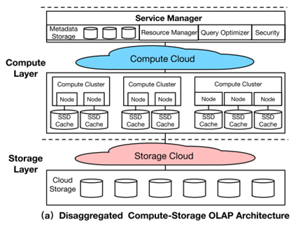
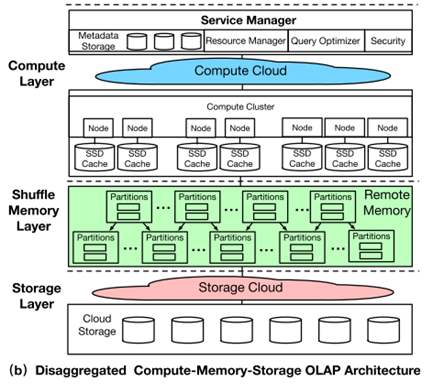

# Awesome-Cloud 周刊（第 1 期）：待定

这里简单记录每周分享的前沿内容，不定期发布。

## 封面图

# 云原生数据库报告

### 云原生数据库总览

先从云托管数据库介绍起，它允许客户选择云供应商提供的数据服务，根据服务水平协议(SLA) 按需支付资源费用。然而它的计算引擎和存储引擎是耦合的，即使用位于相同的物理设备上，因而它的弹性调度能力较弱，并且性能也有一定的限制。

云原生数据库架构弥补了这些缺点，它将计算节点与存储节点解耦，通过高速网络将计算节点连接到共享云存储。因而它使客户能够独立扩展计算和存储资源，从而为客户带来更高的弹性和性能。本文首先将云原生数据库分为两类：云原生在线事务处理数据库和云原生在线分析处理数据库。

云原生在线事务处理（OLTP）数据库强调事务处理中的并发性和低延迟。架构设计考虑：主节点和从节点的一致性；存储层的持久性和可用性；查询处理的效率。

云原生在线分析处理（OLAP）数据库强调分析查询处理的效率和吞吐量。架构设计考虑：计算的弹性，以支持波动的工作负载；本地缓存和共享内存，以实现高效的查询处理。

### 云原生 OLTP 架构

#### 云原生 OLTP 架构总览

计算-存储分析OLTP架构具有具有两层体系结构：计算层处理易失性设备上的事务；存储层维护数据的持久性和可用性。

计算-日志-存储分解OLTP 架构将存储层分离为两组：日志存储保持数据持久性；页面存储提供数据可用性。

计算-缓存-存储分解 OLTP 架构增加了共享缓冲层，辅助上下两层：提高计算节点之间的数据同步效率；降低从存储层读取数据的平均延迟。

#### 计算-存储分解 OLTP 架构

**设计思想：**采用反聚合架构，将云中的计算和存储模块分开。

**设计动机：**

- 弹性：独立调度计算和存储资源，避免云托管数据库中资源耦合造成的资源浪费。
- 效率：消除了脏页刷新，显著降低了写放大。
- 可用性：由于有多个分解的模块，它必须提供多级容错，以减少与实例级恢复相比的平均恢复时间。

**数据访问路径：**

- 写：主节点将重做日志和原数据传输到存储层。存储节点在后台异步重放日志，更新记录。

- 读：重做日志被整理成链表结构，允许存储节点通过直接分析日志链来读取记录。

**优点：**

- 低写延迟：而无需等待记录页的更新。
- 减少写放大：由于数据更新被下推到存储层，避免了脏页传输。
- 提高了弹性：计算和存储由不同的云服务支持。独立的调度过程提高了系统的弹性。

**缺点：**

- 高读延迟：当缓存失败时，计算节点向存储层发送读请求，会遭受额外的日志链分析延迟。

#### 计算-日志-存储分解 OLTP 架构

**设计思想：**在第一类数据库的基础上额外划分了日志和页面的存储服务。日志保证了更新的持久性，而页面提供了高效的查询处理。

**设计动机：**

- 效率：快速的云存储服务可以显著减少写提交延迟；标准的页面云存储服务可以避免高昂的成本。
- 弹性：这两个存储服务单独调度，可以提高系统的弹性。

**数据访问路径：**

- 写：对日志存储进行写入。

- 读：从页面存储进行读取。

- 同步：存储层内部实现日志处理和页面存储。

**优点：**

- 低写延迟：借助快速的日志云存储服务，写提交延迟进一步降低。
- 提高弹性：数据库的弹性随着不同的存储服务的分解而得到改善。页面的标准存储成本相对较低，日志的快速存储提高了事务处理性能。

**缺点：**

- 同步延迟：当数据滞后时，计算节点可能会被阻塞并继续等待存储节点中的同步。

#### 计算-缓存-存储分解 OLTP 架构

**设计思想：**扩展了数据库的共享缓冲区，由远程共享内存服务支持，它提供比持久存储服务低得多的延迟数据访问。

**设计动机：**

- 效率：使用远程内存可以显著降低读延迟。
- 吞吐量：如果所有计算节点共享远程缓冲区，可以减少来自不同计算节点的重复读请求。
- 弹性：由于内存资源分配独立于持久化存储服务，可以进一步提高数据库的弹性。

**数据访问路径：**

- 写：主节点将更新传到缓存层。

- 读：先从缓存层读取，若未命中再从存储层读取。

**优点：**

- 低读时延：当数据缓存在远程缓冲区中时，读延迟显著降低。
- 提高读吞吐量：由于所有节点共享缓冲区，因此减少了来自不同计算节点的重复读取次数。
- 提高弹性：内存解聚可以实现内存资源的弹性调度，因此具有更高的弹性。

**缺点：**

- 高昂的网络成本：要求网络延迟较低、网络带宽较高，需要昂贵的RDMA网络来实现。

#### 云原生 OLTP 架构总结

| OLTP架构           | 写性能 | 读性能 | 可用性 | 弹性 | 成本 |
| ------------------ | ------ | ------ | ------ | ---- | ---- |
| 计算-存储分解      | 中     | 中     | 高     | 高   | 低   |
| 计算-日志-存储分解 | 高     | 中     | 极高   | 极高 | 中   |
| 计算-缓存-存储分解 | 高     | 高     | 极高   | 极高 | 高   |

### 云原生 OLAP 架构

#### 云原生 OLAP 架构总览

计算-存储分解OLAP架构具有两层体系结构：计算层基于本地SSD执行查询；存储层持久化整个数据。

计算-内存-存储分解OLAP架构增加了Shuffle内存层，分解内存池以分布式方式来更有效地处理join操作。

#### 计算-存储分解 OLAP 架构

**动机：**

- 弹性：允许独立扩展计算资源和存储资源。
- 可用性：分解的架构可以分别处理计算和存储节点的故障，可以有更小的停机时间。
- 异构性：可以基于任务的特性（高I/O带宽或计算密集）使用不同的硬件配置来组成计算节点。

**工作流：**

1. 使用元数据存储中的目录统计数据对查询进行解析、重写和优化。
2. 将查询计划编译并发送到计算集群执行，计算节点通过本地缓存（SSD）来执行任务。
3. 如果本地缓存没有命中，数据将通过可选的计算下推从云存储中加载，并执行任务。

**优点：**

- 高可用性：由于跨多个可用区域的数据复制和可扩展的云服务，集群和节点故障可以快速恢复。
- 高成本效益：资源虚拟化以支持多个租户共享；无服务器计算提供了按需付费的查询级粒度模型。
- 弹性：计算和存储资源可以按需单独调度。

**缺点：**

- 缓存依赖：当本地缓存丢失时，网络流量会成为瓶颈。

#### 计算-内存-存储分解 OLAP 架构

**动机：**

- 弹性：内存是一种昂贵的资源，对其进行解聚和独立拓展能获得更高的弹性。
- 资源利用率：集中调度能提高查询处理的资源利用率。
- 通信开销：当涉及到复杂和昂贵的工作负载时，处理大型中间结果将带来高I/O开销。

**工作流：**

1. 工作节点（从本地、内存层、存储层）加载列状数据，在本地应用过滤器，并将数据发送到下一阶段。
2. 内存层执行多个shuffle操作，按键对部分数据进行聚合和排序。

**优点：**

- 高吞吐量：内存层可以通过避免将中间结果写入磁盘来显着减少I/O开销。
- 高资源利用率：计算资源以集中的方式进行虚拟化和调度。
- 弹性：计算、内存和存储资源经过解耦合可以单独调度。

**缺点：**

- 高成本：内存计算具有较高价格。

#### 云原生 OLAP 架构总结

| OLAP架构           | 计算               | 存储               | 吞吐量 | 隔离性 | 成本 |
| ------------------ | ------------------ | ------------------ | ------ | ------ | ---- |
| 计算-存储分解      | 多工作节点的多集群 | 本地SSD缓存+云存储 | 高     | 高     | 中   |
| 计算-内存-存储分解 | 带内存的多工作节点 | 共享内存池+云存储  | 极高   | 极高   | 高   |

### 云原生数据库开放问题和机会

#### 多写入器架构

**现状：**现有的云数据库只支持单个写入器和多个读取器，具有单点性能瓶颈。

**有前途的架构：**1）共享存储架构：支持多个读写节点通过RDMA网络访问相同的存储；2）一致性缓存架构：支持多写入器写入一致性缓存层。

**挑战：**存储层将接受来自多个读写节点的写请求，如何处理倾斜写问题。

#### 细粒度无服务器

**现状：**现有的弹性数据库主要支持使用粗粒度的无服务器为查询提供资源。它们的成本效益不高，并且可能会受到弹性扩展的高延迟的影响。

**有希望的方向：**结合基于FaaS的无服务器化（具有较低启动成本）和数据库（具有更好的性能）的优势。

**挑战：**如何平衡成本和性能之间的取舍。

#### 支持 SLA 的云原生 HTAP（混合事务分析处理）

**现状：**现有的云原生HTAP解决方案只关心如何提高HTAP性能，这可能不具有成本效益。

**挑战：**1） 如何组织数据存储，以在满足SLA的情况下获得最佳性能；2） 如何通过SLA感知优化，明智地为OLTP和OLAP工作负载调度资源。

#### 多云数据服务

**现状：**随着多云变得可用，越来越多的数据密集型应用程序可以从使用多云数据服务中受益。

**挑战：** 1）由于数据存储在云供应商之间，实时数据迁移会在很大程度上影响可用性；2）当数据频繁更新时，很难保持云供应商之间的数据一致性；3）由于不同的云供应商有不同的定价模型，很难有一个具有成本效益的查询处理执行计划。

**有前途的方案：**天空计算，它允许在云间服务之上构建一个抽象。

# Q&A

Q1：OLTP既要读又要写，OLAP只要读，是否后一个是前一个的子集？

A1：不是，OLTP是小规模的读和写，OLAP是大规模的读，前者无法胜任后者大规模的读取任务，但是现在未来两者融合是一个趋势。

Q2：是否是跨地域的，如果跨地域的话，通信会有很多延迟。

A2：没有提到，但是应该是的，比如存储可能有多地备份的要求或考虑。

Q3：是否提到向量数据库，向量数据库和这个有什么区别？

A3：没专门提到，仅稍微提到一些应用使用矢量结构辅助查询。

Q4：这两种分别有什么应用场景？

A4：如Q1，OLTP是小批量的读和写，OLAP是大批量的读。相当于OLTP针对以用户为单位的单次数据操作，OLAP针对整个平台长期数据的查询。

Q5：是否有提到用户选择存储大小？

A5：这个存储层的物理层面对于用户是隔离的，仅有一个整体的抽象的概念，有点像云存储的概念。

Q6：计算的云和存储的云是在同一个数据中心内的吗？

A6：应该是可以跨数据中心的，计算云可以是跨数据中心的，存储云也可以是跨数据中心的。

Q7：存储云的存储位置是由计算云来执行还是由存储云来分析？

A7：没有专门提到，不过存储节点的大体位置应该由计算层计算，可能存储层内部还有小规模的组织结构，那么再有存储层来分析具体的存储位置。

Q8：是否可以把Buffer理解为更好用的存储？

A8：Buffer是共享缓冲层，确实是用于存储，它通过RDMA等硬件结构来给计算层提供更快速高效的访问能力。

Q9：OLAP中的缓冲和OLTP中的缓冲的区别？

A9：由于OLAP需要进行大批量的数据查询操作，它的缓冲层会进行更高效的聚合和排序，相当于进行更多计算。

Q10：OLAP是只读不写的？

A10：是的，OLAP中的数据是预先存进去的，并且已经为大规模查询做了一定的整理工作，后续在线处理的时候只有查询操作。

Q11：OLAP大批量数据的例子？

A11：以电商平台为例子，单个用户添加或删除购物车属于OLTP的处理范畴，而对于整个平台所有用户过去几年的订单数据查询属于OLAP处理的例子。

Q12：OLAP的计算层对比OLTP计算层的改进？

A12：OLAP的计算层有更复杂的结构，如对于每个用户会分配集群来对数据进行查询，即一次查询可能需要很多计算节点来一起进行计算。

Q13：如何保证OLTP中读写的数据一致性？

A13：有基于Quorum协议或基于Paxos协议的两种机制，这是分布式系统的理论，只要是分布式系统都不可避免会遇到这个问题，所以不过多讨论。

Q14：是把数据分开存在不同的节点，还是每个节点都保存一份完整的数据？

A14：一方面节点可能是会崩溃的，所以是需要多节点备份的；另一方面一个节点可能无法存储所有的数据，所有是需要分库分表存的，也就是存在不同的节点上。

