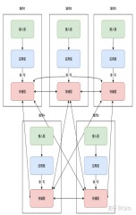

# Awesome-Cloud 周刊（第 10 期）：业界现状-容错方案演进

这里简单记录每周分享的前沿内容，不定期发布。

## 目录  
0. [参考文献声明](#参考文献声明)
1. [背景需求](#背景需求)  
2. [容灾演进路线](#容灾演进路线)  
3. [容灾实践案例](#容灾实践案例)  
4. [单元化方案](#单元化方案)  
5. [未来方向](#未来方向)  

---

# :world_map:0. 参考文献声明   
[[1]《字节跳动容灾实践：同城容灾 + 异地多活是最好的模式吗？》](https://www.infoq.cn/article/r6NV8uZ6M79rAAuVXVrg?utm_source=related_read&utm_medium=article)
[[2]《城市级别系统容灾建设方案演进（同城灾备、同城双活、两地三中心、异地双活、异地多活）》](https://www.cnblogs.com/z-sm/p/18021567)
[[3]《单元化架构在字节跳动的落地实践》](https://www.infoq.cn/article/itqowhjhw23s5yhyyg5v)
[[4]《16.系统高可用说明》](https://blog.csdn.net/Nick_Liux/article/details/129627121)

---

## 1. 背景需求   
- **容灾定义**：  
  - 广义的容灾，可以认为是业务连续性计划当中的灾难恢复的能力，即能够容忍灾难的能力。
  - 如何在灾难发生时，保证生产业务系统的不间断运行，需要我们健全快速容错 / 故障切换能力，即容灾能力，包含了常态化容灾建设以及针对能力进行的周期性演练验收。
- 系统可用性定义及示意图

---

## 2. 容灾演进路线   

### 趋势
- 单机房→多机房
- 单地域→多地域
- 单机→灾备(副本不干活)→多活(副本也干活)
目前，业界内一些领先的大公司已经实现了相当成熟的异地多活部署模式。

### 关键要素
容灾建设需关注 **资源**、**流量**、**数据** 三要素：  
1. 容灾建设强依赖于**资源**评估。
   - 首要任务是评估资源容量是否充足，进一步需要判断是同城资源不足，还是异地资源不足。

2. 基于资源评估，再考虑**流量**。
   - 是否可切换，能切换多少；
   - 如果资源不足，则需要决定哪些业务或服务需要降级。

3. **数据**的恢复也是一个不可忽视的问题。
   - 灾难场景下的逃逸通常会导致一定的数据损失，如何修复数据是必须重点关注的问题。

---

## 3. 容灾实践案例   
### 3.1 传统单机房  

#### a. 单机架构
- **单机**：
  - 缺点：只要出现单点故障（磁盘损坏、OS异常、误删数据等）就很容易导致数据全丢失。

#### b. 机房内主从副本
- **冷备（仅数据）**：定期备份
  - 缺点：恢复时间长、数据完整性低。
    - 恢复需要较多时间造成恢复期间不可用。
    - 备份的数据完整性较低（不是最新的）。

- **机房内主从副本（热备）**：数据库主备
  - 缺点：同机房冗余，无法应对机房级故障。

#### 不足：**字节案例（2018年）**：  
- 业务快速发展导致资源瓶颈，物理机房容量不足。
  - 到了 2018 年，随着商业化加速，业务的快速发展带来了一个重大问题：资源瓶颈。
  - 因为物理机房的容量是有限的，无法满足业务的快速增长。

### 3.2 同城双机房  

#### a. 同城灾备
- **冷备（仅数据）**：定期备份
  - 缺点：同传统单机房。  
    - 恢复需要较多时间造成恢复期间不可用。
    - 备份的数据完整性较低（不是最新的）。

- **热备（全部备份）**：机房镜像
  - 从机房是主机房的镜像，只有在主机房发生故障不可用后才会接管流量对外提供服务。
  - 缺点：资源浪费、故障恢复时间长、灾备机房可靠性低（日常无法校验）。

#### b. 同城双活
- **同城双活（DNS 流量转发）**：  
  - 两机房同时服务。
    - DNS转发流量，业务层各自工作，数据层使用主备模式。
  - 缺点：无法应对城市级灾害（如地震）。  

#### 不足：**字节案例**：  
- 双机房解决资源与单点故障，但无法应对城市级灾害（控制面未独立部署、资源不足）。  
  - 这种模式在一定程度上解决了资源问题和单点故障问题，但无法应对城市级灾害（机房故障or专线故障）：
    - 一方面是控制面没有独立部署，导致在单个机房出现问题或专线中断时，容灾指令无法正常下发；
    - 另一方面双机房最初只为解决业务发展需求，并没有进行相应的容灾冗余部署，需要做机房切流时没有足够的资源支撑。

- 启发：业界实际场景需预留资源，所设计算法需兼顾日常性能和突发情况性能。

### 3.3 同城多机房  
- **优化方案**：业务分散部署，IDC 全互联降低专线中断影响。控制面与数据面分离，支持指令正常下发。
  - 资源/业务：增加机房数量，将不同业务的Master分散部署。
  - 网络：采用了 IDC 全互联的方式，大大降低单专线中断情况下对业务的影响。
  - 管理：控制面和数据面分离，即使IDC出现问题，指令仍然可以正常下发。

能够很好应对两个主要的容灾场景：专线中断和 AZ 不可用。
- **分层降级策略**：优先降低离线业务，再按预设优先级降低在线业务，会考虑到组件、集群、业务功能等复杂维度。

### 3.4 异地多活  
#### **两地三中心（异地灾备）**： 
  - 同城双活 + 异城一灾备。通常应用在银行、金融、政企项目中。 
  - 缺点：灾备机房利用率低、启用时间长。
    - 与同城灾备类似，灾备机房利用率低、启用灾备机房需要时间、启用后不确定是否能按预期工作。

#### **异地双活**  
  - 两机房同时服务，机房内应用只访问本机房数据库。
  - 缺点：双主架构需互相实时同步，实施复杂。
  - 解决：业界主要使用 **【单元化】** ，不同机房几乎完全独立，彼此少耦合，只有存储层依赖同步组件互相进行数据同步。

#### **异地多活**  
  - 多机房同时服务。异地双活基础上部署多个机房。可任意扩展新机房，只需在最上层定义清楚请求的分片规则。
  - 缺点：实施复杂、维护成本大。
  - 优点：机房独立，存储层通过同步组件实现数据同步。  

#### 不足：**字节案例**
- 华东-华北 RTT >30ms，对强一致性/低延迟业务不可用，但部分业务可适配。  
  - 在字节跳动的异地建设模式中，经过测算发现，华东到华北之间的网络往返时间（RTT）大于 30 毫秒。
  - 对于那些对数据强一致性要求高或请求响应时间要求高的业务来说不可接受。
  - 但也存在部分特殊业务能够使用特殊方式发挥异地多活优势。

- 启发：异构业务混合部署，根据不同特点充分利用资源。

---

## 4. 单元化方案   
### 4.1 背景需求  
分布式部署业务后，必须关注数据同步问题，因此需要单元化！

#### **推力**
资源限制、合规要求、容灾需求。  
- 由于部分原因**不得不**分布式部署业务：
  - **资源限制**：单机房受物理资源上限限制，同城多机房受地区的能评和供电等限制，无法做到机房的无限扩展，随着业务规模的扩大，长期一定会面临多地数据中心的布局；
  - **合规要求**：全球化产品通常会面临不同地区的合规要求（例如欧盟的 GDPR），会有当地用户数据只能存储在当地的要求，业务天然需要考虑围绕不同的合规区域构建单元；
  - **容灾考虑**：核心业务有城市级异地容灾需求，通过单元化方式可以构建异地单元，每个单元都有常态真实流量，流量可以灵活地在单元间进行调度。

#### **拉力**
用户体验提升（就近调度）、成本优化、风险隔离。
- 由于部分收益**主动**分布式部署业务：
  - **业务体验提升**：通过结合就近调度，能够将用户流量调度到最近的单元，从而降低请求耗时，提升用户体验；
  - **成本优化**：相比于异地冷备，两地三中心等传统容灾架构，分布式业务各个单元都能直接承载流量，减少资源冗余；
  - **隔离控制**：在最小的单元范围内去做各种技术演进，能够有效控制风险半径。

### 4.2 方法  
- **核心理念**：按维度划分业务单元，单元内自包含。  
  - 将业务按照某种维度划分成一个个单元，理想情况下每个单元内部都是完成所有业务操作的自包含集合，能独立处理业务流程。
- **数据同步**：各单元存储部分数据，整体组合为完整数据集。  
  - 各个单元均有其中一部分数据，所有单元的数据组合起来是完整的数据（各企业实际落地过程中会结合实际业务和基建情况做一些折中）。
- **流量管理**：按分区（如用户 ID）Sharding 到对应单元。  
  - 流量按照某种分区维度（例如流量所属用户）Sharding 到不同的单元，调度上按照流量携带的分区信息进行调度，保证同一时刻该分区的数据写入都在同一个单元。

### 4.3 挑战  
- **流量路由**：需解决请求链路环节的单元识别与纠偏。  
  - 如何将流量调度到正确的单元问题。需要考虑在请求链路哪个环节（客户端、流量入口、内网 RPC、存储层等）、根据请求什么信息（用户 ID、地理位置等）进行用户归属单元的识别，以及如何进行走错单元流量的纠偏。
- **数据正确性**：同步延迟导致的问题（如用户跨单元操作后的数据不一致）。  
  - 业务上需要感知同步延迟带来的正确性问题。
    - 例如归属单元1的用户A评论了归属单元2的用户B的抖音短视频，系统在单元1给B发了一个通知。
    - 但B查看评论的流量被按B的单元归属调度到了单元2，由于数据同步延迟问题，B打开抖音后看不到评论。
- 启发：调度部署相关研究中较少看到对具有“单元化”特点应用的管理，可以进一步探讨。

---

## 5. 未来方向   
- 多Region成本优化：异构业务混合部署，优化资源利用。  
  - 全局视角：字节跳动从原本的单 Region 内同城容灾架构演进到多 Region 异地单元化架构周期比较短（截至2024-11-12，一年半左右），基础设施对多 Region 视角的支持还比较不足，对业务的整体研发和业务管理成本偏高，需要将多 Region 的研发和业务管理成本打平到单 Region。
  - 从计算资源成本视角：在原来三机房同城容灾模式下，每个机房需要预留 50% 的 Buffer 用于机房故障容灾，演进到异地单元化架构后，基于两个容灾单元间的六个机房，部分业务机房故障可以将流量分摊到其他五个机房，此时各机房仅需 20% 的 Buffer。
  - 从存储资源成本视角：在同城容灾+异地多活容灾模式下，各单元都支持同城容灾，部分业务可以直接进行数据的单元化拆分，单元内各自只有一部分数据（加起来是全量数据），理想情况下存储成本减少一半。
- 数据多活管理优化：单元化应用的调度与管理研究。  
  - 字节跳动目前的存储对 AP 场景更友好（侧重抖音这种社交类场景，系统优先保证高可用性和容错性，对一致性要求可以适当降低），主要围绕单 Region 构建。
  - 在多单元场景下对于电商、支付类（对数据一致要求非常高）的业务支持较弱。异地单元化架构下，多单元数据多活强依赖于数据同步能力，导致业务上的限制偏大（例如写只能统一在一个单元），公司对于跨 Region 强一致数据库具有很高的需求。

---

## 问答环节记录

1. 单元化备份和传统异地多活方案备份有什么区别？
   - 不需要全量备份
2. 可用性是怎么获得的？
   - 业界主要根据事后推断
3. 可用性是否误差很大，比如受到人为因素影响。
   - 确实，目前的主要问题是可用性体现的是统计性的情况，但对于具体细粒度时间段的分析，借鉴意义不大（类似于可以估算均值，但方差仍然很大）。
4. 同机房和异机房的冷备和热备是不同的？
   - 本质上是一样的，只是机器位置从同机房变成了多机房。
   - 但由于同机房内带宽时延约束都很小，因此同机房热备也可以发展成类似多活的模式。
5. 业界主要用的是哪一种？
   - 业界内一些领先的大公司已经实现了相当成熟的异地多活部署模式。
6. AZ 和 Region 的区别是什么？
   - AZ小于Region。一个Region内存在多个AZ。
     - Region类似省份级。
     - AZ类似数据中心级。
