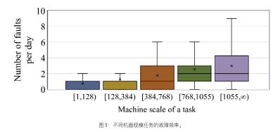
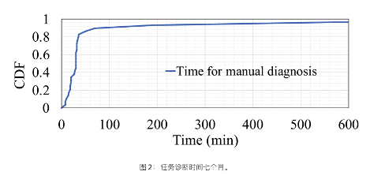
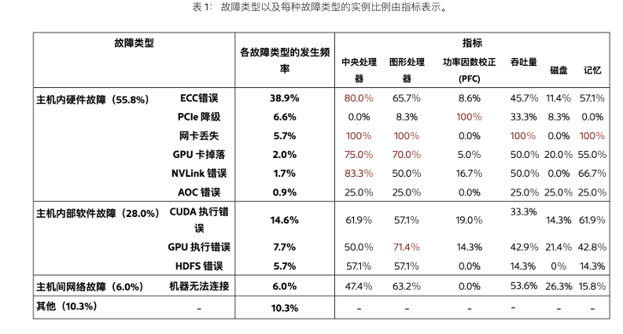
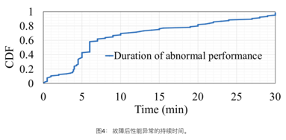
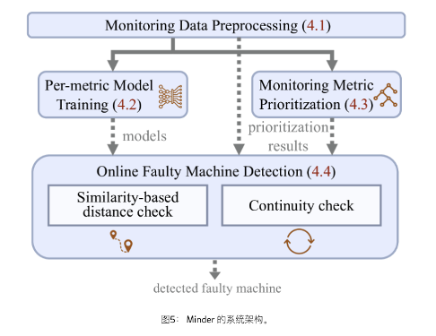
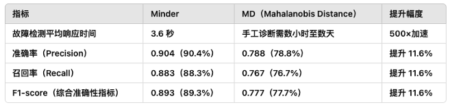
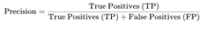
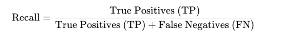
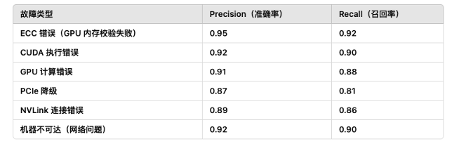
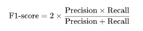

# Awesome-Cloud 周刊（第 11 期）：前沿论文-计算-大模型容错方案Minder论文分享

这里简单记录每周分享的前沿内容，不定期发布。

## 目录  
0. [背景](#背景)  
2. [挑战&解决方案](#挑战&解决方案)  
3. [Minder框架](#Minder框架)  
4. [效果](#效果)  
5. [未来研究](#未来研究)

---

## 背景

* 论文名: Minder: Faulty Machine Detection for Large-scale Distributed Model Training
* 会议名： NSDI'25
* 论文链接: <https://www.usenix.org/conference/nsdi25/presentation/deng>

**大规模语言模型（LLMs）** 训练中，**分布式训练** 已成为主流。

而集群规模越大，故障率往往也越频繁。

以下是一个不同机器规模任务的故障频率：

**故障会产生多方的影响**

* **单个故障可能会导致大规模任务停止。**&#x20;

* **故障诊断耗时长，增加人力和资源成本。**

> 在 128 台机器的任务中，客户在 40 分钟内的经济损失可能超过 1700 美元。

而目前的**人工诊断方式落后：**

* **任务停止，收到警告后才去检查**

* **需要网络、存储、硬件多个团队一起检查**

* **日志内容难以解读，容易遗漏**

* **检查时间长，下图是任务诊断耗费的时间**

系统的目标是：

* **快速检查故障**

* **消除人工干预**

**PCIe 降级案例的手动诊断流程和故障传播为例**进行介绍。

其**排查过程**如下：

* 检测总共耗时 40 分钟，涉及多个团队。 负责的工程师仔细检查了与模型相关的信息、并行性设置、依赖项、环境和框架（例如Megatron-LM ) 参数。&#x20;

* 网络团队仔细检查了主机内吞吐量、远程直接内存访问 (RDMA) 流量、数据包丢失/随机性、拥塞指标、驱动程序和路由。&#x20;

* 存储和硬件团队检查了 HDFS\&SSD 使用情况、GPU\&CPU 使用情况、NIC 健康状况和机器调度。

**最终发现原因为：**

* 故障传播从 PCIe 降级开始，到 PFC 浪涌。故障机器的 NIC 缓冲区在 PCIe 降级后被填满。随之而来的瓶颈主机间通信导致 PFC Tx 数据包浪涌。拥塞还增加了显式拥塞通知 (ECN) 接收量和拥塞通知数据包 (CNP) 发送量。

* 结果，所有机器的 NIC 吞吐量从 6.5Gbps 下降到 4.9Gbps。计算数据减少导致 GPU 张量核心使用率下降。因此，训练效率下降了。

下图是采集的各类故障出现的频率和概率等信息：

## **挑战&解决方案**

### **挑战 1：机器可能以多种方式发生故障**

**问题：**

* 分布式训练涉及大量硬件组件（如 CPU、GPU、PCIe、NVLink、RDMA NIC、内存、磁盘等），**任何组件都可能发生故障**。

* 软件层面也可能出现 CUDA 执行错误、NCCL 通信失败等问题。

* 故障可能是**单机内部**（如 GPU 过热）或**多机通信**（如网络丢包、NIC 失效）。

* 由于故障类型众多，无法仅凭少数固定规则检测所有可能的故障。

**解决方案：**

**引入“机器相似性”检测**（Machine-level Similarity）：

* 在分布式训练中，由于 **数据并行（DP）**、**张量并行（TP）**、**流水线并行（PP）** 机制，各机器在计算、存储和通信上应具有相似的监控数据模式。

* Minder 通过计算各机器的监控数据相似度，发现偏离群体行为的异常机器，而无需预先了解具体的故障类型。

* 例如，PCIe 降级会导致网络带宽显著下降，影响 GPU 通信，Minder 可通过异常的 PFC（Priority-based Flow Control）包速率识别该故障。

### 挑战2：**监控指标的“正常范围”因任务而异**

**问题：**

* 训练任务的**机器规模、模型参数、数据集大小、训练框架**不同，导致各任务的监控指标有不同的正常范围。

* 例如：

  * 70°C 的 GPU 温度可能是正常的（如果 GPU 频率为 1800MHz），但在低频率任务（1350MHz）下可能表示异常。

  * GPU 利用率的波动在 Transformer 训练中很常见，但在某些稳定任务中可能表示故障。

* 传统的**监督学习异常检测**方法需要预先定义“正常”范围，而 Minder 无法直接应用这些方法。下图是故障后异常持续的时间。

**解决方案：**

**基于无监督学习的“连续性检测”**（Machine-level Continuity）：

* **核心思想**：真正的故障通常会持续一段时间（如 5-10 分钟），而短期波动（如 GPU 突发计算）往往是正常的。

* Minder 在多个时间窗口内检查异常是否持续：

  * 如果某台机器的监控指标在短时间内突然变化但随后恢复，则可能是正常波动。

  * 但如果异常持续超过 4 分钟（基于生产环境数据统计），则极有可能是故障。

* 例如，在 PCIe 降级故障中，受影响机器的 PFC Tx Packet Rate 会长时间异常升高，而非短暂抖动。

### 挑战3：**故障类型和监控指标之间的映射关系并非一对一**

**问题：**

* **单个监控指标无法检测所有故障**：

  * ECC 错误可能表现为 CPU 负载下降，但 GPU 负载可能仍然正常。

  * PCIe 降级可能导致 PFC 指标异常，但不会影响 GPU 计算利用率。

* **单一故障可能影响多个指标**：

  * 例如，CUDA 执行错误可能会导致 **CPU、GPU 和 PFC**指标同时异常，而非仅影响 GPU。

* **传统的端到端预测模型会被这些复杂关系干扰，导致检测失效**。

**解决方案：**

**独立训练各个监控指标的 LSTM-VAE 降噪模型**（Per-metric Learning-Based Denoising Models）：

* Minder 采用 **LSTM 变分自编码器（LSTM-VAE）**&#x5BF9;每个监控指标单独训练降噪模型：

  * 例如，**CPU 利用率、GPU 计算负载、PFC 流量** 分别训练不同模型，而不是合并到一个统一的模型中。

  * 这样可以避免不同指标之间的干扰，提高检测准确率。

* **模型训练方式**：

  * 以正常训练状态的数据为训练集，让 LSTM-VAE 学习正常模式。

  * 在故障发生时，LSTM-VAE 无法正确重构异常数据，输出与正常模式偏离，从而识别故障。

* 例如：

  * **ECC 错误** 可通过 GPU 负载检测到。

  * **PCIe 降级** 可通过 PFC 速率检测到。

  * **机器不可达** 可通过网络吞吐量异常检测到。

### 挑战4：**监控数据存在噪声**

**问题：**

* 由于传感器误差、采样抖动、网络中断、时间戳不同步等原因，监控数据可能包含短时异常（噪声）。例如：

  * **短时 CPU 负载下降** 可能是任务本身的调度导致，而不是故障。

  * **GPU 温度波动** 可能是由于风扇速度调整，而不是散热问题。

* 传统的**简单统计方法（如均值、标准差检测）**&#x5BB9;易被噪声误导，导致误报或漏报。

**解决方案：**

**LSTM-VAE 降噪 + 监控指标优先级排序（Metric Prioritization）**：

* **LSTM-VAE 降噪**：

  * LSTM 结构适用于时间序列数据，可学习数据的长期趋势和短期波动。

  * Minder 通过 LSTM-VAE 过滤掉短期噪声，只保留长期的异常信号。

* **优先使用最敏感的监控指标**：

  * 使用 Z-score 计算每个监控指标的异常检测能力，建立决策树排序：

    * **CPU、GPU、NVLink、PFC**是最敏感的指标，优先用于检测。

    * **低敏感度指标**（如磁盘 I/O）被放在次要检测层级，以降低噪声影响。

* 例如：

  * **如果 PCIe 发生故障，PFC 速率是最直接的异常指标，Minder 会优先使用 PFC 进行检测，而不是等待 GPU 利用率下降。**

## Minder框架

Minder 主要由 **四个核心模块** 组成：

1.**数据预处理（Monitoring Data Preprocessing）**

2.**单指标模型训练（Per-metric Model Training）**

3.**监控指标优先级排序（Monitoring Metric Prioritization）**

4.**在线故障检测（Online Faulty Machine Detection）**

### **1. 数据预处理（Monitoring Data Preprocessing）**

**目的：**

* 处理原始监控数据，确保数据格式一致，便于后续检测。

**主要步骤：**

* **时间对齐（Time Alignment）：**

  * 由于不同机器的数据采样时间可能不一致，Minder 需要对齐时间戳，确保所有机器的数据可以进行直接比较。

  * 对于缺失数据点，Minder 采用最近邻填充（padding with nearest values）。

* **归一化（Normalization）：**

  * 由于不同监控指标的数值范围不同（如 GPU 利用率是 0-100%，而 PFC 速率可能是数百万 pps），Minder 采用 **Min-Max 归一化** 将所有数据映射到 \[0,1] 范围。

* **时间窗口划分（Time Windowing）：**

  * 以 **8 秒（w=8）**&#x4E3A;一个时间窗口，确保 Minder 仅在稳定的时间范围内进行检测，避免瞬时抖动影响结果。

### **2. 单指标模型训练（Per-metric Model Training）**

**目的：**

* 训练 **LSTM-VAE 降噪模型**，用于去除监控数据中的噪声，使 Minder 只关注真正的异常。

**核心方法：**

* **LSTM-VAE 结构（Long Short-Term Memory Variational Autoencoder）**

  * **编码器（Encoder）**：提取时间序列数据的特征，映射到隐变量空间（latent space）。

  * **解码器（Decoder）**：从隐变量中重构数据，恢复原始序列。

  * **异常检测原理**：如果解码后的数据与原始数据差异较大（重构误差大），则表明该时间序列中存在异常。

**训练方式：**

* **数据集：** 采用过去 **3 个月** 的正常运行数据作为训练集，确保模型学习到正常行为模式。

* **超参数：**

  * **隐藏层大小（hidden\_size）= 4**

  * **潜变量维度（latent\_size）= 8**

  * **LSTM 层数（lstm\_layer）= 1**

**模型特点：**

* 每个监控指标都有一个独立的 LSTM-VAE 模型，避免不同指标之间的干扰。

* LSTM 结构能够捕获长期时间依赖关系，提高异常检测的稳定性。

### **3. 监控指标优先级排序（Monitoring Metric Prioritization）**

**目的：**

* 由于系统可用的监控指标数量较多，Minder 需要优先使用最敏感的指标进行检测，以加快故障检测速度。

**实现方法：**

1. **计算 Z-score（异常分数）**

2. **使用决策树进行排序**

   1. 训练一个**决策树（Decision Tree）**，使用 **Z-score 最大值** 作为特征，使用手工标注的故障情况作为标签。

   2. 决策树会自动学习哪些监控指标最能区分正常机器和故障机器。

   3. 例如，**PFC、CPU、GPU 计算负载、NVLink 带宽** 被判定为最敏感的指标，应优先用于检测。

3. **生成优先级列表**

   * Minder 依据决策树结果，确定检测时应**优先使用哪些指标**：

   1. **PFC Tx Packet Rate**

   2. **CPU Usage**

   3. **GPU Duty Cycle**

   4. **NVLink Bandwidth**

   5. **其他低优先级指标**

### **4. 在线故障检测（Online Faulty Machine Detection）**

**目的：**

* 在实际运行中，快速检测出发生故障的机器。

**检测流程：**

1. **选择优先级最高的监控指标**

   1. Minder 按照 **决策树生成的优先级** 依次检查各监控指标。

   2. 例如，PFC Tx Packet Rate 是最敏感指标，则优先使用它进行故障检测。

2. **数据降噪**

   1. 使用 **LSTM-VAE 模型** 处理原始监控数据，去除噪声，提取关键异常特征。

3. **机器相似性检测（Similarity-based Distance Check）**

   1. 计算**所有机器之间的欧几里得距离**，找出最偏离群体的机器。

4. **连续性检测（Continuity Check）**

   1. Minder 在多个时间窗口（默认 4 分钟）内持续跟踪同一台机器：

      1. 如果异常仅出现一次，则可能是噪声，忽略。

      2. 如果同一机器的异常持续 4 分钟以上，则触发故障警报。

5. **触发告警**

   1. Minder 识别故障机器后，自动向 **Kubernetes 发送故障节点驱逐请求**，将其替换为新节点。

## 效果

Minder 在生产环境中运行超过 **一年**，对大规模分布式训练任务进行**自动化故障检测**，并取得了显著成效。

* **True Positives (TP)**：正确检测出的故障主机。

* **False Positives (FP)**：被误判为故障的正常主机（误报）。

* **True Positives (TP)**：正确检测出的故障主机。

* **False Negatives (FN)**：实际故障但未被检测出的主机。

## 未来研究

### 1. **提高多机故障检测能力**

**当前问题：**

* 目前 Minder 主要关注 **单台机器故障**，但 **多机故障（如交换机故障、批量 GPU 失效）** 仍然难以准确检测。

* 由于**3D 并行训练（数据并行 + 张量并行 + 流水线并行）**&#x5BFC;致故障传播速度快，Minder 可能难以区分是单机故障还是系统级别的故障。

### 2.&#x20;**&#x20;细化根因分析（Root Cause Analysis）**

**当前问题：**

* Minder 目前只能检测出 **哪台机器故障**，但无法直接提供**故障的具体原因**（如 ECC 错误、PCIe 降级、NVLink失败等）。

* 需要依赖**工程师进一步分析日志**，确定具体的故障类型和解决方案。

**未来改进方向：**

* **自动关联日志和监控数据**：

  * 结合 **GPU/CPU/NVLink 日志**，自动关联 Minder 识别的异常模式，提供更精确的**根因诊断**。

* **基于 Explainable AI（XAI）的方法**：

  * 使用 **可解释的机器学习算法**，输出导致故障的关键指标，提高诊断的可读性。

### 3.&#x20;**&#x20;监控数据的时间粒度优化**

**当前问题：**

* 目前 Minder 主要基于**秒级别（second-level）监控数据**，但某些故障（如网络抖动、GPU 计算瓶颈）可能发生在更短时间内，导致 Minder 可能检测不到这些短时异常。

* **并行训练的交互时间通常在毫秒级（ms-level）**，秒级监控可能无法捕捉任务间的精细交互模式。

**未来改进方向：**

* **引入毫秒级（ms-level）监控数据**：

  * 在 GPU 计算、RDMA 通信等关键指标上，提高监控数据的采样频率，提升故障检测的时效性。

* **动态调整采样率**：

  * 当检测到**异常趋势**时，自动提高采样率，从 **秒级（1s）升级到毫秒级（100ms 或更短）**，减少计算开销的同时提高检测精度。

### **4. 结合更多监控指标（如 in-band tracing）**

**当前问题：**

* 目前 Minder 主要依赖**外部监控数据（out-of-band metrics）**，例如 GPU 利用率、CPU 负载、PFC 流量等。

* 但许多关键性能指标（如**GPU 内部计算状态、CUDA 事件、训练框架的时间戳信息**）并未被充分利用。

**未来改进方向：**

* **结合 in-band tracing（带内监控）**：

  * 整合 **Torch Profiler**、**Megatron-LM 定时器**、**CUDA 事件计时器**，分析训练任务的内部执行情况。

  * 例如：通过 CUDA 事件追踪，确定是否是 **张量计算延迟** 导致任务超时。

* **扩展更多低层硬件计数器（Performance Counters）**：

  * 目前 Minder 依赖 GPU 监控数据（如 NVLink、PCIe 带宽），但未来可以整合 **更多 CPU/GPU 硬件计数器**。
