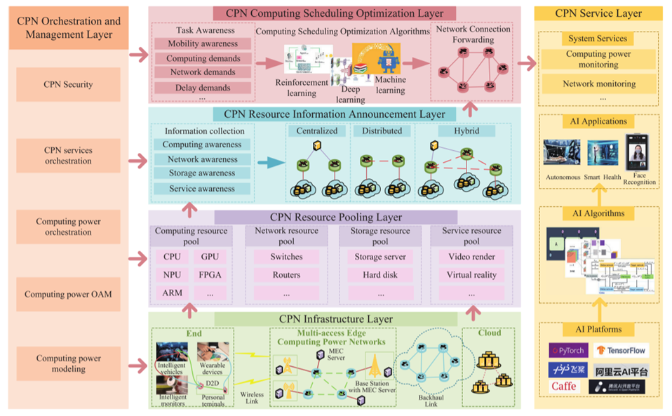
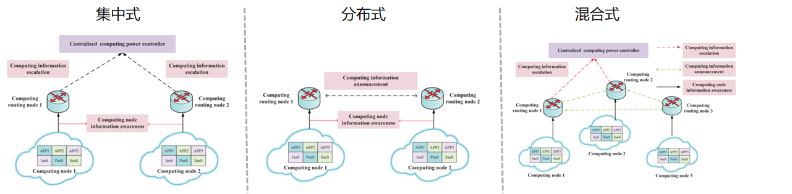
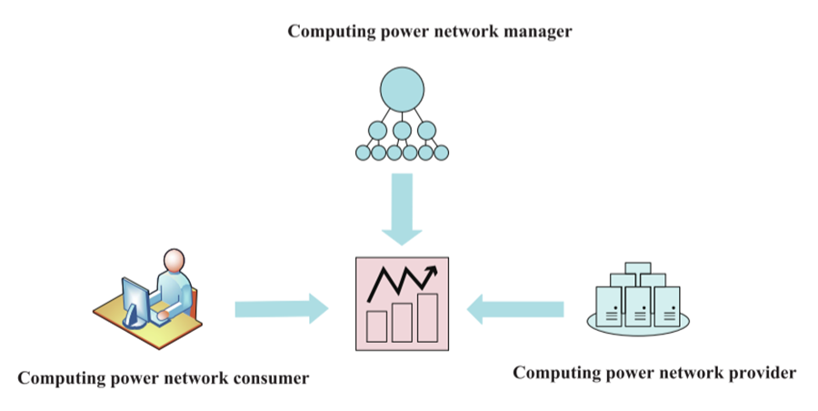
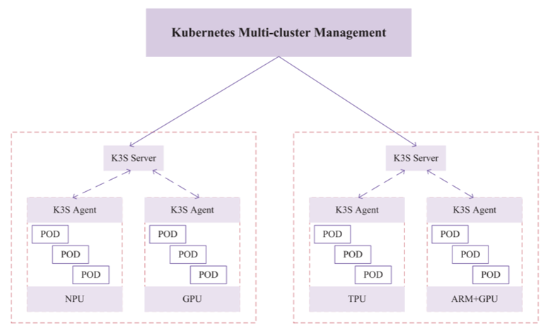
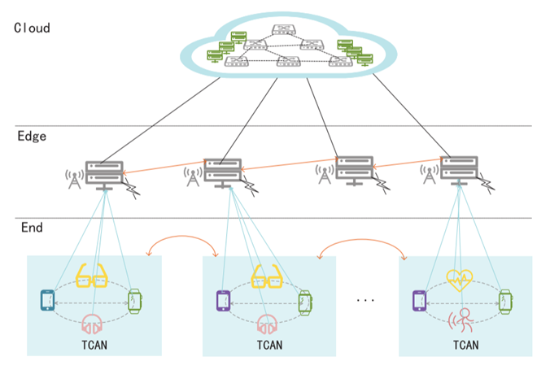
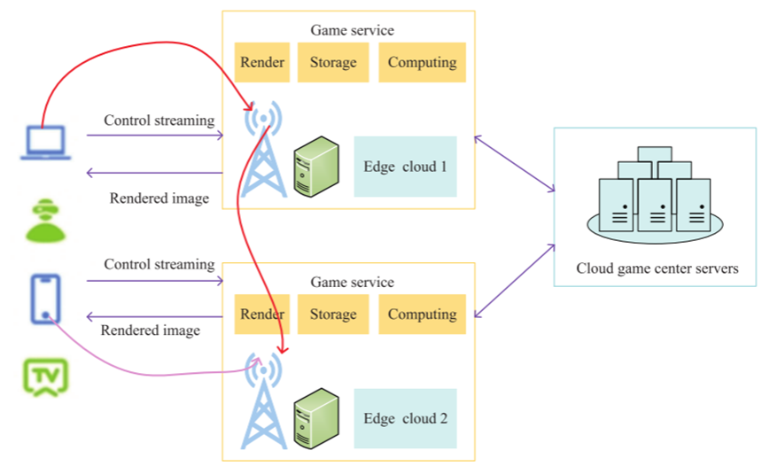
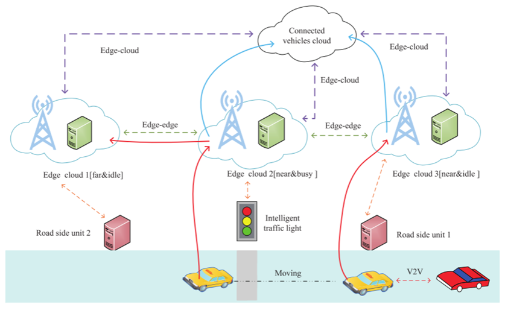
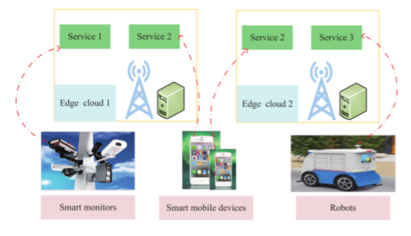

# Awesome-Cloud 周刊（第 13 期）：前沿论文-算力网络综述

**Computing Power Network: A Survey**

北邮团队 2024 年 发表于 China Communications（JCR分区Q2，中科院分区Q4）

## 简述

算力网络结合了云计算和边缘计算的优势，他们之间的对比如下所示。

| **范式**        | **云计算**           | **边缘计算**             | **算力网络**                       |
| --------------- | -------------------- | ------------------------ | ---------------------------------- |
| **提出时间/年** | 2006                 | 2014                     | 2019                               |
| **核心思想**    | 提供云中心的计算服务 | 将计算资源汇聚到网络边缘 | 通过网络连接和协调的分布式计算资源 |
| **节点间合作**  | 无                   | 无                       | 有                                 |
| **延迟**        | 高                   | 低                       | 极低                               |
| **计算能力**    | 高                   | 有限                     | 高                                 |
| **感知能力**    | 无                   | 有限                     | 高                                 |
| **关键技术**    | 虚拟化               | 计算卸载                 | 算力路由                           |
| **应用场景**    | 阿里云，Azure        | 物联网                   | 车联网                             |
| **缺点**        | 网络瓶颈             | 算力孤岛效应             | 庞大的网络设备升级成本             |

算力网络的功能架构如下图所示，分为六个层：

- 基础设施层：管理所有的基础设施，包括云、边、端的所有的节点。
- 资源池层：将下层的基础设施中的各种属性进行抽象管理，分为计算资源、网络资源、存储资源和服务资源。
- 资源信息通告层：用户在各个节点中传输的信息集合，而各个节点的信息传播的架构可以分为集中式、分布式和混合式。
- 调度优化层：将各种类型的任务调度到各个节点进行处理。
- 编排管理层：对上面四层进行编排和管理。
- 服务层：与调度优化层联合对外提供服务。

## 算力建模

算力测量目标可分为如下3类：

| **算力类型** | **逻辑算力**                         | **并行算力**                                         | **神经网络算力**                           |
| ------------ | ------------------------------------ | ---------------------------------------------------- | ------------------------------------------ |
| **典型芯片** | CPU                                  | GPU                                                  | NPU,TPU                                    |
| **衡量单元** | TOPS                                 | FLOPS                                                | FLOPS                                      |
| **特性**     | 逻辑控制                             | 统一数据类型的大数据并行处理                         | 处理AI任务                                 |
| **应用场景** | 武装、信息化等需要复杂逻辑控制的场景 | 密码破解、图像处理等相互独立、需要大量计算能力的场景 | AI语音识别、AI人脸识别等需要深度学习的场景 |

算力的分级可以分为以下四级：

- 第一级：超级计算能力的应用，如视频渲染，需要超过1 PFLOPS的算力。例如，在ImageNet数据集上训练VGG16，需要19个PFLOPS。
- 第二级：大计算能力的应用，如DNN训练，需要10TFLOPS~1 PFLOPS的算力。例如，识别具有16个通道和300个图像并发的人脸图像，需要大约64 TFLOPS。
- 第三级：中等计算能力的应用，比如人工智能，需要500 GFLOPS~10 TFLOPS的算力。例如，识别单通道和并发300张图像的人脸图像，需要大约4个TFLOPS。
- 最低级：所有计算能力的应用程序，如语音识别，需求低于500 GFLOPS级别。例如，对语音识别的DeepSpeech2算法，需要2个GFLOPS。

## 信息感知和公告

#### 感知

**感知用户任务需求信息**

- **基本任务特性**：包含计算数据的大小、计算数据的类型、任务的最大容忍延迟和任务流粘性要求。
- **计算性能目标**：主要包括计算能力要求和计算任务类型。
- **存储性能目标**：主要包括存储容量要求、存储能力要求和存储质量要求。
- **算法性能目标**：主要包括任务的算法功能要求、算法的时间复杂度和算法的空间复杂度。
- **网络性能目标**：主要包括对网络传输延迟、边缘网络门的网络接口带宽、网络分组延迟变化(PDV)、数据传输安全性和误码率的任务要求。

**感知计算节点信息**

- **计算资源信息**：包括计算能力类型、整体计算能力和剩余计算资源。
- **存储资源信息**：主要包括存储容量、剩余存储资源、存储能力和存储质量。

**感知网络链路信息**

包括动态网络连接状况(即是否存在网络连接)、数据传输速率、时延抖动、丢包率、可用频谱、5G基站的整体发射功率等。

#### 公告

集中式、分布式和混合式的架构如下所示：

| **栏目**              | **集中式** | **分布式** | **混合式**   |
| --------------------- | ---------- | ---------- | ------------ |
| **技术**              | NFVO       | IGP&BGP    | NFVO+IGP&BGP |
| **收集速度**          | 低         | 高         | 中           |
| **资源视图**          | 全局       | 部分       | 全局         |
| **应用程序-资源映射** | 准确       | 受限       | 折中         |
| **部署成本**          | 低         | 高         | 中           |

其中NFVO：由网络功能虚拟化编排器；IGP：内部网关协议；BGP：和边界网关协议。

## 算力网络平台

#### 算力网络事务平台

分为三种角色：

- **算力网络消费者**：请求算力资源和网络资源。他们要求各种计算服务，如云游戏、增强现实、人脸识别等，具有不同的性能目标，如延迟、安全、准确性等。而且，部分算力网络消费者是移动用户，特别是车辆网。
- **算力网络提供商**：可以提供计算能力资源，如小规模边缘计算节点、大规模云计算节点甚至超级计算中心等。提供商可以是电信运营商、云服务提供商、边缘云企业，甚至是计算能力有限的单个设备。
- **算力网络管理者**：需要在**算力网络消费者**和**算力网络提供者**之间签订计算服务合同，同时，提供算力的计费： **算力网络消费者**按算力资源的占用统计来支付账单；**算力网络提供者**按算力资源的供给量获取收入。

#### 算力网络资源编排平台

**动机：**可以根据网络资源采集负载与资源之间的依赖关系，实现灵活的业务调度和业务自动部署，在保证网络高性能、资源高利用率的同时，简化资源管理流程。

**基本特征：**

- 通用的分布式计算框架，
- 适应不断变化的网络环境，
- 支持计算和资源的联合优化，
- 安全性、可用性和故障恢复能力。

**实现：**由于上述特点与容器集群的优势非常相似。因此，构建基于容器集群管控应用的算力网络资源调度平台是未来的发展趋势，而Kubernetes (K8S)是容器管控的事实上的标准。

## 应用和用例

#### 终端算力网络（TCAN）

**介绍：**TCAN将在CPN中加入更多终端，充分利用分布式多级终端计算能力资源，构建高效的端端计算能力共享架构和新的网络范式。

**技术：**TCAN将致力于实现端端计算能力感知、虚拟资源协同、多粒度计算能力调度、协同调度等安全、隐私和可信的算力交易，从而显著提升终端端新算力的利用能力。

**局限：**由于终端设备的电池容量有限，且终端设备分布更为广泛，需要考虑的因素更多。

与CPN的区别：

- 首先，终端设备会随时进入或离开网络，因为它们属于任何一个而不是固定的企业。
- 其次，设备间通常采用短距离无线通信，这种方式通常不兼容。
- 最后，终端设备是移动的，这将导致计算能力调度的不可靠性。

#### 云游戏

智能手机、个人电脑和笔记本电脑不足以处大型游戏，云游戏以简单的形式在云中远程呈现交互式游戏应用程序，并通过互联网将场景作为视频序列流传回给玩家。在考虑各个服务提供链阶段之间的相互依赖关系以确保用户满意度的同时，有必要以低延迟和最佳画质传输云游戏数据流。

云游戏的游戏过程中，用户的控制流发送给最近的边缘服务器，进行渲染、存储和计算，然后将渲染的图像返回给用户。当最近的边缘服务器繁忙时传输给临近的边缘服务器进行处理，来保证低延迟的要求。

#### 车联网

由于计算能力网络可以提供足够的计算能力和低延迟，因此可以实现辅助驾驶和车内娱乐应用。此外，由于计算力网络可以分析来自智能车辆和无处不在的路边传感器的实时数据，交通状况也可以得到有序控制。

与边缘计算相比，车辆还可以将其计算任务卸载给附近具有更短延迟的CPN的其他车辆，而不仅仅是边缘云。更重要的是，边缘云将相互交互感知到的车辆和环境信息，与CPN进行全局分析。因此，与边缘计算相比，CPN不仅可以为网联车辆提供更强大的计算资源，还可以提供更集成的决策。

#### AI模型训练

近年来，人脸识别、人工智能辅助医疗诊断等需要巨大计算能力的AI应用不断涌现。然而，AI模型训练需要巨大的计算能力。智能终端设备或单边缘计算节点的计算能力通常是有限的。因此，无处不在的计算节点需要协同训练AI模型。

在算力网络中，大规模的VGGNet可以被划分为几个小模型，而在边缘计算的情况下，模型可以只有两个段。训练好的介质结果可以在连接的计算节点之间传输。因此，AI模型可以在EC1、EC2和EC3的协同下进行训练，并且延迟时间更短。

## 使能技术

- **多接入边缘计算（****Multi-Access Edge Computing****）**：多接入边缘计算的进步使得无处不在地部署计算能力基础设施成为可能，在边缘提供存储和计算资源，减少移动终端用户的延迟，并更有效地利用移动回程和核心网。
- **软件定义网络（****Software Defined Network****）**：核心思想是分离控制平面和数据平面，使网络更加智能、可编程和开放。算力网络中的计算资源感知和计算任务调度可以在SDN控制平面集中处理。应用SDN范式将使算力网络在计算资源感知和计算任务卸载方面更加灵活和高效。
- **网络功能虚拟化（****Network Function Virtualization****）**：核心思想是通过一些软件技术，将一组网络功能从专用硬件虚拟化到通用计算平台上，可以用通用硬件提供与传统网络相同的服务。算力网络可以通过NFV实现灵活的计算能力编排和按需调度。
- **网络切片（****Network Slicing****）**：是计算、存储、网络资源等网络功能和资源的集合。网络切片技术可以使算力网络为用户提供切片服务，使得带宽更加灵活和动态可调，同时可以基于多种网络隔离技术为客户提供端到端的各种隔离服务，保证网络性能(如时延、网络带宽)不受其他网络切片的影响。
- **Docker****容器（****Docker Container****）**：算力网络中的微服务架构可以提供基于Docker容器技术和容器编排的服务分解和服务调度。Docker容器技术可以有效地将单个操作系统的计算资源划分为隔离的组，解决资源使用需求冲突的问题。容器编排自动化了容器的供应、部署、联网、扩展、可用性和生命周期管理，用于在计算能力网络中使多个不耦合的容器组件相互协作。
- **段路由****IPv6****（****Segment Routing IPv6****）**：基于IPv6数据平面的网段路由(SRv6)技术是在骨干网和数据中心实现业务功能链(SFC)、流量工程(TE)和虚拟专用网(VPN)等业务的一种很有前途的方法。基于SRv6的计算能力网，有利于简化网络结构，实现灵活的编程。

## 开放的挑战和未来的方向

- **计算能力建模**：作为资源管理和计算能力调度的基础，计算能力的度量并没有一个通用的标准，需要探索更多、更全面的反映计算能力特征的因素。
- **信息同步**：在当前的分布式计算节点信息公告中，算力网络的规模受到限制。需要探索：1、是否有可能在IP网络层之上构建一个新的层，将信息公告与网络路由解耦。2、如何设计适用于更大规模、收集速度更快的信息发布协议。
- **移动性增强**：自动驾驶、移动云游戏等服务通常具有非常高的移动性，会改变用户和计算资源之间的物理距离，从而导致计算延迟增加和计算资源利用率不足。因此，应实现兼顾水平和垂直移动的移动性增强，使算力网络能够为用户分配最优的计算资源。
- **通信瓶颈**：数据量的急剧增加对算力网络的通信能力提出了新的挑战，方向：1、基于信息论、编解码理论和机器学习理论对海量数据进行有效压缩；2、使用网内计算来充分利用路由器、交换机等网络设备的计算资源，在通信过程中处理海量数据。
- **能源消耗**：新兴的AI应用和计算密集型任务将导致巨大的能源消耗。基本研究方向有几个：1、期望开发出能耗更低但计算性能更高的硬件芯片；2、对算力需求巨大的任务需要划分成若干个子任务，卸载给其他计算节点来处理。
- **确定性超低延迟**：网络传输方式具有随机不确定性，很难保证信息的快速准确传输。确定性网络(Deterministic networking, DetNet)技术通过应用资源预留、周期映射、路径绑定和聚合调度等方法，实现在大规模网络中为时间敏感型用户的计算任务提供确定性的网络传输服务。
- **安全**：用户需要频繁地使用计算资源，需要在计算能力提供者和计算能力消费者之间建立可信的算力交易。区块链可以在不相互信任的情况下，在具有无限数据共享能力的多个实体之间实现新的合作生态系统。
- **定价政策**：在算力网络中，网络、计算、存储、业务等资源根据用户的需求进行灵活、动态的分配。异构的、普适的计算资源由各种各样的企业或个人提供。因此，最优定价策略与以往的网络不同。