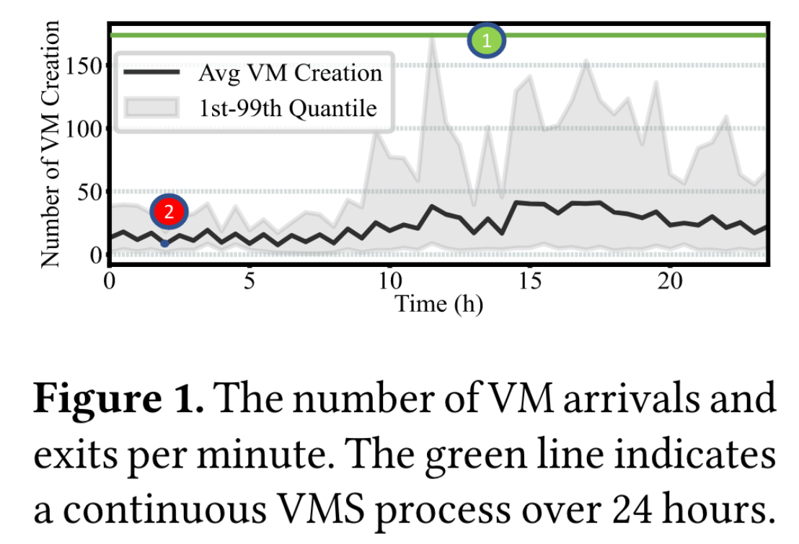
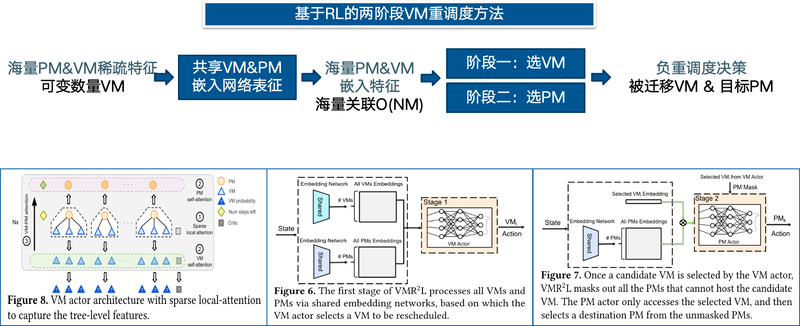

# Awesome-Cloud 周刊（第 17 期）：业界现状-容错方案演进

这里简单记录每周分享的前沿内容，不定期发布。

## 目录  
1. [为什么](#为什么)  
   1.1 [需求](#需求)  
   1.2 [研究现状](#研究现状)  
   1.3 [研究挑战](#研究挑战)  
2. [做什么](#做什么)  
   2.1 [创新点](#创新点)  
   2.2 [总体框架](#总体框架)  
3. [做的效果](#做的效果)  
   3.1 [实验设置](#实验设置)  
   3.2 [实验结果](#实验结果)  
4. [展望](#展望)  
   4.1 [未来方向](#未来方向)  
   4.2 [EuroSys论文风格](#EuroSys论文风格)  
   4.3 [论文创新性思考](#论文创新性思考)  

---

## 1. 为什么  

业界数据中心需要管理大量资源，尤其需要应对大量资源碎片。

* 业界存在大规模虚拟机管理需求，具体而言，所涉及对象包括：
  * 资源需求： **最终用户** **（End-users）** 需要大量计算资源。
  * 资源供应： **云服务提供商（Cloud Service Providers）** 采用资源虚拟化来最大化硬件利用率，将资源分配给最终用户。业界数据中心通常组织成 **集群（Cluster）** ，每个集群都有数百种 **物理机器（PMs）** ，每个PM可以托管多个独立运行的 **虚拟机（VMs）** 。

* 在此前提下，出现大量资源碎片现象。
  * 如果PM已经托管了多个VM，并且PM上的其余资源无法满足额外的VM请求，则不能使用剩余的资源称为碎片（fragments）。
  * 由于VM的不断创建和释放，许多小型资源碎片散布在PMs之间。导致了资源的严重浪费。
  * 需要通过重调度等机制应对资源碎片问题。

### 1.1 需求   

解决资源碎片的方案：VM重调度。

本文论证了 VM 重调度在业界实践的可行性，具体包括：
* 可行性：前提-请求量有低谷
  * VMR 可以在非高峰时段的清晨执行，如图 1 中的红点所示，清晨的 VM 变动较少。这样就有更宽松的时间，可以使用先进算法。
* 可行性：保底-重调度失败影响小
  * 如果重新调度操作失败，虚拟机只需停留在原来的 PM 上，不会影响最终用户。
* 可行性：过程-重调度耗时短
  * VMR 可通过实时迁移高效执行，确保停机时间最短。
  * 由于大多数数据中心在管理虚拟机时都将计算与存储分离（即使用云磁盘），因此只需传输内存。具体来说，
    * 初始复制：我们首先将虚拟机的内存状态从源 PM 复制到目标 PM，同时继续在源 PM 上运行。
    * 后续同步：在此过程中，虚拟机内存的变化（称为 “脏页”）会被跟踪并逐步重新复制，直到剩余的变化很小为止。此时，虚拟机会短暂暂停，进行最终同步。
  * 由于现代数据中心使用高带宽网络进行内部文件传输，因此 VMR 过程产生的开销较低。

### 1.2 研究现状   

#### 研究综述

a. 转化为装箱问题的最优化方法：
* 现状：基于成熟的MIP求解器进行求解加速[48,66]，无法满足严格的延迟要求（5s）。
* 问题：数据中心中VM和PM的总数很容易达到数千个或更多[63]，远远超过通常不超过几百个对象的装箱问题的典型规模[41,67]。

b. 转化为装箱问题的启发式方法：
* 现状：依赖人为设计的启发式方法[27]，导致次优解决方案。
* 问题：
  * 首先，VM重调度问题涉及动态调整VM对PM的初始分配，需要考虑已有的VM关系，现有的装箱解决方案通常不考虑这些关系。
  * 其次，重新平衡已经装入箱子中的物品在其他装箱应用的背景下很少受到关注。

c. 面向优化问题的强化学习方法：
* 现状：RL被广泛用于选择分支变量等场景[23,25,26]，也可以应用于MIP问题下启发式方法的质量优化[9,58]。
* 问题：但都只面向传统简单场景，难以在VM重调度问题下获得较好训练结果。

#### 不足

* 前两类研究中，存在复杂性过高或求解质量差问题。
* 最后一类研究中，存在泛化性和复杂性表现较差问题。

### 1.3 研究挑战   

【挑战一】：效率与质量兼顾——在有限的时间内（5s）实现较优的调度效果
* 与大多数组合优化任务不同，VM重调度算法的计算时间显著影响其性能，因为在此期间VM状态发生了动态变化。这要求算法具有极低的计算时间，导致现有方法的扩展性很差。

【挑战二】：RL效率——求解缓慢，动作空间过大
* 共 $N$ 个VM、 $M$ 个PM时，同时重调度 $MNL$ 个VM，动作空间大小为 $O({(MN)}^{MNL})$ 。
* 当RL代理选择将VM从其源PM重新调度到目标PM时存在复杂约束，导致计算动作惩罚的掩码操作缓慢。如：
  * PM必须有足够的可用CPU和内存来托管VM。
  * 在实际场景中为确保服务稳定性，应用程序可能要求某些VM跨不同PM托管，需要反亲和性约束。

【挑战三】：RL质量——表征与收敛困难，需要大量训练数据
* 为了有效重调度，必须对状态观察进行表征，其中包括每个单独的PM和VM的特征以及它们的从属关系特征。
  * 即使在同一个集群中，VM的数量也可能差异很大。这意味着每个时间步的特征大小也是高度动态的。
  * 为了对这些特征进行编码，一种选择是将所有VM和PM的特征连接成一个长向量。然而，这种方法无法处理任意数量的VM，因为神经网络通常需要固定大小的输入，并且还需要具有许多难以训练的参数的模型。

---

## 2. 做什么   

### 2.1 创新点  

【挑战一】：效率与质量兼顾——在有限的时间内（5s）实现较优的调度效果 -> 【创新点 1】：转化为RL适用的问题表述，从而便于使用 RL 解决

【挑战二】：RL效率——求解缓慢，动作空间过大 -> 【创新点 2】：两阶段RL求解框架

【挑战三】：RL质量——表征与收敛困难，需要大量训练数据 -> 【创新点 3】：大型数据中心&VMs特征提取模块

### 2.2 总体框架   

---

## 3. 做的效果   

### 3.1 实验设置  

#### 对比方法

* 【最优化】
  * MIP最优化算法
* 【启发式】
  * 基于过滤的启发式算法（HA）
  * 向量装箱问题（𝛼 -VBPP）：将装箱调度问题的经典解决方法VBPP[49]，推广到重调度问题。
  * 分区优化问题（POP）[47]：将问题随机拆分为子问题（每个子问题包含VM和PM的子集），对每个子问题应用MIP求解器，使能够满足五秒的限制。
  * 蒙特卡洛树搜索（MCTS）[67]：使用DDTS[67]来修剪搜索空间，在推理时间内多次搜索。
* 【RL】
  * Decima[44]：使用图神经网络对VM和PM信息进行编码，分解为二阶段动作并使用深度RL进行训练。
  * NeuPlan[66]：在第一阶段以图作为输入接收，并生成前几个VM迁移以修剪搜索空间。在第二阶段，使用MIP求解器求解剩余MNL（待迁移数量）。

#### 实验内容（非常丰富）

* 【整体实验】本方法与现有最先进算法的差距（§5.2）
* 【消融实验】每个组件具体能够提高多少效率&质量（§5.3）
* 【消融实验】两阶段框架如何适应不同的约束：（§5.4）
  * i）对原始Medium数据集的约束
  * ii）多维资源约束
  * iii）服务亲和性约束？
* 【扩展性】VMR2L能否优化：（§5.5）
  * i）除碎片率FR以外的目标
  * ii）定义了多种资源类型的混合目标
* 【扩展性】如何推广到：（§5.6）
  * i）不同于训练数据分布的工作负载
  * ii）在推理时使用不同的MNL（重调度数量）
  * iii）更多PM和VM
  * iv）不同的集群、不同工作负载
  * v）具有不同MNL的不同工作负载？
* 【扩展性】学习更大的集群更困难吗？（§5.7）
* 【核心亮点】直觉上的改进来自哪里？（§5.8）

可以看出实验内容的丰富性是这篇论文的一大优点，本次暂不详细分析，下次有机会再结合具体研究内容展开介绍。

### 3.2 实验结果   

#### 数据集产出

* 从真实的行业规模数据中心收集两个数据集：
  * 一个包含多达2089个虚拟机和280个PMs的中等数据集；
  * 一个包含多达4546个虚拟机和1176个PMs的大型数据集。
* 每个数据集包含4400个映射，它们表示在不同时间点VM到PM的分配。
* 为了在确保商业运营机密性和避免潜在的训练/测试泄漏的同时发布这些数据集，我们通过随机删除一些现有虚拟机并将虚拟机重新部署到它们可以适应的任何PM来匿名化每个映射。
* 在实验中，本文将4400个映射分成4000个用于训练，200个用于验证，200个用于测试。
* 本文设计了一个遵循OpenAI Gym环境[11]的模拟器，允许我们离线训练，模拟器直接支持数据集格式。

> 据我们所知，这些是基于真实跟踪进行VM重新安排的最大数据集，对社区非常有用。

#### 实验结果

* 暂不赘述，感兴趣的同学可以自行精读论文。

---

## 4. 展望   

### 4.1 未来方向  

* 总结一：可变数量表征 应用于算力网络场景
  * 面向具有复杂拓扑的请求时，同样存在“可变数量表征”难题以及“拓扑矩阵稀疏”难题。
  * 需要探究如何用少量信息表征最重要的内容，并解决数量可变问题。
* 总结二：性能干扰场景研究
  * 数据中心管理的一个挑战是由嘈杂的邻居（Noisy Neighbors）引起的性能干扰，这些邻居是大量占用共享资源的虚拟机，导致同一PM上的其他VM性能降级。
  * 这种情况下也会需要重调度以避免性能降级，但需研究何种VM共置会产生性能干扰。

### 4.2 EuroSys论文风格  

* 总结一：不重视现状&挑战&创新总结
  * 关于现状不足和研究挑战，在引言仅提及“最优化方法效率低+启发式方法质量差”，完全没有提及使用RL时会存在什么困难。实际存在较多挑战，但在方法设计部分才零零散散提出。
  * 显得创新性很弱，仅从摘要引言看起来“平平无奇”。阅读挑战大，需自行花大量时间总结。
  * （仅代表个人意见，如有其他意见欢迎指教！）

* 总结二：撰写风格偏工程
  * 在本文引言部分，花费了大量篇幅介绍调度、重调度相关的工程性实践细节。
  * 做了非常丰富的实验和数据分析（7/16页，8个小节），提供了开源数据集。

* 本文引言中囊括了丰富的工程性实践细节！
  * 任务：存在两类典型任务
    * 重调度主要应用于使用硬件虚拟化的VM集群，这些VM提供强大的隔离性并具有高启动成本，使其适用于长时间运行的工作负载，例如开发机器[46]。
      * 较小的VM（例如代理服务器或例行监控/测试）很容易使用碎片化资源创建，几乎没有供应中断的风险。
      * 相反，许多直接面向消费者的高优先级任务需要中大型虚拟机。因此，我们的研究重点关注16核碎片率，以满足ByteDance的运营需求，其中16核是开发机器的默认VM类型。
    * 对于其他短期任务，如CI/CD或CronJob，重调度是不必要的。它们通过K8s在单独的集群中进行管理，通过操作系统级虚拟化提供快速启动[36]。
  * 资源：通常在集群内少量迁移
    * 为了系统稳定性，重调度通常仅限于同一集群。一个集群通常涉及不超过几百个PM，因为
      * 它允许将专用资源分配给不同的用户组，其中特定配置可以更好地优化；
      * 每个集群可以独立监控和管理，允许一个集群升级而不影响其他集群[1]。
    * 设置迁移数量限制（MNL）以控制要迁移的VM数量，通常选择为所有VM的2~3%。

### 4.3 论文创新性思考    

* 联系最近看到一片篇个人认为非常有意思的[文章](https://github.com/zibuyu/research_tao/blob/master/03_finding_idea.md)，作以下总结：

* 总结一：不确定性→确定性
  * 一个想法“新不新”，本质上就是“是否从不确定走向了确定”。
  * 一个开放问题有无数种答案，验证了其中一种，就是推动了确定性，也就是新。
* 总结二：方法新 or 结论新
  * **方法新**：是高校主流的（传统的）“新”，重在理论，体现在能否找到一个“新问题”、能否提出一个“新方法”。
  * **结论新**：重在实践，体现在能否通过实践操作得到“新发现”、获得“新结果”。
  * 不必拘泥于前者，后者也很重要。二者相辅相成。
* 总结三：两种创新路线
  * dh 同学（初学者可参考）：从一个反直觉发现出发，逐步落实。
  * ljw 同学（有积累后可参考）：好奇心驱动，对于好奇的问题不断调研和实验分析。

---

## 问答环节记录

1. 有没有做真实实验？
  - 没有，因为目标是碎片率，所以使用真实数据集做模拟实验绰绰有余。
2. 迁移多花的时间有多长？
  - 本论文没细讲
3. 是否可以没有冷启动？
  - 整个内存迁移可能没有冷启动
4. 热迁移是否会因为内存变化太快而失败？
  - 会的，可能有保底机制（太长时间不成功就直接冷迁移）