# Awesome-Cloud 周刊（第 18 期）：基础概念-如何从零构建大模型

这里简单记录每周分享的前沿内容，不定期发布。

## 目录  
1. [概览](#概览)
2. [1. 数据预处理](#1-数据预处理)
3. [2. Attention机制](#2-attention机制)
4. [3. GPT模型](#3-gpt模型)
5. [4. Pretraining](#4-pretraining)
5. [参考资料](#参考资料)


---

## 概览

整体流程如下，本次分享主要讲述Stage 1 和Stage 2：

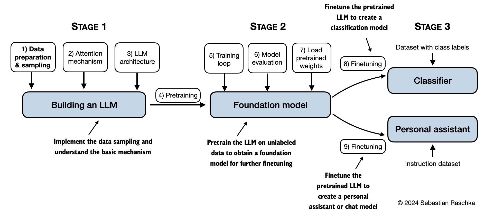

## 1. 数据预处理

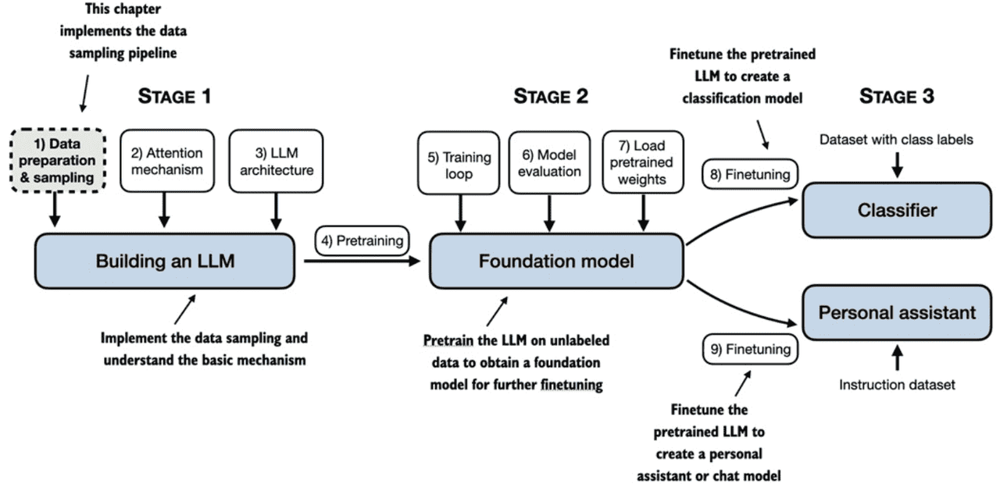

**出发点**：深度学习难以识别自然语言，需要将其转化为矩阵以方便参与计算。

### 1.1 文本编码

对于一串文本，我们需要先将其进行划分，得到句子的基本单元。拆分的规则可以有多种，最简单的就是直接按单词粒度进行拆分，即按分隔符进行拆分。

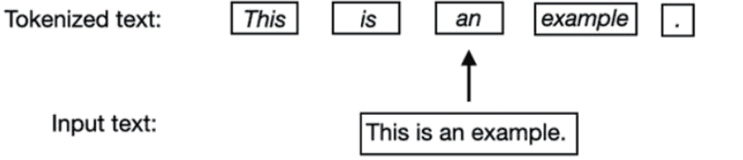

**代码实现：**

```python
text = "Hello, world. Is this-- a test?"

result = re.split(r'([,.:;?_!"()\']|--|\s)', text)
result = [item.strip() for item in result if item.strip()]
print(result)
```

在对数据集中的所有文本都进行拆分后，我们可以对所有的单词进行去重，然后得到一个单词与id互相映射的词汇表（例如直接按字母顺序进行排序）。

此外还需要一些特殊的标识符来标识文本间的分割符以及填充符。

常见的特殊标识符有：

* `[BOS]` 一个文本序列的起始标识

* `[EOS]` 一个文本序列的结束标识

* `[PAD]` 如果batch size大于1，那么就需要用它来填充那些较短的文本，以做到长度统一

* `[UNK]` 用于表示在词汇表之外的单词

> GPT、GPT-2 只使用了`<|endoftext|>` ，当做结束的标识符号，也当做填充的标识符。GPT-2不需要`[UNK]` ，因为它使用 byte-pair encoding (BPE)来编码

加入`[UNK]` 后的词汇表如下：

```python
class SimpleTokenizerV2:
    def __init__(self, vocab):
        self.str_to_int = vocab
        self.int_to_str = { i:s for s,i in vocab.items()}
    
    def encode(self, text):
        preprocessed = re.split(r'([,.:;?_!"()\']|--|\s)', text)
        preprocessed = [item.strip() for item in preprocessed if item.strip()]
        preprocessed = [
            item if item in self.str_to_int 
            else "<|unk|>" for item in preprocessed
        ]

        ids = [self.str_to_int[s] for s in preprocessed]
        return ids
        
    def decode(self, ids):
        text = " ".join([self.int_to_str[i] for i in ids])
        # Replace spaces before the specified punctuations
        text = re.sub(r'\s+([,.:;?!"()\'])', r'\1', text)
        return text
```

在实际处理的过程中，我们会希望控制词汇表的大小，或者说给出一个词汇表适应于所有的数据集。但是实际永远会存在不在字典中的人造单词，所以以常见的OpenAI开源库（ <https://github.com/openai/tiktoken> ）中 BPE 标记器为例，其做法是引入词元的概念，对于不在字典中的人造单词将其表示为多个词元的组合。


现在我们可以将一个数据集中的所有数据都转化为Token IDs。但是这还不是一个矩阵，难以实际在训练中使用，所以紧接着我们需要生成一个embedding 矩阵，该矩阵的长度是字典中token的大小，宽度是我们设置的一个token的表示长度。我们根据Token ID去对应的行取出一行用来表示该Token，如下所示。

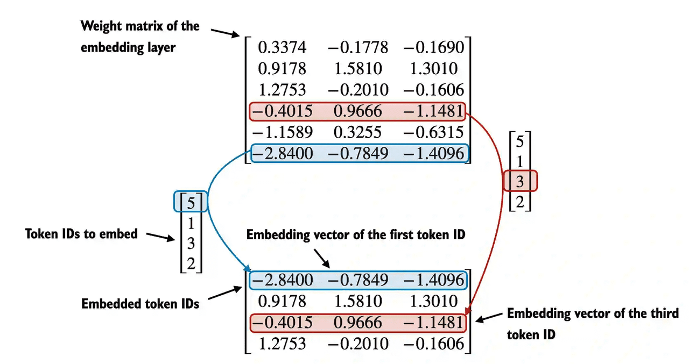

### 1.2 位置编码

一个词在不同的位置其表示的含义可能会有所不同，所以还需要有位置编码的信息。position-aware embeddings有两类：

* 相对位置嵌入的重点并非关注标记的绝对位置，而是标记之间的相对位置或距离。这意味着模型学习的是“相距多远”而不是“具体在哪个位置”的关系。这样做的好处是，即使在训练过程中没有遇到过这种长度的序列，模型也能更好地泛化到不同长度的序列。

* OpenAI 的 GPT 模型使用绝对位置嵌入，这些嵌入在训练过程中进行优化，而不是像原始 Transformer 模型中的位置编码那样固定或预定义。此优化过程是模型训练本身的一部分。

简单的位置嵌入编码就是直接生成一个行数为最大位置数的embeddings层，然后各个词按照序列id去取对应的embddings来得到位置嵌入编码，之后需要将Token embeddings和Positional embeddings进行相加最后得到一个完整的Iput embeddings。

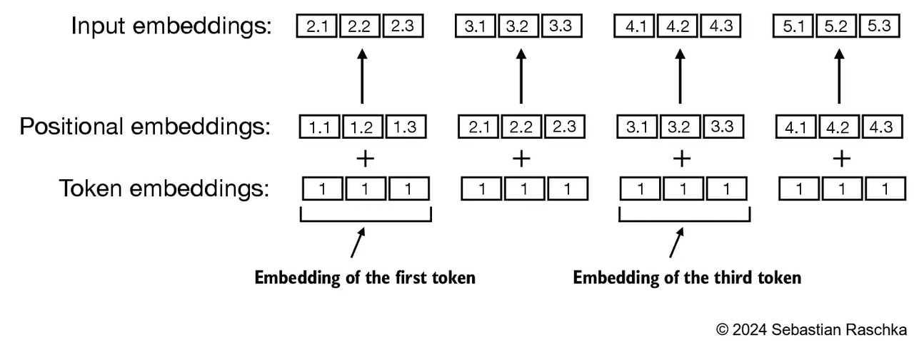

## 2. Attention机制

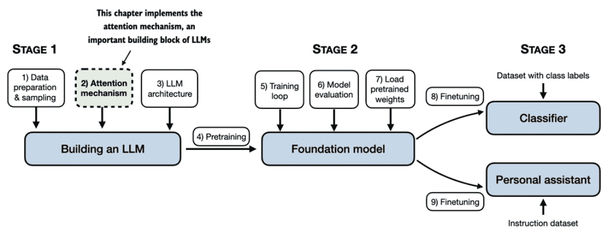

### 2.1 Self-attention机制

注意力机制简要来说是为了在生成下一个词的时候可以不同程度地参考句子中之前的词语的情况再生成，而这参考的程度就是我们常说的Attention，简单的表示如下所示：

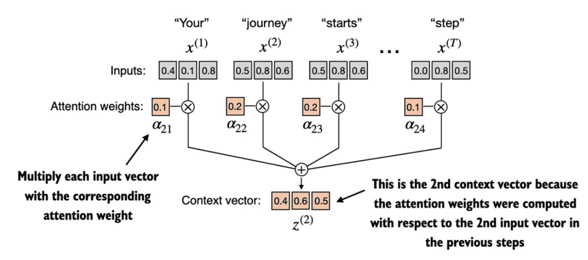

在实际的self-attention中会三个可训练的权重矩阵$$W_q$$，$$W_k$$，$$W_v$$，其分别用于与原token embedding相乘计算**Q**uery、**K**ey、**V**alue。

整体流程如下图所示：

1. 各个token与$$W_q$$，$$W_k$$，$$W_v$$相乘得到q、k、v

2. 第二个token的q与各个k相乘的到attention

3. 对attention进行softmax

4. 对attention进行缩放

5. 各个attention与v加权相乘得到上下文向量

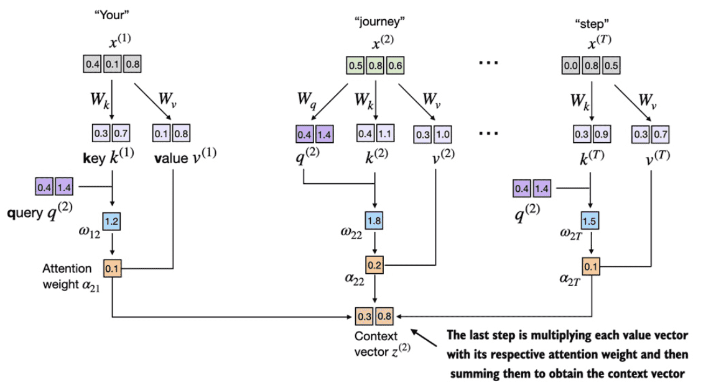

在实际处理时，会将这一系列操作直接通过矩阵乘来批量实现，如下所示：

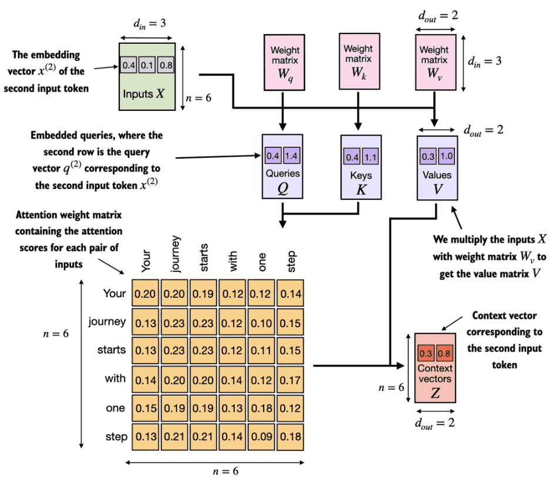

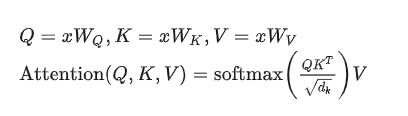

代码如下：

```python
class SelfAttention_v2(nn.Module):
    def __init__(self, d_in, d_out, qkv_bias=False):
        super().__init__()
        self.d_out = d_out
        self.W_query = nn.Linear(d_in, d_out, bias=qkv_bias)
        self.W_key   = nn.Linear(d_in, d_out, bias=qkv_bias)
        self.W_value = nn.Linear(d_in, d_out, bias=qkv_bias)
    def forward(self, x):
        keys = self.W_key(x)
        queries = self.W_query(x)
        values = self.W_value(x)

        attn_scores = queries @ keys.T

        attn_weights = torch.softmax(attn_scores / keys.shape[-1]**0.5, dim)

        context_vec = attn_weights @ values
        return context_vec

torch.manual_seed(789)
sa_v2 = SelfAttention_v2(d_in, d_out)
print(sa_v2(inputs))
# 输出
tensor([[-0.0739,  0.0713],
        [-0.0748,  0.0703],
        [-0.0749,  0.0702],
        [-0.0760,  0.0685],
        [-0.0763,  0.0679],
        [-0.0754,  0.0693]], grad_fn=<MmBackward0>)
```

### 2.2  Causal attention机制

在上述的配置下，在训练中预测下一个词的时候可以看到后面的词，这与推理时候只能看见前一个词的配置不一样，所以我们需要进行mask，从而使得在训练过程中不能看到后续的词。

常见的方法是利用softmax的数学特性，在q@k得到attention之后直接给要mask的attention weights记为-inf，这样softmax之后其值为0。

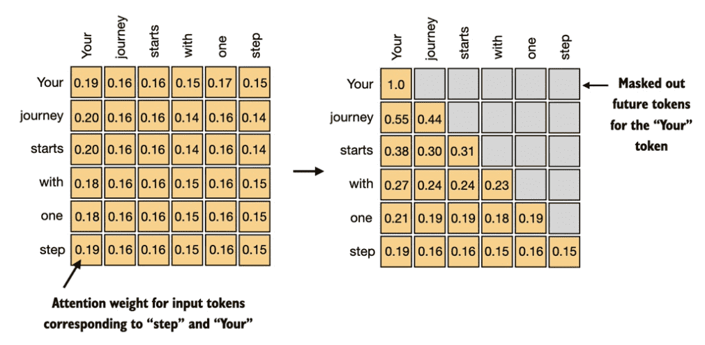

此外，我们还应用dropout来减少训练过程中的过拟合，确保模型不会过度依赖任何特定的隐藏层单元集。需要强调的是，Dropout 仅在训练期间使用，训练结束后将被禁用。

可以有两处dropout的地方

1. 在计算完attention weight之后

2. 在attention weight与values相乘之后

一般第一种更加普遍，下图我们以50%的dropout 比例为例来介绍，在实际如GPT模型中往往只会采取10%、20%的比例。

> 注意目前主流的模型训练已经舍弃掉了dropout，因为它使得模型在训推过程中行为不一致，导致模型性能下降。

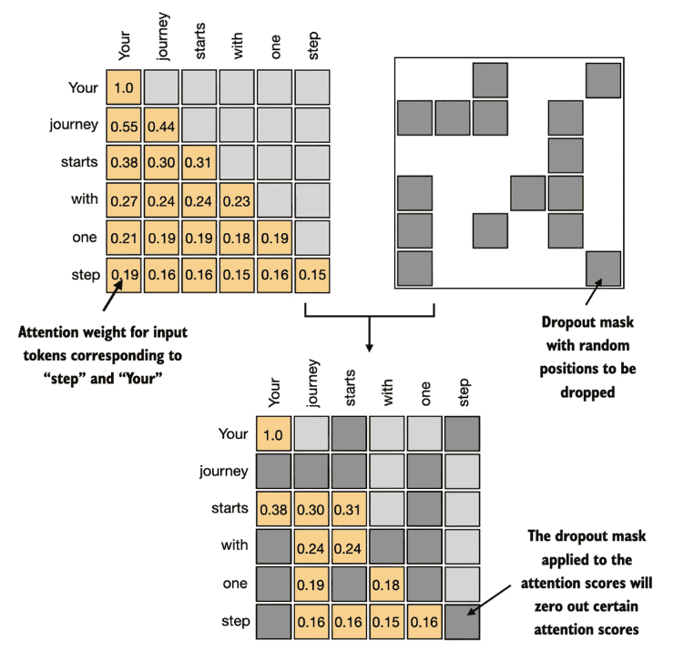

### 2.3 多头注意力机制

实际在使用的时候会使用多个QKV来生成attention，其大致含义可以理解为在不同维度上的attention。

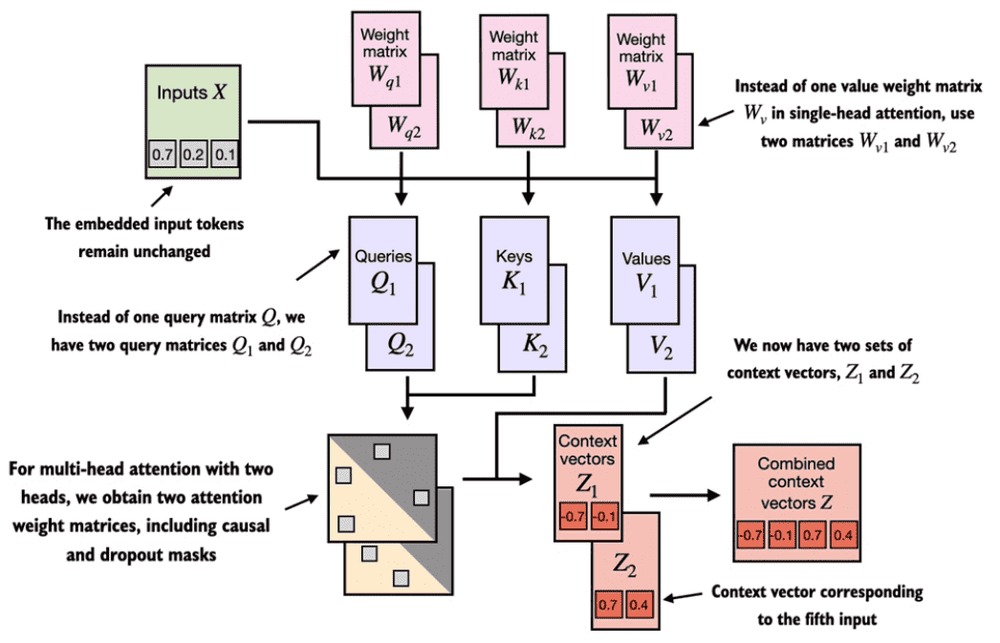

在实际的处理中，为了更好的并行化，其实会作为一个大矩阵来计算多头注意力。例如我们会一次性初始化一个大的Wq，然后通过一次矩阵运算得到Q后再对其进行形状的转化，分割成多个self-attention中的Q。再计算得到attention，再计算得到上下文，最后又通过形状的变化得到拼接后的输出。

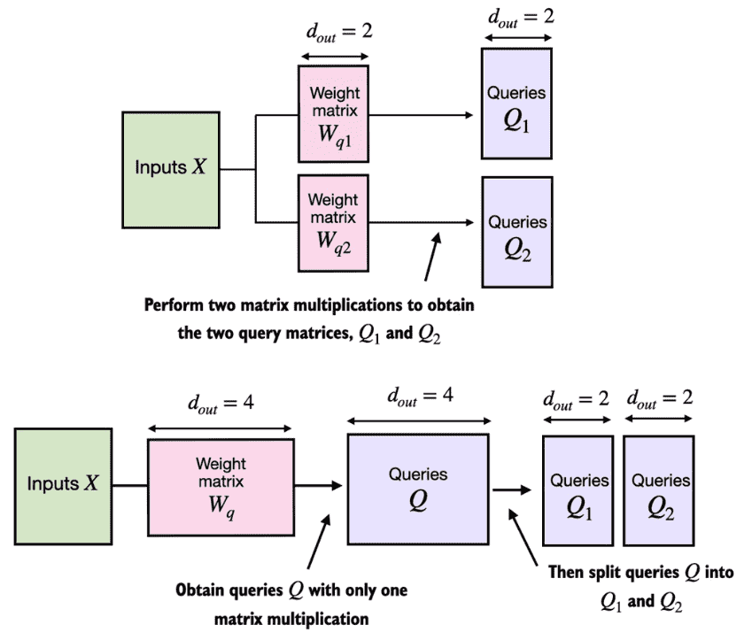

简单的代码实现如下：

```python
class MultiHeadAttention(nn.Module):
    def __init__(self, d_in, d_out, context_length, dropout, num_heads, qkv_bias=False):
        super().__init__()
        assert (d_out % num_heads == 0), \
            "d_out must be divisible by num_heads"

        self.d_out = d_out
        self.num_heads = num_heads
        self.head_dim = d_out // num_heads # Reduce the projection dim to match desired output dim

        self.W_query = nn.Linear(d_in, d_out, bias=qkv_bias)
        self.W_key = nn.Linear(d_in, d_out, bias=qkv_bias)
        self.W_value = nn.Linear(d_in, d_out, bias=qkv_bias)
        self.out_proj = nn.Linear(d_out, d_out)  # Linear layer to combine head outputs
        self.dropout = nn.Dropout(dropout)
        self.register_buffer(
            "mask",
            torch.triu(torch.ones(context_length, context_length),
                       diagonal=1)
        )

    def forward(self, x):
        b, num_tokens, d_in = x.shape
        # As in `CausalAttention`, for inputs where `num_tokens` exceeds `context_length`, 
        # this will result in errors in the mask creation further below. 
        # In practice, this is not a problem since the LLM (chapters 4-7) ensures that inputs  
        # do not exceed `context_length` before reaching this forwar

        keys = self.W_key(x) # Shape: (b, num_tokens, d_out)
        queries = self.W_query(x)
        values = self.W_value(x)

        # We implicitly split the matrix by adding a `num_heads` dimension
        # Unroll last dim: (b, num_tokens, d_out) -> (b, num_tokens, num_heads, head_dim)
        keys = keys.view(b, num_tokens, self.num_heads, self.head_dim) 
        values = values.view(b, num_tokens, self.num_heads, self.head_dim)
        queries = queries.view(b, num_tokens, self.num_heads, self.head_dim)

        # Transpose: (b, num_tokens, num_heads, head_dim) -> (b, num_heads, num_tokens, head_dim)
        keys = keys.transpose(1, 2)
        queries = queries.transpose(1, 2)
        values = values.transpose(1, 2)

        # Compute scaled dot-product attention (aka self-attention) with a causal mask
        # attn_scores Shape: (b, num_heads, num_tokens, num_tokens)
        attn_scores = queries @ keys.transpose(2, 3)  # Dot product for each head

        # Original mask truncated to the number of tokens and converted to boolean
        mask_bool = self.mask.bool()[:num_tokens, :num_tokens]

        # Use the mask to fill attention scores
        attn_scores.masked_fill_(mask_bool, -torch.inf)
        
        attn_weights = torch.softmax(attn_scores / keys.shape[-1]**0.5, dim=-1)
        attn_weights = self.dropout(attn_weights)

        # (b, num_heads, num_tokens, num_tokens) @ (b, num_heads, num_tokens, head_dim) = (b, num_heads, num_tokens, head_dim)
        # Shape: (b, num_tokens, num_heads, head_dim)
        context_vec = (attn_weights @ values).transpose(1, 2) 
        
        # Combine heads, where self.d_out = self.num_heads * self.head_dim
        context_vec = context_vec.contiguous().view(b, num_tokens, self.d_out)
        context_vec = self.out_proj(context_vec) # optional projection

        return context_vec

torch.manual_seed(123)

batch_size, context_length, d_in = batch.shape
d_out = 4
mha = MultiHeadAttention(d_in, d_out, context_length, 0.0, num_heads=2)

context_vecs = mha(batch)

print(context_vecs)
print("context_vecs.shape:", context_vecs.shape)

# 输出
tensor([[[ 0.1184,  0.3120, -0.0847, -0.5774],
         [ 0.0178,  0.3221, -0.0763, -0.4225],
         [-0.0147,  0.3259, -0.0734, -0.3721],
         [-0.0116,  0.3138, -0.0708, -0.3624],
         [-0.0117,  0.2973, -0.0698, -0.3543],
         [-0.0132,  0.2990, -0.0689, -0.3490]],

        [[ 0.1184,  0.3120, -0.0847, -0.5774],
         [ 0.0178,  0.3221, -0.0763, -0.4225],
         [-0.0147,  0.3259, -0.0734, -0.3721],
         [-0.0116,  0.3138, -0.0708, -0.3624],
         [-0.0117,  0.2973, -0.0698, -0.3543],
         [-0.0132,  0.2990, -0.0689, -0.3490]]], grad_fn=<ViewBackward0>)
context_vecs.shape: torch.Size([2, 6, 4])
```

## 3. GPT模型

### 3.1 Transformer Block

大模型中一个简单的transformer block的结构如下所示：

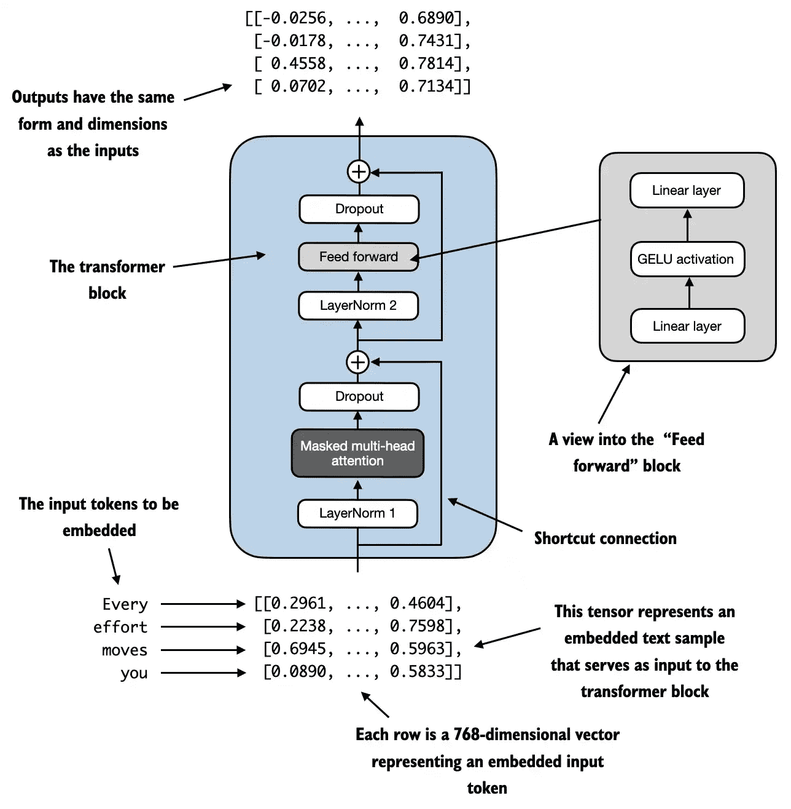

#### 3.1.1 LayerNorm

LayerNorm归一化层的作用是将某一个维度中的参数都均值化到0，同时将方差归为1。其处理方法如下：

* $$\mu = \frac{1}{N} \sum_{i=1}^{N} x_i$$：均值

* $$\sigma^2 = \frac{1}{N} \sum_{i=1}^{N} (x_i - \mu)^2$$：方差

* $$\varepsilon$$：小值，防止除以0

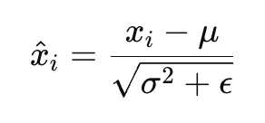

而更灵活一点的实现会再额外添加了一个scale变量以控制各变量x进行缩放，还有shift变量来控制变量x进行平移。

#### 3.1.2 Feed forward

一个前馈网络的结构如下：

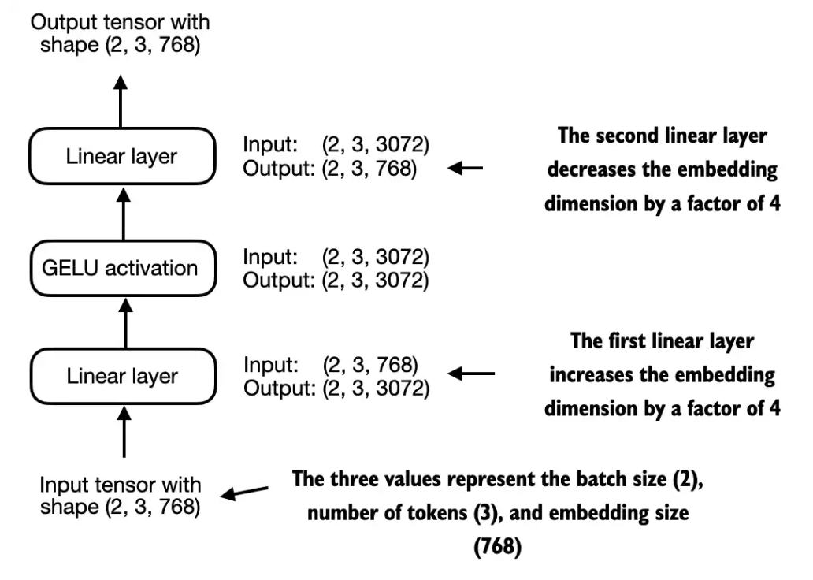

注意这里采用的是GELU激活函数，其表达式如下：

$$\text{GELU}(x) \approx 0.5 \cdot x \cdot \left(1 + \tanh\left[\sqrt{\frac{2}{\pi}} \cdot \left(x + 0.044715 \cdot x^3\right)\right]\right)$$

相比于RELU激活函数，GELU是一个平滑的非线性函数，近似于ReLU，但负值具有非零梯度（约-0.75除外）。

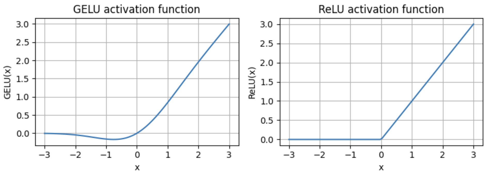

> 需要一个Gelu的原因是使得模型可以拟合非线形特征，避免过拟合。

#### 3.1.3 Shortcut connections

shortcut连接主要是为了解决梯度消息的问题，它将之前网络的输出与现在网络的输入相加后再进行传递，如下所示：

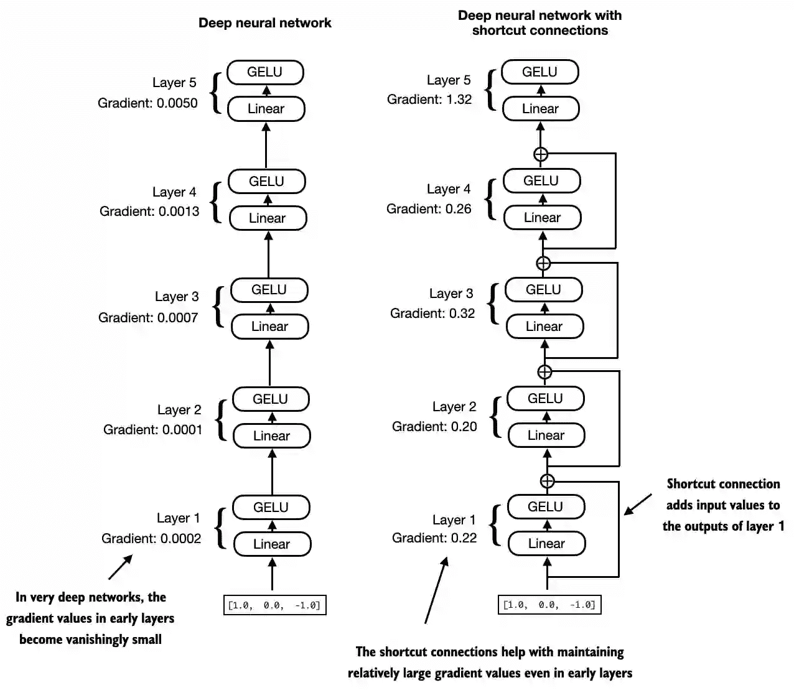

#### 3.1.4 Coding

简单的代码实现如下：

```python
from previous_chapters import MultiHeadAttention

class TransformerBlock(nn.Module):
    def __init__(self, cfg):
        super().__init__()
        self.att = MultiHeadAttention(
            d_in=cfg["emb_dim"],
            d_out=cfg["emb_dim"],
            context_length=cfg["context_length"],
            num_heads=cfg["n_heads"], 
            dropout=cfg["drop_rate"],
            qkv_bias=cfg["qkv_bias"])
        self.ff = FeedForward(cfg)
        self.norm1 = LayerNorm(cfg["emb_dim"])
        self.norm2 = LayerNorm(cfg["emb_dim"])
        self.drop_shortcut = nn.Dropout(cfg["drop_rate"])

    def forward(self, x):
        # Shortcut connection for attention block
        shortcut = x
        x = self.norm1(x)
        x = self.att(x)  # Shape [batch_size, num_tokens, emb_size]
        x = self.drop_shortcut(x)
        x = x + shortcut  # Add the original input back

        # Shortcut connection for feed forward block
        shortcut = x
        x = self.norm2(x)
        x = self.ff(x)
        x = self.drop_shortcut(x)
        x = x + shortcut  # Add the original input back

        return x
```

### 3.2 GPT model

GPT2 模型的结构如下所示：

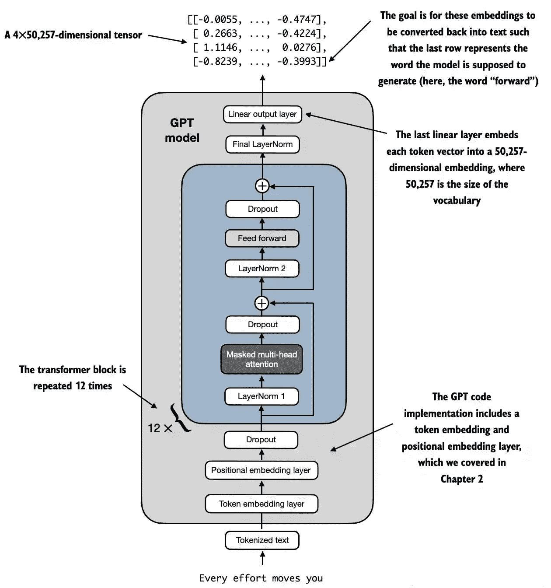

注意

对于一个一个参数量为124 million的GPT-2模型包括了以下的定义参数：

```yaml
GPT_CONFIG_124M = {
    "vocab_size": 50257,    # Vocabulary size
    "context_length": 1024, # Context length
    "emb_dim": 768,         # Embedding dimension
    "n_heads": 12,          # Number of attention heads
    "n_layers": 12,         # Number of layers
    "drop_rate": 0.1,       # Dropout rate
    "qkv_bias": False       # Query-Key-Value bias
}
```

* vocab\_size：单词数量，也就是BPE解码器所支持的单词数量

* context\_length：最长允许输入的token数量，也就是常说的上下文长度

* emb\_dim：Embedding层的维度

* n\_heads：多头注意力中注意力头的数量

* n\_layers：transformer块的数量

* drop\_rate：为了防止过拟合所采用的丢弃率，0.1意味着丢弃10%

* qkv\_bias：Liner层是否再加一个bias层


其简单的代码实现如下：

```python
class GPTModel(nn.Module):
    def __init__(self, cfg):
        super().__init__()
        self.tok_emb = nn.Embedding(cfg["vocab_size"], cfg["emb_dim"])
        self.pos_emb = nn.Embedding(cfg["context_length"], cfg["emb_dim"])
        self.drop_emb = nn.Dropout(cfg["drop_rate"])

        self.trf_blocks = nn.Sequential(
            *[TransformerBlock(cfg) for _ in range(cfg["n_layers"])])

        self.final_norm = LayerNorm(cfg["emb_dim"])
        self.out_head = nn.Linear(
            cfg["emb_dim"], cfg["vocab_size"], bias=False
        )

    def forward(self, in_idx):
        batch_size, seq_len = in_idx.shape
        tok_embeds = self.tok_emb(in_idx)
        pos_embeds = self.pos_emb(torch.arange(seq_len, device=in_idx.device))
        x = tok_embeds + pos_embeds  # Shape [batch_size, num_tokens, emb_size]
        x = self.drop_emb(x)
        x = self.trf_blocks(x)
        x = self.final_norm(x)
        logits = self.out_head(x)
        return logits
```

## 4. Pretraining

### 4.1 交叉墒与困惑度

假设现在一个batch中有两个训练实例，那么其target就是相应的右移一位的结果，如下所示。

```python
inputs = torch.tensor([[16833, 3626, 6100],   # ["every effort moves",
                       [40,    1107, 588]])   #  "I really like"]

targets = torch.tensor([[3626, 6100, 345  ],  # [" effort moves you",
                        [1107,  588, 11311]]) #  " really like chocolate"]
```

最后在经过模型前向传播后我们会得到每一个batch中各个前缀的推理结果，这个结果的维度是字典中各个token的概览，简单地通过softmax获取最高可能性的token就可以得到推理的结果，如下所示：

```python
with torch.no_grad():
    logits = model(inputs)

probas = torch.softmax(logits, dim=-1) # Probability of each token in vocabulary
print(probas.shape) # Shape: (batch_size, num_tokens, vocab_size)
# 输出
# torch.Size([2, 3, 50257])

token_ids = torch.argmax(probas, dim=-1, keepdim=True)
print("Token IDs:\n", token_ids)
# 输出
# Token IDs:
#  tensor([[[16657],
#          [  339],
#          [42826]],
# 
#         [[49906],
#          [29669],
#          [41751]]])
         
         
print(f"Targets batch 1: {token_ids_to_text(targets[0], tokenizer)}")
print(f"Outputs batch 1: {token_ids_to_text(token_ids[0].flatten(), tokenizer)}")
# Targets batch 1:  effort moves you
# Outputs batch 1:  Armed heNetflix
```

因为是随机的参数，所以可以看到输出是混乱的，我们的目标是让输出与target之间的距离接近。

而由于在训练过程中优化概率的对数比优化概率本身更加容易，所以我们会对概率取一个对数，又因为我们一般都是说最小化某个值，所以我们再取一个负数修改目标为最小化。而这也叫做`cross_entropy`（交叉熵）。

> 更通用的交叉墒的公式为：
>
> $$H(y, \hat{y}) = -\sum_{i=1}^{C} y_i \log(\hat{y}_i)$$
>
> 由于我们这目标是唯一的一个target，而其他token的目标概率都为0，所以就可以只关注目标y这一个。

> 我们的目标是概率接近1（eg：0.99），-log(0.99)约等于0.0043

使用pytorch进行计算的代码如下

```python
logits_flat = logits.flatten(0, 1)
targets_flat = targets.flatten()

print("Flattened logits:", logits_flat.shape)
print("Flattened targets:", targets_flat.shape)

# Flattened logits: torch.Size([6, 50257])
# Flattened targets: torch.Size([6])

loss = torch.nn.functional.cross_entropy(logits_flat, targets_flat)
print(loss)
# tensor(10.7940)
```

此外直接对交叉墒求指数就可以得到困惑度，它代表了大模型对输出的不确定性，越低的困惑度就更接近真实的分布，如下：

```python
perplexity = torch.exp(loss)
print(perplexity)
# tensor(48725.8203)
```

### 4.2 训练

在训练过程中会将数据分为训练集和测试集，最简单的分法就是直接将文本按比例进行划分。在训练过程中我们会一batch为粒度进行划分。
暂时不考虑一些高阶的大模型训练方法，其整体的训练流程如下：

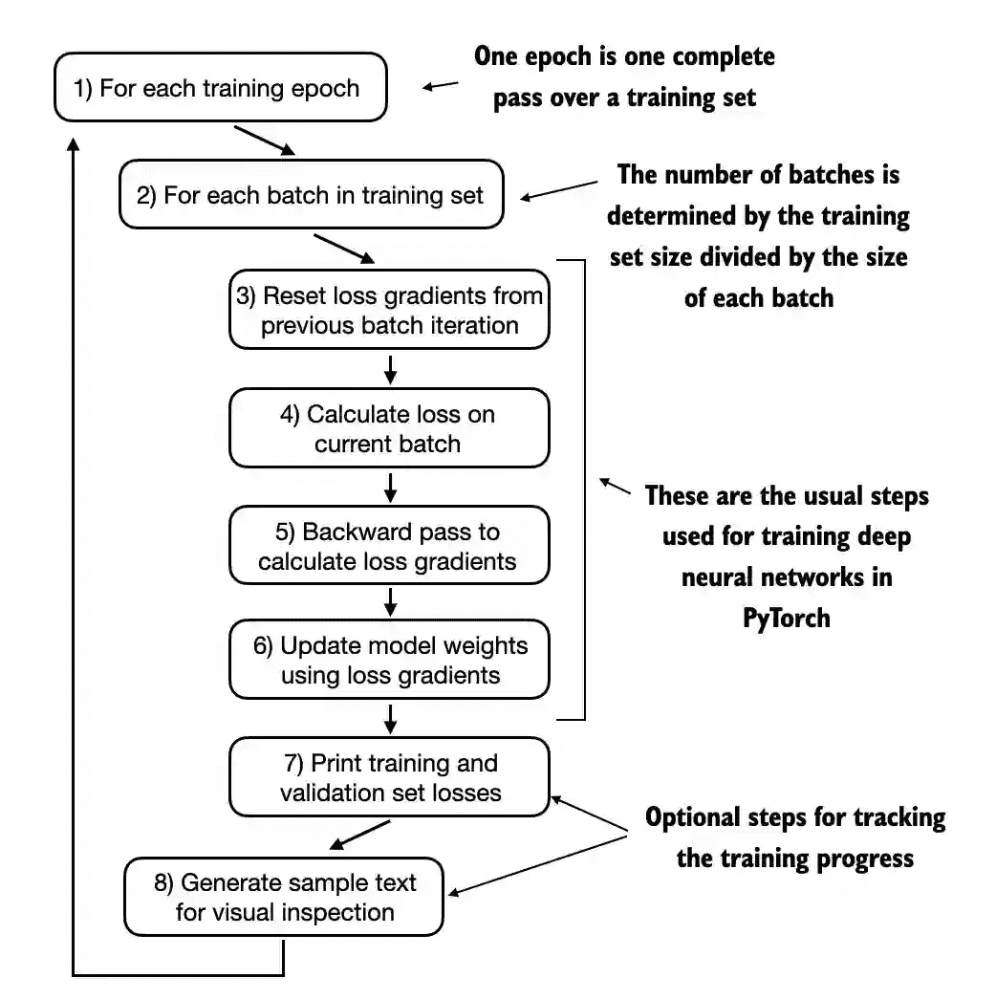

简单的代码实现如下，我们这里采用的是经典的AdamW优化器

```python
def train_model_simple(model, train_loader, val_loader, optimizer, device, num_epochs,
                       eval_freq, eval_iter, start_context, tokenizer):
    # Initialize lists to track losses and tokens seen
    train_losses, val_losses, track_tokens_seen = [], [], []
    tokens_seen, global_step = 0, -1

    # Main training loop
    for epoch in range(num_epochs):
        model.train()  # Set model to training mode
        
        for input_batch, target_batch in train_loader:
            optimizer.zero_grad() # Reset loss gradients from previous batch iteration
            loss = calc_loss_batch(input_batch, target_batch, model, device)
            loss.backward() # Calculate loss gradients
            optimizer.step() # Update model weights using loss gradients
            tokens_seen += input_batch.numel()
            global_step += 1

            # Optional evaluation step
            if global_step % eval_freq == 0:
                train_loss, val_loss = evaluate_model(
                    model, train_loader, val_loader, device, eval_iter)
                train_losses.append(train_loss)
                val_losses.append(val_loss)
                track_tokens_seen.append(tokens_seen)
                print(f"Ep {epoch+1} (Step {global_step:06d}): "
                      f"Train loss {train_loss:.3f}, Val loss {val_loss:.3f}")

        # Print a sample text after each epoch
        generate_and_print_sample(
            model, tokenizer, device, start_context
        )

    return train_losses, val_losses, track_tokens_seen


def evaluate_model(model, train_loader, val_loader, device, eval_iter):
    model.eval()
    with torch.no_grad():
        train_loss = calc_loss_loader(train_loader, model, device, num_batches=eval_iter)
        val_loss = calc_loss_loader(val_loader, model, device, num_batches=eval_iter)
    model.train()
    return train_loss, val_loss


def generate_and_print_sample(model, tokenizer, device, start_context):
    model.eval()
    context_size = model.pos_emb.weight.shape[0]
    encoded = text_to_token_ids(start_context, tokenizer).to(device)
    with torch.no_grad():
        token_ids = generate_text_simple(
            model=model, idx=encoded,
            max_new_tokens=50, context_size=context_size
        )
    decoded_text = token_ids_to_text(token_ids, tokenizer)
    print(decoded_text.replace("\n", " "))  # Compact print format
    model.train()
    
```

* 可以看到随着训练的持续，模型可以输出一些更加通顺的句子

```python

# Note:
# Uncomment the following code to calculate the execution time
import time
start_time = time.time()

torch.manual_seed(123)
model = GPTModel(GPT_CONFIG_124M)
model.to(device)
optimizer = torch.optim.AdamW(model.parameters(), lr=0.0004, weight_decay=0.1)

num_epochs = 10
train_losses, val_losses, tokens_seen = train_model_simple(
    model, train_loader, val_loader, optimizer, device,
    num_epochs=num_epochs, eval_freq=5, eval_iter=5,
    start_context="Every effort moves you", tokenizer=tokenizer
)

# Note:
# Uncomment the following code to show the execution time
end_time = time.time()
execution_time_minutes = (end_time - start_time) / 60
print(f"Training completed in {execution_time_minutes:.2f} minutes.")

# 输出
Ep 1 (Step 000000): Train loss 9.783, Val loss 9.927
Ep 1 (Step 000005): Train loss 7.985, Val loss 8.335
Every effort moves you,,,,,,,,,,,,.                                     
Ep 2 (Step 000010): Train loss 6.753, Val loss 7.048
Ep 2 (Step 000015): Train loss 6.114, Val loss 6.573
Every effort moves you, and,, and, and,,,,, and, and,,,,,,,,,,,,,, and,,,, and,, and,,,,, and,,,,,,
Ep 3 (Step 000020): Train loss 5.525, Val loss 6.490
Ep 3 (Step 000025): Train loss 5.324, Val loss 6.387
Every effort moves you, and to the picture.                      "I, and the of the of the's the honour, and, and I had been, and I
Ep 4 (Step 000030): Train loss 4.761, Val loss 6.360
Ep 4 (Step 000035): Train loss 4.461, Val loss 6.258
Every effort moves you of the to the picture--as of the picture--as I had been " it was his " I was the     "I was his I had been the his pictures--and it the picture and I had been the picture of
Ep 5 (Step 000040): Train loss 3.833, Val loss 6.196
Every effort moves you know the "Oh, and he was not the fact by his last word.         "I was.      "Oh, I felt a little a little the    
Ep 6 (Step 000045): Train loss 3.352, Val loss 6.139
Ep 6 (Step 000050): Train loss 2.861, Val loss 6.112
Every effort moves you know; and my dear, and he was not the fact with a little of the house of the fact of the fact, and.                       
Ep 7 (Step 000055): Train loss 2.347, Val loss 6.138
Ep 7 (Step 000060): Train loss 2.084, Val loss 6.179
Every effort moves you know," was one of the picture for nothing--I told Mrs.  "I looked--as of the fact, and I felt him--his back his head to the donkey. "Oh, and_--because he had always _
Ep 8 (Step 000065): Train loss 1.521, Val loss 6.176
Ep 8 (Step 000070): Train loss 1.272, Val loss 6.178
Every effort moves you?" "I didn't bear the picture--I told me.  "I looked up, and went on groping and Mrs. I was back the head to look up at the honour being _mine_--because he was when I
Ep 9 (Step 000075): Train loss 1.000, Val loss 6.277
Ep 9 (Step 000080): Train loss 0.718, Val loss 6.281
Every effort moves you?"  "Yes--quite insensible to the irony. She wanted him vindicated--and by me!"  He laughed again, and threw back his head to look up at the sketch of the donkey. "There were days when I
Ep 10 (Step 000085): Train loss 0.506, Val loss 6.325
Every effort moves you?"  "Yes--quite insensible to the irony. She wanted him vindicated--and by me!"  He laughed again, and threw back his head to the donkey again. I saw that, and down the room, when I
Training completed in 4.03 minutes.
```

绘制训练集的loss与验证集的loss如下，可以发现整个模型训练过程中训练集的loss在一直快速下降，但是验证集的loss后面就基本保持不变了，说明其实是有发生过拟合的。

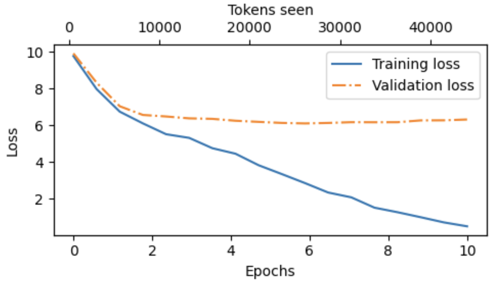

## 参考资料

* https://knowledge.zhaoweiguo.com/build/html/x-learning/books/ais/2024/build\_llm\_from\_scratch#understanding-llm

* https://github.com/rasbt/LLMs-from-scratch

* https://slipegg.github.io/2025/05/01/LLMFromScratch1/
