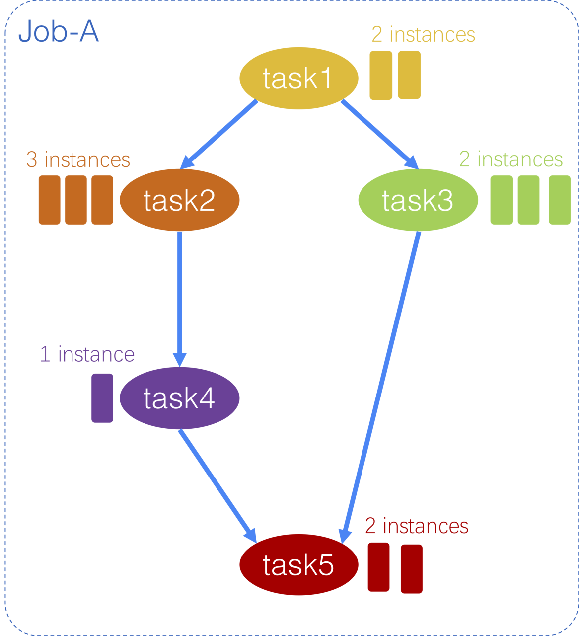
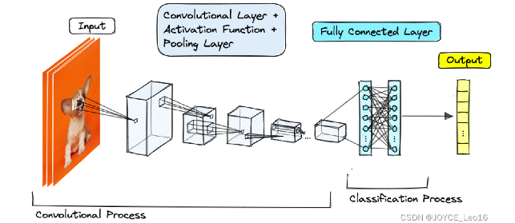
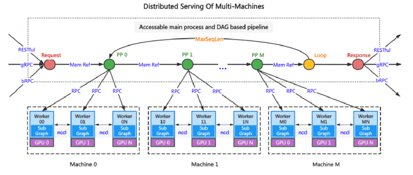
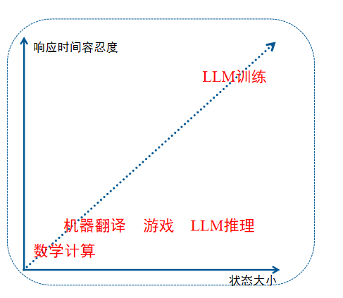

# Awesome-Cloud 周刊（第 2 期）：基础概念-任务及其分类

这里简单记录每周分享的前沿内容，不定期发布。

## 封面图

## 任务分类

### 按内部资源管理方式分类

+ 有状态任务”（Stateful Task）
  + 定义：有状态的系统能够记住之前的交互或者事件的状态。每次交互时，系统会依赖于之前的状态信息。
  + 特征：保存状态，系统记住用户的会话信息或其他上下文。
  + 举例：
    + 游戏：KB, MB
    + LLM训练：GB
+ “无状态任务”（Stateless Task）
  + 定义：无状态的系统每次请求都是独立的，不依赖于之前的状态信息。服务器不保存任何关于客户端的上下文信息。
  + 特征：
    + 简单性：每个请求都包含所有需要的信息，从而减轻服务器的负担。
    + 可扩展性：较容易横向扩展，因为服务器不需要存储状态信息。
  + 举例
    + 数学计算

### 按外界请求响应方式分类

+ 在线任务（Online Task）
  + Service
  + 需要对实时数据进行处理和响应的任务，它通常需要快速的响应时间
  + 举例
    + 实时渲染任务:<=15ms
    + 自动驾驶任务:<=500ms~1s
    + LLM 推理：<=10s
+ 离线任务(Offline Task)
  + Jobs
  + 对大量数据进行批量处理的任务，它通常没有时间限制，可以在后台运行
  + 举例
    + 机器翻译：s
    + 小模型训练：min
    + LLM 训练： min, hours, day……

## job、task与instance之间的关系

### 整体关系

一言以蔽之，job是task的集合，而task使用多个instance运行。
但这样的理解不够深刻，因为更重要的为什么它们是这种关系。

### task的顺序性

上图图片是图片识别的流程，它需要先对图片进行卷积化，再识通过神经网络分类器进行分类。显然不同task之间有依赖关系，所以其运行具有顺序性。

### task的可分解性

为了减少运行时间，我们可以将一个任务分配给多个实例，从而实现并行计算。

## 对我们的启示

按照响应时间容忍度、状态大小可以画出一张二维直角坐标图。并从原点可以划出一条射线。
射线以上：学界更关注优化成本
射线以下：学界更关注优化QoS（服务质量和响应时间）

## 问答环节记录

+ xyh
  + Q:K8S执行中，statefulset中的pod的关系是什么？副本？双生子?
  + A:副本吧。
  + Q:那实际生活中，什么场景下需要副本有顺序的不同？
  + A:pod绑定PV的时候，需要保证重新创建的pod与原pod绑定的PV是同一个。而且重新创建的pod与原pod的网络IP也要一致。
  + Q:有/无状态任务是否有明确的学界的划分的共识？
  + A:需要调研。。。。
  + Q:刚刚现在你说的内存一个主机，这个计算一个主机，在你的数据库里面是一个常见的操作吗？
  + A:一般来说，可能我们现在接触到的还是传统的云数据库的做法就是它的主机跟内存。是耦合的，都是在同一个服务器上，然后我刚刚说的他是云原生数据库的那种架构，然后它是主机计算层全连成一片，然后内存层都全连成一片，然后内存层跟主机内存层跟计算层之间是通过那个高速的网关。好像什么 RDMA ，快速的进行通信。
  + Q:那正好如果有没有一些产品就是已经对公众进行服务的这种产品有案例的话，你也可以在周报里面整理一下。
  + A:好像是有的，但我还没有细看。
+ wxl
  + Q:如果将计算层与存储层分开，那迁移有状态任务的是不是就可以不需要迁移状态？
  + A:是的。但是有些响应敏感的任务，比如视频渲染，需要实时的响应，还是需要把状态保存在计算层。不然计算层与存储层的的延时过长。
  + Q:用RDMA之类的低延时网络架构呢？
  + A:可以使用。但价格比较高，需要结合具体场景。
+ ljw
  + Q:有状态任务的调度/迁移有何挑战？
  + A:需要同步迁移/调度状态数据。
+ fmc
  + Q:无状态，如果一个 job 它是无状态的，然后它里面有多个 task。然后这时候我们调度的时候就可以，不管先后顺序甚至可以是多个调度器同时为这个每一个 task 同时去调度，因为它们没有之间依赖关系，所以就可以并行全部把它一起调度完，这样会很快。
  + A:是的
