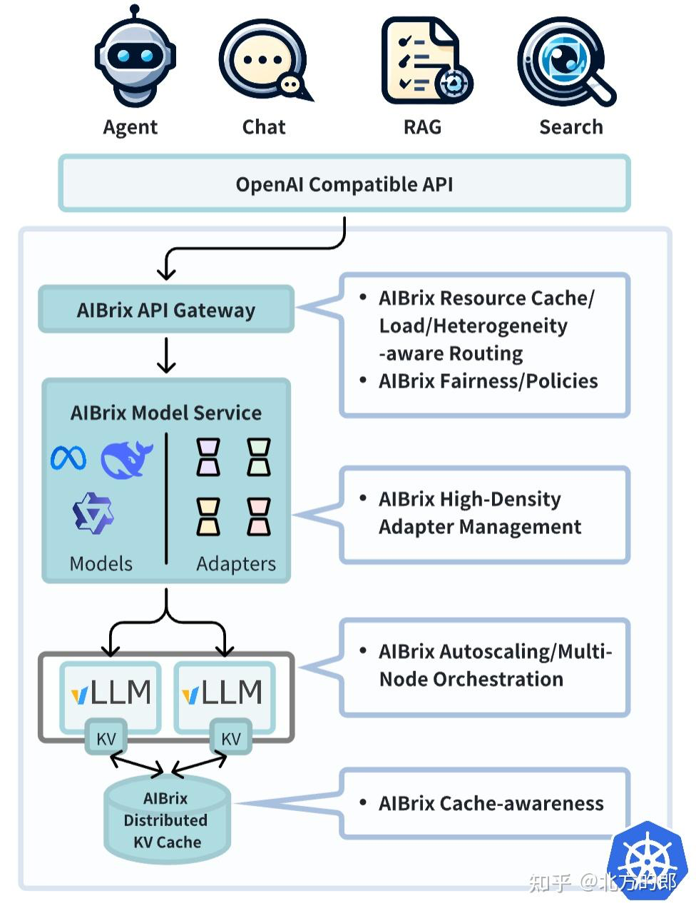
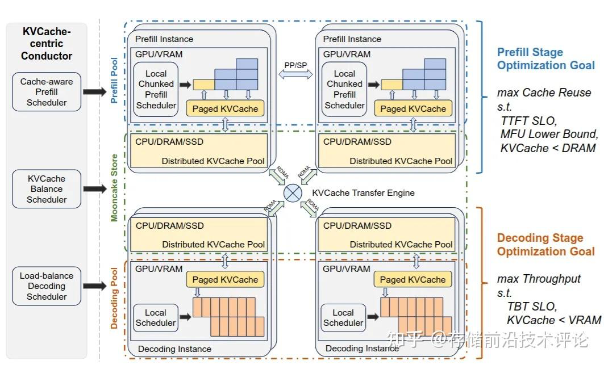
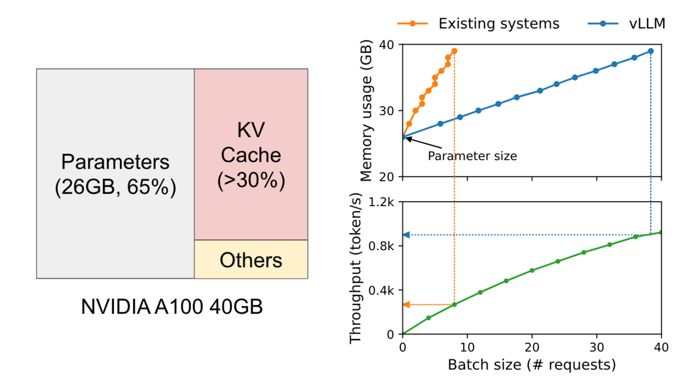
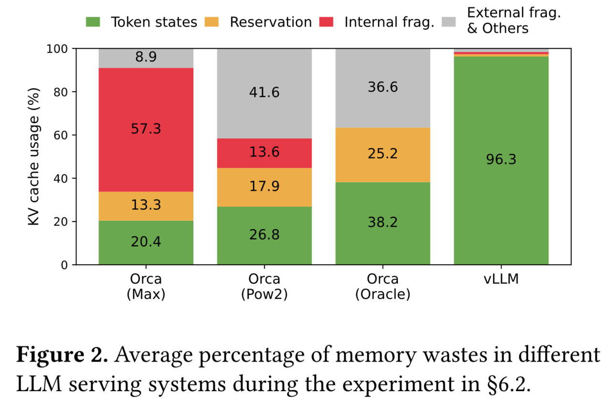
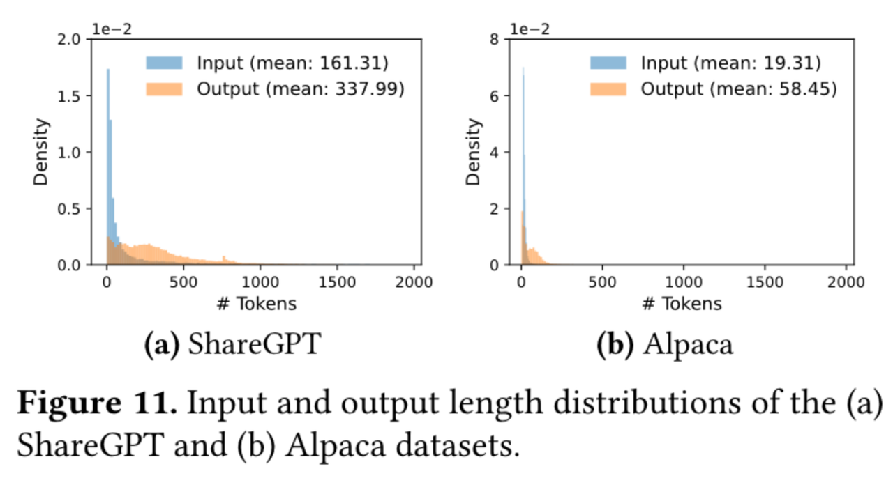

# Awesome-Cloud 周刊（第 24 期）：业界现状-AI Infra框架

这里简单记录每周分享的前沿内容，不定期发布。

## 背景简介：**为何需要AI-Infra框架？从大模型推理的痛点说起**

大语言模型（LLM）的兴起使其从科研领域走向了实际应用。这些强大的模型在实际部署和应用中，需要专门的“AI基础设施框架”（AI-Infra）来保障其高效、稳定地运行。这些框架是LLM从研究走向工业级应用的关键。

> 上个月sglang-v0.3.0和vllm-v0.6.0前后脚发布（2024.9）之后，就一直想总结梳理一下现在主流的大模型推理引擎。因为我觉得这也算是一个有意义的节点吧，从此开源大模型推理引擎总算是由"非常粗糙，但是能用"的阶段迈入到了"好用，稍微有那么点粗糙"的阶段。
>
> 大模型的推理引擎实际也就是近一两年才开始飞速发展，从最开始的tgi和vllm并驾齐驱到如今sglang、lmdeply的异军突起，整个开源社区都是非常有活力的。
>
> 但是正如之前所说，从长远的一个视角看如今的开源引擎实际上都还是比较粗糙的，大家都是在摸索中前进。另一方面也是因为现在全世界的目光都聚焦在llm这里，新技术的更新换代太快了，做好一个大模型的推理引擎要做的事情实在是太太太太多了。除了要支持日新月异的**新模型和新硬件**，还要不断关心学术界最新的paper并且想方设法落地实现。而这些新的想法可能涉及到**模型结构、计算策略、调度策略、存储策略、cuda内核、硬件加速**等各个层级，这就需要开发者有非常广泛的知识范围和过硬的工程能力。
>
> 我一直认为大模型推理引擎最难的地方就在于：对模型和硬件的广泛支持以及如何将各种角度的不同优化方法兼容实现。因为写paper的人可以只关心他自己的idea，在transformer库的基础上写个简单demo就行，但是在推理引擎里落地的时候往往就会与其它模块有冲突，需要想办法去做各种兼容。退一步说，即使没有冲突的情况，你也需要对其他基础的优化比较熟悉，你才能在这些的基础上完成新功能的开发。
>
>
>
> ——开源大模型推理引擎现状及常见推理优化方法 - 齐夏的文章 - 知乎 https://zhuanlan.zhihu.com/p/755874470

***

在AI-Infra框架出现之前，大语言模型的实际部署和应用，尤其是推理环节，面临着一系列严峻的挑战。这些挑战不仅关乎性能，也关乎成本和效率，它们是催生AI-Infra框架的根本原因。

### **1.1 GPU显存挑战：显存占用与内存碎片化**

大语言模型的核心是Transformer架构，其推理过程大致分为两个阶段：预填充（Prefill）和解码（Decode）。在解码阶段，模型需要逐个生成新的词元（token），而每一次生成，都需要访问前面所有词元的“键值缓存”（KV Cache），这部分数据占据了大量的GPU显存\[1]。随着模型规模和用户请求数量的增加，GPU的显存常常爆满\[1]。 &#x20;

更棘手的问题是内存碎片化。传统的推理方法在为每个用户会话分配KV Cache时，会预留一个连续的、固定的内存块。然而，用户请求的文本长度是动态的，当会话结束或内容比预分配的短时，就会产生大量无法被其他请求利用的零散显存碎片。这导致了显存资源的巨大浪费，严重影响了GPU的利用率。

### **1.2 吞吐量挑战：处理大规模并发请求的挑战**

除了显存问题，另一个核心挑战是吞吐量瓶颈，即单位时间内能够处理的请求数量。传统的推理架构在处理并发请求时效率低下。例如，串行批处理（static batching）会等待一组请求全部完成输入后，再一起进行推理计算。如果批处理中的某个请求很长，其他所有请求都必须等待它完成，这导致了GPU计算资源在大部分时间内处于闲置状态，整体吞吐量无法有效提升\[2]。 &#x20;

此外，传统的无状态推理架构在处理LLM应用时面临性能瓶颈：每次请求被随机路由到不同的计算实例，导致KV Cache无法有效复用、多轮对话上下文频繁重建、系统提示词重复处理，这严重影响了用户体验和系统效率\[3]。这表明，通用的云计算架构在LLM这种特定工作负载面前，不再是最优解。

### **1.3 复杂应用场景挑战：从简单对话到程序化调用**

早期的大模型应用以简单的单轮对话为主。但随着应用的发展，LLM的使用方式变得更加复杂，例如LLM参与多轮规划、推理以及与外部环境的交互等场景\[4]。这些新的使用模式不再是简单的单轮对话形式，而是需要包含多个LLM调用，这些调用之间穿插着控制流，并且需要接收和产生结构化的输入和输出（比如JSON格式）\[4]。 &#x20;

传统的推理引擎主要针对单次、无状态的推理进行优化，难以高效地处理这种复杂的“程序化调用”（LM Programs）范式。开发者必须在外部手动管理状态、编排调用顺序，这不仅繁琐，而且难以实现端到端的性能优化\[4]。

***

## 脉络梳理：**AI-Infra框架的演进脉络与核心解法**

针对前面提到的三大痛点，AI-Infra框架领域出现了一系列解决方案。

### **2.1 vLLM：内存管理上的创新**

> vllm原本只是作为PagedAttention的一个开源实现，但发展到今天已经成为llm推理引擎的标杆了。

vLLM是AI-Infra框架中一个代表性的框架\[5]，团队来自UC Berkeley。

* **技术：**&#x5B83;率先对底层推理效率进行了优化。vLLM的核心贡献在于其独创的  **PagedAttention&#x20;**&#x6280;术，这一技术旨在高效管理注意力键和值的内存\[6]。vLLM将KV Cache分割成多个离散的“块”（block），这些“块”可以根据需要动态地分配和管理。通过这种方式，vLLM解决了KV Cache显存碎片化的问题，显著提高了显存的利用率，使得GPU能够同时处理更多的并发请求，从而大幅提升了整体吞吐量\[6]。 &#x20;

* **优势：**&#x76;LLM有着大量且稳定的开发者，Github上Contributors已经1500+人了，相比于SGLang的663人、Aibrix的75人、TensorRT的79人、Mooncake的84人，vLLM的开发人员投入是最高的。因此vLLM对模型的支持和对硬件的支持都是最完善的，以及各种功能也往往是最齐全的。\[14]

vLLM的出现，让大模型的在线服务效率达到了一个全新的高度，也为后续的框架发展奠定了基础\[7]。目前，vLLM的社区活跃度是最高的，github上issue和pr都很多，且大量paper都是以vLLM作为baseline来开发demo。

### **2.2 SGLang：面向复杂应用场景的编程范式**

SGLang也来自UC Berkeley，但是跟vLLM是不同的一拨人，核心团队基本都是交大的\[14]（另有说法为：很多人都是vLLM的作者\[4]）。

当vLLM解决了底层的显存和吞吐量问题后，SGLang将关注点提升到了更高层面的应用场景\[4]。它专注于解决前文提到的“复杂应用场景：程序化调用”挑战，即如何让开发者能够像编写传统软件一样，编排复杂的LLM应用逻辑\[4]。 &#x20;

* **技术：**&#x53;GLang的核心思想是采用一种**编译器设计**的理念。它引入了一个“前端语言”和“后端运行时”协同设计的模式，允许开发者在框架内直接编写多步LLM调用和控制流，例如循环和条件判断\[8]。这使得LLM能够更高效地处理工具使用、多轮推理和结构化生成等任务\[8]。SGLang的这种设计，可以从根本上优化多对多的输入输出，并进行端到端的性能优化\[4]。SGLang通过其RadixAttention技术，实现了对KV Cache的高效复用\[8]。 &#x20;

* **优势：**&#x53;GLang的代码可拓展性很高，主流功能都有支持的情况下，代码比vLLM清晰简单很多，这对于二次开发来说是很重要的。社区活跃度虽然比不上vLLM，但是作者都很积极地回复issue。\[14]

SGLang的出现，标志着AI-Infra框架开始从单纯的“性能优化”走向“应用范式创新”，它让LLM成为了一个可以被深度集成到复杂软件系统中的“计算单元”\[4]。

### **2.3 Aibrix与Mooncake：面向大规模部署的系统级创新**

当LLM的应用从单机走向大规模集群部署时，新的挑战随之出现。vLLM和SGLang主要解决了单机或少量GPU环境下的效率问题，但面对大规模集群，就需要新的系统级解决方案。Aibrix和Mooncake的出现正是为了解决这一问题，它们将关注点从“引擎内部”转移到了“集群系统层面”\[10]。 &#x20;

**Aibrix（来自字节跳动）**&#x662F;一个云原生的开源框架，其核心使命是简化和优化大规模LLM在云环境中的部署\[11]。它并非一个全新的推理引擎，而是一个协同vLLM等引擎运行的“控制平面”（Control Plane）\[5]。Aibrix负责集群层面的资源调度、自适应扩缩容、负载均衡以及智能路由等任务\[11]。根据一项实验数据，Aibrix的扩缩容响应时间可加速82%\[5]。此外，Aibrix还引入了针对低秩适配（LoRA）模型的高密度管理，支持动态调度和加载LoRA适配器\[11]。 &#x20;

**Mooncake（为Kimi服务的平台，由MoonshotAI提供，论文获FAST'25最佳论文奖）**&#x5219;是一个专门为LLM推理场景设计的**分布式KV Cache存储系统**\[10]。它解决了在集群环境中，KV Cache无法在不同计算节点之间高效共享和复用的问题。Mooncake的核心是其“全局缓存+分离式推理架构”（KVCache-centric disaggregated architecture），它将预填充和解码的计算集群与KV Cache的存储集群分离\[12]。通过聚合集群中未被充分利用的CPU、DRAM甚至SSD资源，Mooncake形成了一个统一的分布式内存池，供所有节点共享KV Cache\[10]。这种设计使得计算资源可以根据负载动态增减，而KV Cache则可以在独立的存储池中持久化，并被所有节点复用，这对于长上下文、多轮对话场景尤其重要，能显著提升吞吐量和资源利用率\[12]。  （KV-Cache 的管理时机）

Aibrix和Mooncake的出现，反映了LLM应用已经进入大规模工业化生产阶段，关注点从单纯的性能，扩展到了成本、可扩展性和服务质量。

***

## **框架横向对比：各自的定位与优劣**

通过以上分析，我们可以看到AI-Infra框架的主要生态系统。为了更清晰地理解它们的定位和特点，本节将通过表格形式对几个主要框架进行对比。同时，我们还引入一个来自硬件厂商的代表——NVIDIA的TensorRT-LLM，来展示不同的技术路径。

### **主流AI-Infra框架能力对比**

| **框架名称**         | **核心解决问题**       | **关键技术**             | **典型应用场景**          | **优点**                      | **局限性**                  |
| ---------------- | ---------------- | -------------------- | ------------------- | --------------------------- | ------------------------ |
| **vLLM**         | 单机显存管理           | PagedAttention，连续批处理 | 高性能API服务，单机部署       | 吞吐量高，易用性强，社区活跃\[6]          | 主要为单机引擎，集群扩展能力有限         |
| **SGLang**       | 复杂应用编程与结构化生成     | 编译器设计，RadixAttention | 复杂Agent，工具调用，多轮对话   | 支持复杂逻辑编排，编程范式友好\[8]         | 相对vLLM，底层性能优化空间可能略小      |
| **Aibrix**       | 大规模集群资源管理与扩展     | LLM专用自适应扩缩容，高效LoRA管理 | 大规模企业级生产环境部署        | 系统级优化，弹性高，降低成本\[5]          | 非核心推理引擎，需与vLLM等配合使用\[5]  |
| **Mooncake**     | 分布式KV Cache与长上下文 | KVCache分离式架构         | 长上下文场景，多机KV Cache共享 | 高效利用集群资源，支持超长上下文\[12]       | 纯缓存系统，需与引擎配合使用\[10]      |
| **TensorRT-LLM** | 极致单机性能与低延迟       | 量化，层/张量融合，CUDA内核优化   | 实时交互应用，边缘设备部署       | 性能高，延迟低，针对NVIDIA硬件深度优化\[13] | 强硬件（NVIDIA）依赖性，通用性差\[13] |

从上表可以看出，这些框架并非相互替代，而是在不同层级上进行互补。

* vLLM和SGLang是“引擎层”的框架，专注于模型执行效率和应用逻辑；

* 而Aibrix和Mooncake则是“系统层”的框架，专注于集群管理和资源调度；

* TensorRT-LLM则代表了一种由硬件厂商主导的、从底层进行优化的路径，它通过对NVIDIA硬件的深度适配，实现了超高的性能，但代价是牺牲了通用性和跨硬件的兼容性\[13]。 &#x20;

这种分层发展的趋势，反映了AI-Infra领域发展的成熟度。当底层引擎的性能问题得到解决后，开发者们会将目光投向更高层面的应用编程和大规模部署，而这些新挑战又催生了新一轮的框架创新。

***

## 代表工具：vLLM论文介绍

### 📖《Efficient Memory Management for Large Language Model Serving with PagedAttention》

2023 年 UC Berkeley 大学、斯坦福大学、UC San Diego 大学团队 发表于 CCF-A 类会议 SOSP。\[16]

### 🎯需求

* **高吞吐量服务大型语言模型（LLMs）需要同时批量处理足够多的请求。**

  * **LLM快速发展：**&#x5927;型语言模型（LLMs）如 GPT 和 PaLM 的出现，使得编程助手和通用聊天机器人等新应用成为可能，这些应用正开始深刻影响我们的工作和日常生活。

  * **LLM很贵：**&#x8BB8;多云公司正在竞相提供这些作为托管服务。然而，运行这些应用非常昂贵，需要大量的硬件加速器，如GPU。根据最新的估计，处理LLM请求的成本可能比传统的关键词查询高10倍。

  * **LLM需要降本增效：**&#x9274;于这些高昂的成本，提高LLM服务系统的吞吐量——从而降低每请求的成本——变得越来越重要。

### 🚧现状

* **然而，现有系统存在困难，因为每个请求的键值缓存（KV缓存）内存巨大，且动态增长和收缩。**

  * LLMs的核心是一个自回归Transformer模型。该模型根据输入（提示）和之前生成的输出token序列，逐个生成单词（token）。对于每个请求，这个过程会重复进行，直到模型输出终止token。这种顺序生成过程使得工作负载受**内存限制**，未能充分利用GPU的计算能力，限制了服务吞吐量。

  * 通过将多个请求一起批处理，可以提高吞吐量。然而，为了批量处理许多请求，每个请求的内存空间应该得到有效管理。例如，

    * 图1（左）展示了在配备40GB RAM的NVIDIA A100 GPU上运行13B参数的LLM的内存分布。

      1. 大约65%的内存分配给模型权重（参数），在服务期间保持**静态**。

      2. 接近30%的内存用于存储请求的**动态**状态。对于Transformer，这些状态包括与注意力机制相关的键和值张量，通常称为KV缓存，它们代表从早期标记到生成新输出标记的上下文。

      3. 剩余的小部分内存用于其他数据，包括激活（activations）——在评估LLM时创建的临时张量。

    

    **图1：**

* **当管理效率低下时，这种内存可能会因碎片化和冗余重复而造成显著浪费，限制批大小（Batch Size）。**

  * 由于模型权重（参数）是恒定的，而激活（activations）只占用GPU内存的一小部分，因此KV缓存的内存管理方式对于确定最大批量大小至关重要。管理不当时，**KV缓存内存可以显著限制批量大小，从而降低LLM的吞吐量，如图1（右）所示**。

* 在这篇论文中，我们观察到现有的LLM服务系统在高效管理KV缓存内存方面存在不足。这主要是因为它们将请求的KV缓存**存储在连续的内存空间中**，因为大多数**深度学习框架**要求张量存储在连续的内存中。

  * **特点：**&#x4E0E;传统的深度学习工作负载中的张量不同，KV缓存具有独特的特性：随着时间的推移，随着模型生成新的tokens，它动态地增长和缩小，其生命周期和长度事先并不知道。

  * **问题：**&#x8FD9;些特性使得现有系统的方法在两个方面都显著低效：

    1. 首先，现有的系统存在**内部和外部内存碎片化**问题。

       * 为了在连续空间中存储请求的KV缓存，它们预先分配一个与请求最大长度连续的内存块（例如，2048个标记）。这可能导致严重的**内部碎片化**，因为请求的实际长度可能远短于其最大长度（例如，图11）。

       * 此外，即使事先知道实际长度，**预分配**仍然效率低下：在整个请求生命周期中，整个块（chunk）被预留（reserved），其他较短的请求无法利用当前未使用的任何部分。

       * 此外，**外部内存碎片化**也可能很大，因为预分配的大小对每个请求可能不同。

       * 实际上，我们图2中的分析结果显示，在现有系统中，只有20.4% - 38.2%的KV缓存内存用于存储实际标记状态。

       

       图2：第6.2节实验中不同LLM服务系统中内存浪费的平均百分比。

    2. 其次，现有系统无法利用**内存共享**的机会。

       * LLM服务通常使用先进的**解码算法**，如并行采样和束搜索（parallel sampling and beam search），每个请求生成多个输出。在这些场景中，请求（request）由多个序列（sequences）组成，这些序列可以部分共享它们的KV缓存。

       * 然而，由于序列的KV缓存存储在各自连续的空间中，现有系统中无法实现内存共享。

图11：输入和输出长度分布的（a）ShareGPT和（b）Alpaca数据集。

### 🛩创新

* **为了解决这个问题，我们提出了PagedAttention，这是一种受操作系统中的解决内存碎片化和共享方案（经典虚拟内存和分页）启发的注意力算法。**

  * PagedAttention将请求的KV缓存划分为块（blocks），每个块可以包含一定数量的标记的注意力键K和值V。

  * **内部碎片化：**&#x5728;PagedAttention中，KV缓存的块不一定存储在连续的空间中。因此，我们可以像操作系统中的虚拟内存一样以更灵活的方式管理KV缓存：可以将块视为页面，将tokens视为字节（bytes），将请求（requests）视为进程（processes）。这种设计通过使用相对较小的块并在需要时分配它们来缓解内部碎片。

  * **外部内存碎片化：**&#x6B64;外，它消除了外部碎片，因为所有块的大小都相同。

  * **预分配：**&#x6700;后，它允许在块粒度上实现内存共享，跨越与同一请求相关联的不同序列（sequences），甚至跨越不同的请求。

* **在此基础上，我们构建了vLLM，一个基于PagedAttention的高吞吐量分布式LLM服务引擎，在KV缓存内存中实现了近乎零浪费。**&#x5B9E;现了（1）KV缓存内存接近零浪费和（2）在请求之间灵活共享KV缓存，以进一步减少内存使用。

  * vLLM使用与PagedAttention协同设计的**块级内存管理**和**抢占式请求调度**。

  * vLLM支持各种大小的流行LLM，如GPT、OPT和LLaMA，包括超出单个GPU内存容量的那些LLM。

* **总结来说，我们做出了以下贡献：**

  1. 确定了在为LLM提供服务中的内存分配挑战，并量化了它们对服务性能的影响。

  2. 提出了PagedAttention，这是一种在非连续分页内存中存储的KV缓存上运行的注意力算法，灵感来源于操作系统的虚拟内存和分页。

  3. 设计和实现了vLLM，这是一个基于PagedAttention的分布式LLM服务引擎。

  4. 在各种场景下评估了vLLM，并证明它在性能上显著优于之前的先进解决方案，如 FasterTransformer 和 Orca。

### 📊效果

* 我们的评估表明，与最先进的系统（如FasterTransformer和Orca）相比，vLLM在相同延迟水平下将流行LLMs的吞吐量提高了2-4倍，而且完全没有影响模型精度。随着序列变长、模型变大和解码算法更复杂，这种改进更为明显。

* vLLM的源代码在https://github.com/vllm-project/vllm上公开。

### ⛳️未来机会

* **将虚拟内存和分页技术应用于其他GPU工作负载。**

  * 虚拟内存和分页的想法对于管理LLM服务中的KV缓存是有效的，因为工作负载需要动态内存分配（因为输出长度事先未知）并且其性能受限于GPU内存容量。

  * 然而，这并不适用于每个GPU工作负载。例如，在DNN训练中，张量形状通常是**静态**的，因此可以在事先优化内存分配。另一个例子是在服务不是LLM的DNN时，提高内存效率可能不会带来任何性能提升，因为性能**主要受计算限制**。在这种情况下，引入vLLM的技术可能会因为内存间接和非连续块内存的额外开销而降低性能。

  * 然而，我们很期待看到vLLM的技术被应用于具有类似LLM服务特性的其他工作负载。

* **在应用虚拟内存和分页时对LLM特定的优化。**

  * vLLM通过利用应用特定的语义重新解释和增强虚拟内存和分页的概念。

    * 一个例子是vLLM的全或无交换策略（all-or-nothing swap-out policy），它利用了处理请求需要存储所有相应标记状态在GPU内存中的事实。

    * 另一个例子是恢复被驱逐块的重计算方法，这在操作系统中是不可行的。

    * 此外，vLLM通过融合用于内存访问操作的GPU内核与其他操作（如注意力）的内核来减轻分页中内存间接的开销。

## **参考文献**

1. 大模型推理成本每年降低10倍的秘密：一文了解vLLM、SGLang等主流推理引擎 - PPIO,  <https://ppio.com/blogs/post/da-mo-xing-tui-li-cheng-ben-mei-nian-jiang-di-10bei-de-mi-mi-yi-wen-liao-jie-vllm-sglangdeng-zhu-liu-tui-li-yin-qing> &#x20;

2. 从vLLM到大模型推理的最新进展\_vllm复现-CSDN博客,  <https://blog.csdn.net/lqfarmer/article/details/140906949> &#x20;

3) 利用Amazon SageMaker Sticky Session 实现大语言模型推理加速| 亚马逊AWS官方博客,  <https://aws.amazon.com/cn/blogs/china/accelerating-inference-on-llm-with-amazon-sagemaker-sticky-sessions/> &#x20;

4) SGLang：LLM推理引擎发展新方向- 极术社区- 连接开发者与智能计算 ...,  <https://aijishu.com/a/1060000000476318> &#x20;

5. 字节跳动开源AIBrix：填补云原生大模型推理“系统层”空白 - InfoQ,  <https://www.infoq.cn/article/ncbudc3vvp8kignttiof> &#x20;

6. 欢迎来到vLLM！ | vLLM 中文站,  <https://vllm.hyper.ai/docs/> &#x20;

7) Continuous Batching：一种提升LLM 部署吞吐量的利器 - 幻方,  <https://www.high-flyer.cn/blog/continuous-batching/> &#x20;

8) 学习笔记：主流大模型框架对比分析（Ollama、vLLM、SGlang ...,  [https://blog.csdn.net/2401\\\_85280106/article/details/147835433](https://blog.csdn.net/2401_85280106/article/details/147835433) &#x20;

9. SGLang - Qwen - Read the Docs,  <https://qwen.readthedocs.io/zh-cn/latest/deployment/sglang.html> &#x20;

10. Mooncake | LMCache,  [https://docs.lmcache.ai/kv\\\_cache/mooncake.html](https://docs.lmcache.ai/kv_cache/mooncake.html) &#x20;

11) AIBrix: Towards Scalable, Cost-Effective Large Language Model Inference Infrastructure,  <https://arxiv.org/html/2504.03648v1> &#x20;

12) Mooncake is the serving platform for Kimi, a leading LLM service provided by Moonshot AI. - GitHub,  <https://github.com/kvcache-ai/Mooncake> &#x20;

13. NVIDIA TensorRT - NVIDIA 开发者,  <https://developer.nvidia.cn/tensorrt> &#x20;

14. 2024年-开源大模型推理引擎现状及常见推理优化方法 - 知乎,  <https://zhuanlan.zhihu.com/p/755874470> &#x20;

15) Research Collaboration - AIBrix - Read the Docs,  <https://aibrix.readthedocs.io/latest/community/research.html>

16) Woosuk Kwon, Zhuohan Li, Siyuan Zhuang, Ying Sheng, Lianmin Zheng, Cody Hao Yu, Joseph Gonzalez, Hao Zhang, and Ion Stoica. 2023. Efficient Memory Management for Large Language Model Serving with PagedAttention. In Proceedings of the 29th Symposium on Operating Systems Principles (SOSP '23). Association for Computing Machinery, New York, NY, USA, 611–626. https://doi.org/10.1145/3600006.3613165

17) 【深度解读FAST'25最佳论文Mooncake】：存储为中心的大语言模型推理架构 - 知乎, https://zhuanlan.zhihu.com/p/27872556474

18) 字节跳动开源AIBrix：一个可扩展、经济高效的vLLM控制平面 - 知乎, https://zhuanlan.zhihu.com/p/25874756271
