# Awesome-Cloud 周刊（第 24 期）：业界现状-机器学习平台

这里简单记录每周分享的前沿内容，不定期发布。

# 机器学习平台是什么

**简述：**&#x8D1F;责抽象底层的计算、存储、通信等资源，为算法同学提供方便快捷的模型开发、模型训练、模型推理、数据集管理、模型管理等功能。

> 广义上还可以囊括大数据处理、机器学习训练框架、推理框架、搜广推框架、Agent框架等算法工程相关内容。

## 模型开发

**介绍：**&#x7528;户按需创建一个开发机，相比本地开发，其可以提供一个更加干净的专属环境，可以挂载远程存储，并且网络限制也更少。但是为了提供资源利用率，一般不允许创建带GPU带开发机，使用GPU需要远程提交任务。

**创建时需要填写的主要内容：**

* 所属成本树

* 使用的镜像

* CPU大小、内存大小

* 是否挂载远端存储

**支持的主要能力：**

* ssh远程连接

* vscode在线页面

* Jupyter在线页面

## 模型训练

**介绍：**&#x63D0;供CPU、GPU等资源对指定仓库等发起模型训练作业

**创建时需要填写的主要内容：**

* **模型参数：**

  * 模型训练作业所使用的主仓库及其分支和commit

  * 运行命令

  * 运行镜像

  * 环境变量

  > 环境变量是k8s与任务沟通的重要变量，可以将各种配置注入给进程，如告诉进程用户配置实例数量是多少，用户名是什么等

* **运行资源：**

  * 使用**哪个集群哪个用户组**的资源

  * 要创建多少个角色，每个角色

  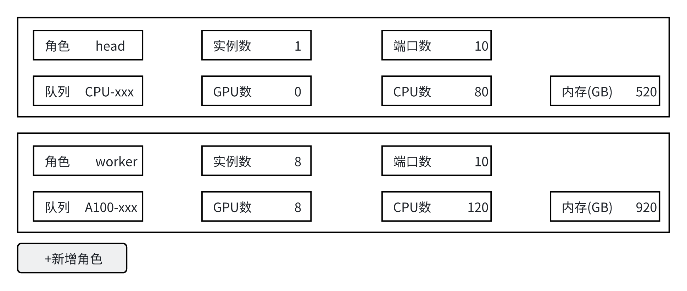

  * 要挂载的云盘

* **高级配置：**

  * 排队优先级

  * 角色指定镜像

  * 禁用IP列表

## 模型部署

**介绍：**&#x652F;持模型服务的部署

**创建时需要填的内容：**

* 模型所在地址

* 服务实例所使用的资源的地区、用户组

* 服务实例所使用的镜像

* 服务实例所使用的GPU、CPU、内存

* 服务实例环境变量

* 服务实例数量

## 数据管理

**介绍：**&#x63D0;供数据集管理的能力

**主要内容：**

* 支持在指定目录创建数据集对象、导入数据集内容

* 数据湖创建和写入内容

## 与传统云计算的区别

* 传统云计算部门着重在pod管理，包括pod如何调度到机器上，如何保障pod单机侧的运行、隔离，如何做在离线业务的混部，如何做自动扩缩容，如何做流量均衡，如何提高CPU资源的利用率，如何做多集群管理。

* 机器学习部门往往是利用云计算部门提供的能力，在上层做作业级别的编排调度、多租户管理。此外会结合机器学习常见做更多的适配。

# 机器学习平台（训练）相关技术分层

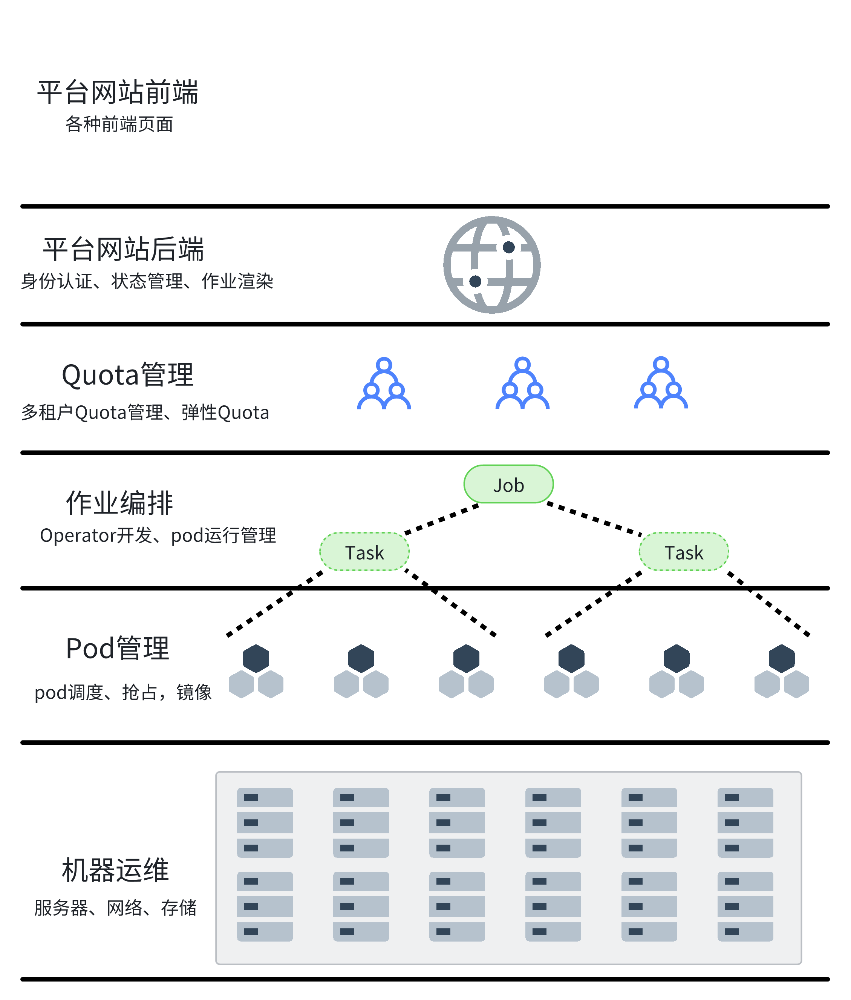

## 平台前端

* 一般是用vue

* 主要是一些作业表单的展示

## 平台后端

* 提供用户权限校验与管理

* 接受用户从前端发送来的作业创建、删除、更新等操作，并将这些事件往后传递

* 记录各作业配置，记录作业与实例的状态

## K8s资源管理与调度

* 作业排队：

  * 作业归属于一个租户，租户资源有限

  * 往往支持排队优先级

  * 支持多种排队策略，往往默认先来先服务

* 作业模板渲染：

  * 需要将排队的作业渲染为一个k8s的job对象

  * 主要渲染的内容包括：label、annotation、**node selector、node affinity**、resource、command、env、volume等

## 作业编排需求

* Operator创建资源：

  * Operator依据Informer机制watch到job对象的创建，然后执行reconcile，创建对应的pod、podGroup、service、ingress、pv、pvc等资源，此外执行反调度，删除掉在blockIP上的pod。

  * 一个作业中的一个pod失败或成功，作业应该执行什么动作？拉起一个新pod？结束整个作业？

* pod的container运行进程管理：

  * 往往不会直接运行用户的脚本，用户的脚本会被放到一个指定的目录文件中

  * pod中主容器的命令往往是会执行一个拉取entry\_point的操作，然后进行节点环境的初始化，如设置基础环境、设置python环境、设置apt源等，然后进行资源与拓扑感知，安装好内部依赖，拉取用户代码，最后才执行用户脚本文件。

### 大模型训练的容错作业编排

* EntryPoint运行完之后也不跑用户命令，而是跑一个Agent进程

* Agent进程会与HouseKeeper进行交互，得到运行命令，如预检命令

* Agent进程会收集当前环境信息，如果有异常可以交由housekeeper进行反调度，删除掉在坏机上的pod进行重新调度

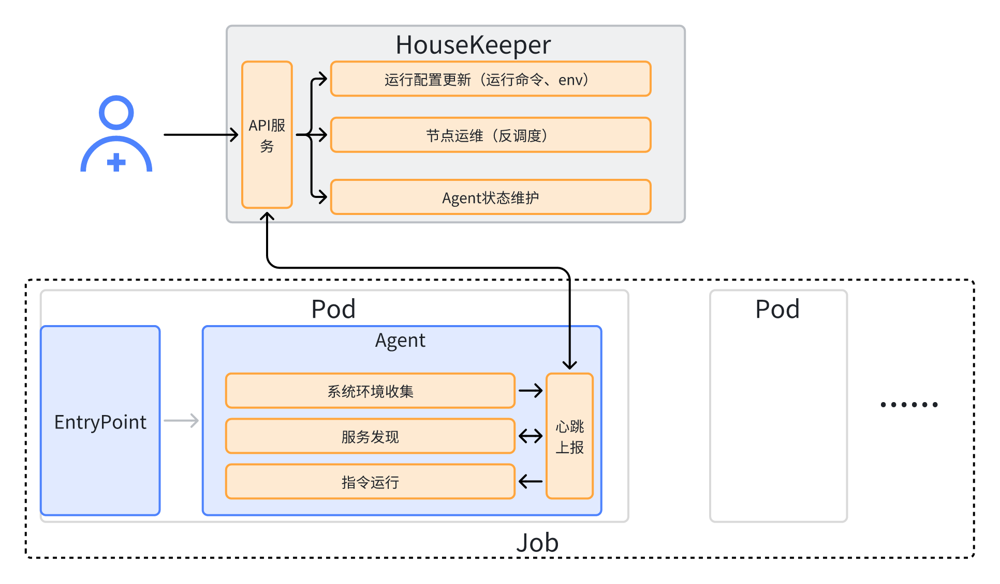

# 机器学习平台（推理）相关技术分层

一般也会有平台、前端、后端、k8s资源管理与调度，此外比较有特色的有：

* **请求接收与调度层**：在最上层，平台负责接收来自用户的推理请求。这些请求通常是对推理任务的组合，系统需要根据不同的推理任务类型、资源需求和优先级进行智能路由，将请求分发到相应的处理服务。推理引擎优化在这里发挥重要作用，能够基于请求内容进行一些加速处理，比如通过模型压缩、量化或动态调整推理策略来提高响应速度。

* **调度编排层**：接下来，调度系统负责将推理任务分配到合适的计算节点上，这涉及到**多角色、多阶段的调度机制**。比如，推理服务可能需要在不同的阶段进行不同的计算，而且有可能多个任务共享同一资源池，因此调度器需要灵活分配资源。此外，**PD分图**和**EP调度**也是关键技术，它们负责将推理任务的执行图划分成可并行处理的子任务，并根据当前资源情况选择最佳执行路径。

* **KVCache管理**：对于频繁调用的模型，可以使用**KVCache-centric调度**来提高性能。这一层主要用于存储和管理缓存，优化数据的重用，避免不必要的计算。在推理过程中，缓存数据库（KVCache）会存储计算结果或中间结果，这样可以减少重复计算，并有效降低延迟。

  * prompt的kvcahe数据库

* **扩缩容管理**：平台还需要支持动态的扩缩容机制，以应对不稳定的负载。在高峰期，需要快速扩容资源，保证系统能处理更多请求；在低谷期，则需要及时回收资源，避免资源浪费。为了实现这一点，平台通常需要基于**实时监控数据**和**负载预测模型**来决定扩缩容的时机和规模。

* **资源潮汐处理与混部**：为了提高资源利用率，平台需要有效管理资源的波动（**资源潮汐**）。通过对资源的动态调度，平台能够根据负载变化，自动将计算任务分配到合适的计算节点上，减少资源空闲的时间。**混部**指的是将不同类型的任务分配到混合资源池中，在保证性能的同时，最大化硬件资源的利用效率。

# 开源社区

## Kubeneters

* 基础中的基础

* 需要看源代码把一个pod从创建到被拉起的过程理清楚

## Volcano

* k8s之上二次开发的经典之作，值得多多研究

## Kubeflow

* https://www.kubeflow.org/

* https://github.com/kubeflow/

* Kubeflow 是2017 年由Google、IBM、才云科技（Caicloud）、Cisco 等公司发起的开源和免费的机器学习平台，目前正在经历从kubeflow1.0向kubeflow2.0的转变

## Kubedl

* https://kubedl.io/

* https://github.com/kubedl-io/kubedl

* 阿里云开源的机器学习平台框架，但是目前属于基本没人维护的状态

# 招聘需求

## **阿里云-Pai**

* 业界一流的机器学习平台，业界认可度高

* 但是传言目前就是在给通义疯狂打黑工，地位向通义让步

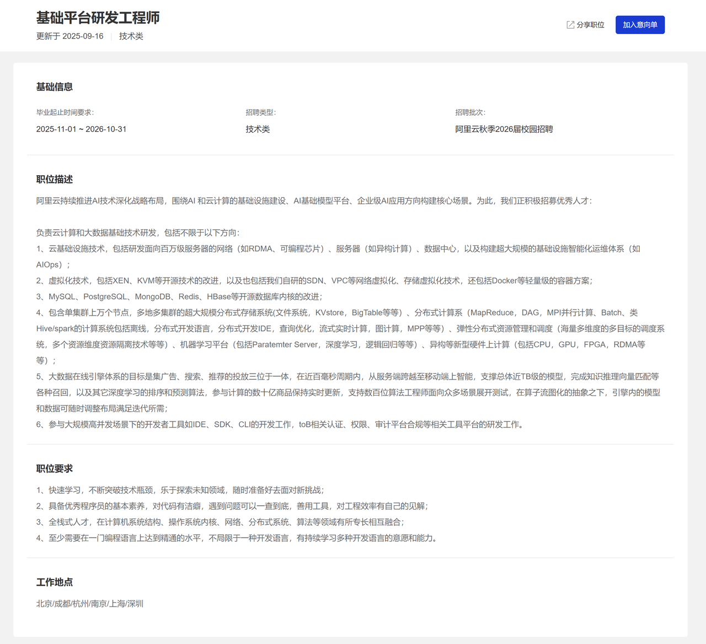

## **字节跳动**

* DATA AML-机器学习平台

* Seed-机器学习平台

* 火山引擎-大模型服务

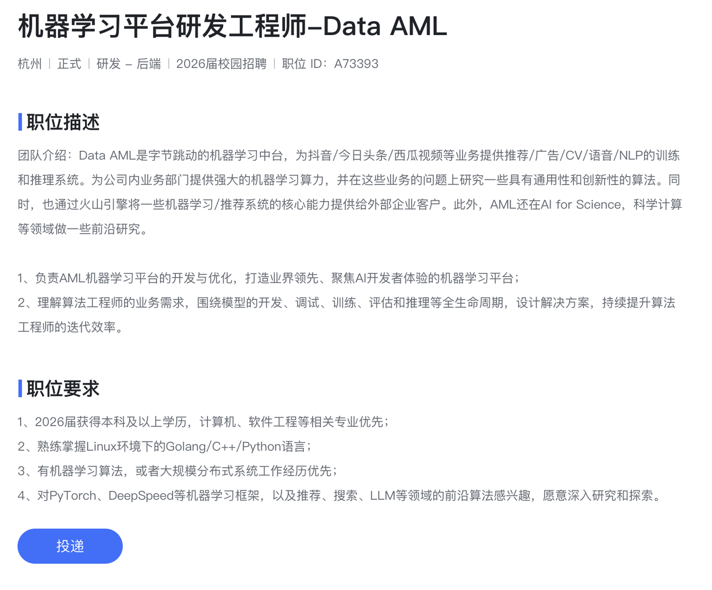

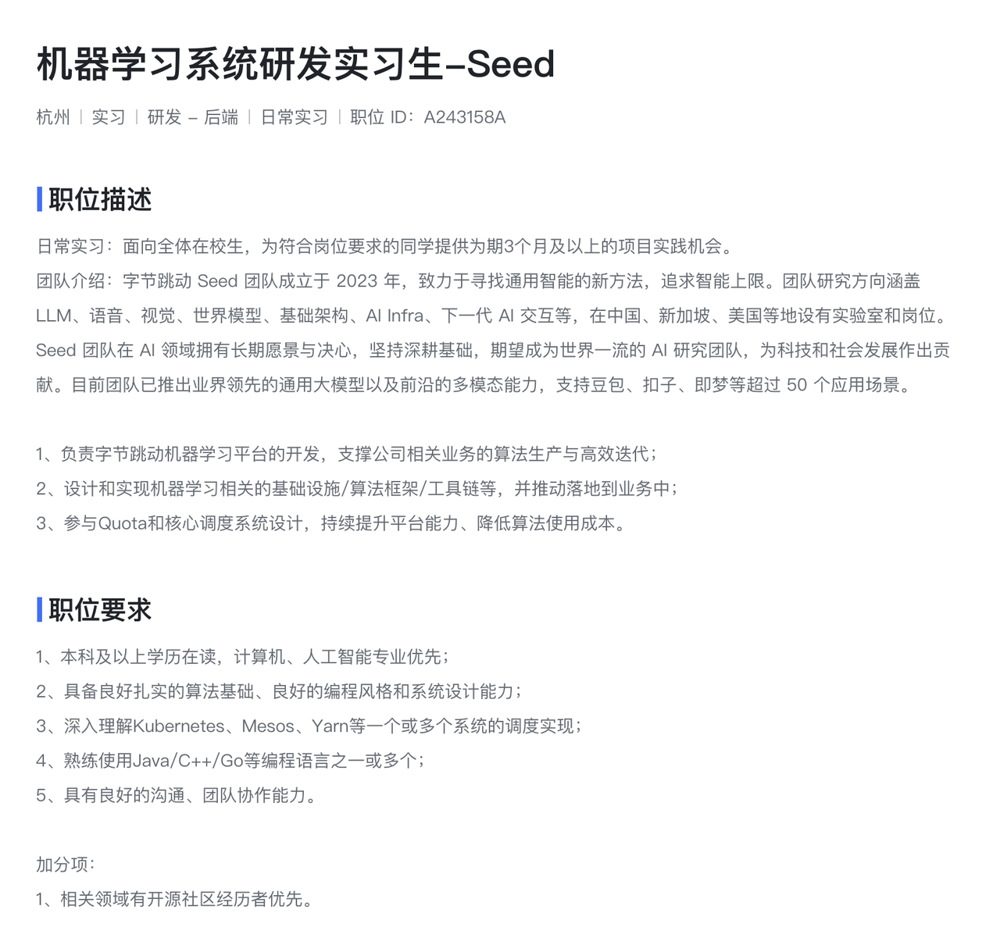

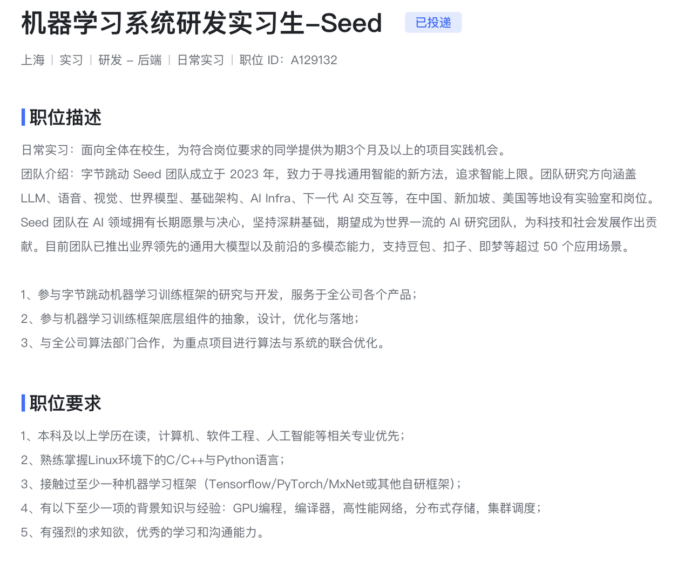

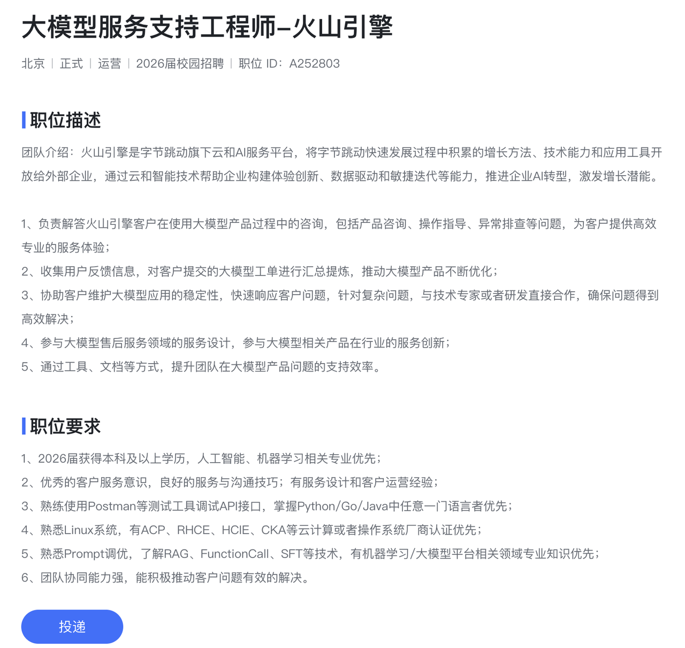

## 腾讯

软件开发-后台开发方向

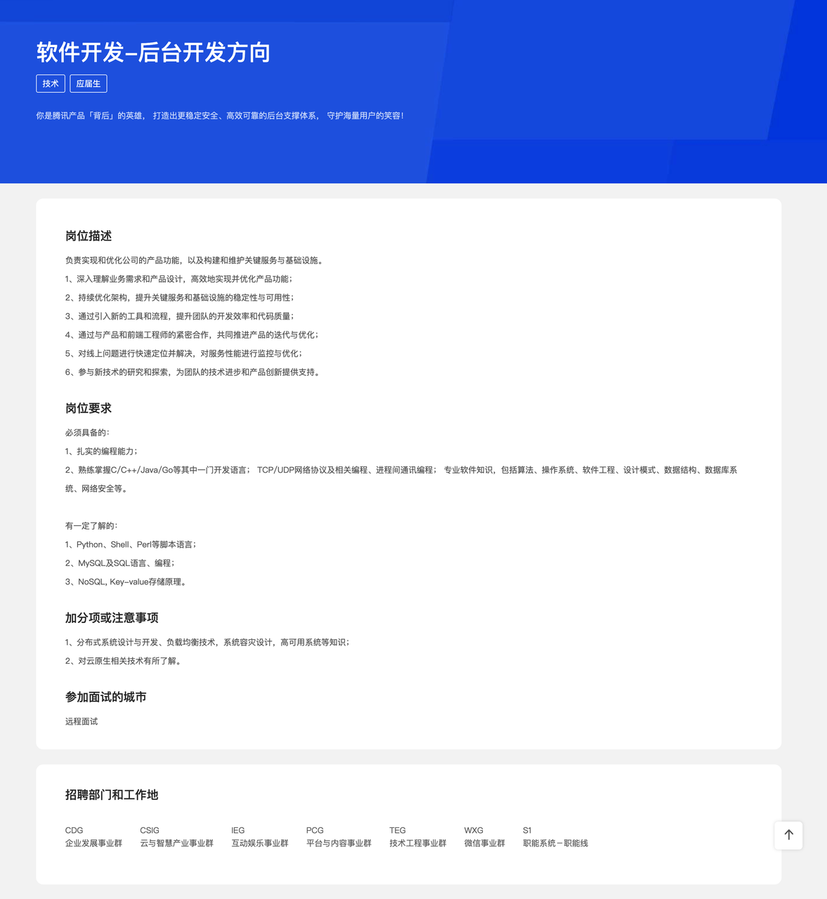

## 美团

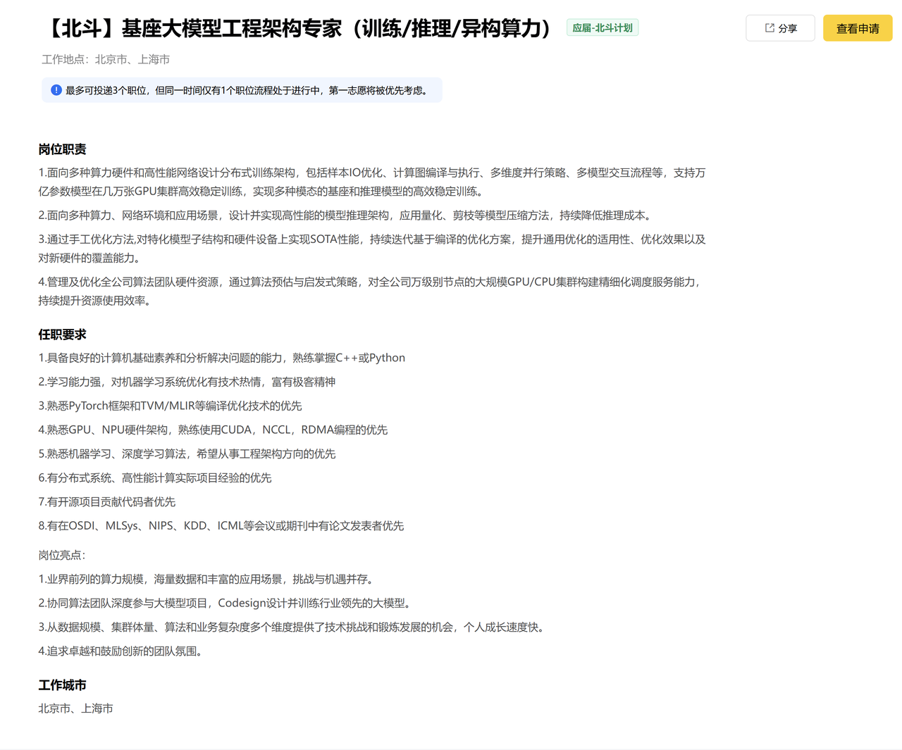

## 快手

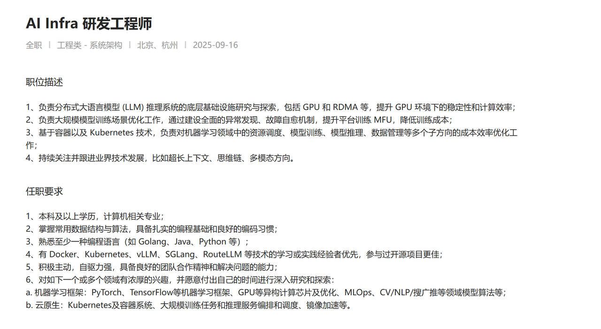

## 小红书

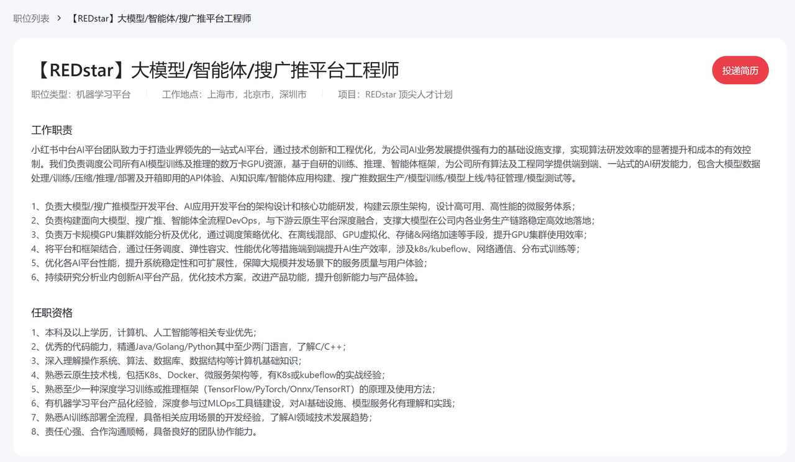

## 其他

| 初创 | DeepSeek | 夯，团队氛围应该很open，但是要求很高              |
| -- | -------- | --------------------------------- |
|    | 米哈游      | 新成立了做大模型游戏的公司                     |
|    | Minimax  | 一般般                               |
| 量化 | 宽德       | 今年2月新成立的大模型部门                     |
|    | 九坤       | 有专门做机器学习平台来卖算力的部门                 |
|    | 明汯       | 不做大模型，只做传统的机器学习量化                 |
| 其他 | 商汤       | 大装置部门专门对外售卖算力以及搭建机器学习平台，有很多To G业务 |
|    | 滴滴       |                                   |
|    | 虾皮       |                                   |
|    | 得物       |                                   |
|    | 京东       |                                   |

# 缺点

* 容易变成运维😓

  * 为什么有资源但是作业调度不上去了，麻烦看看呢

  * 为什么一个实例挂了把整个作业都挂了，麻烦看看呢

  * 推理实例大范围挂掉,P0拉起来!!!

* 夹在上层算法需求与下层云计算团队之间，需要经常扯皮。

* 技术栈广度大，但是深度并没有那么深，需要向上、向下拓展。

