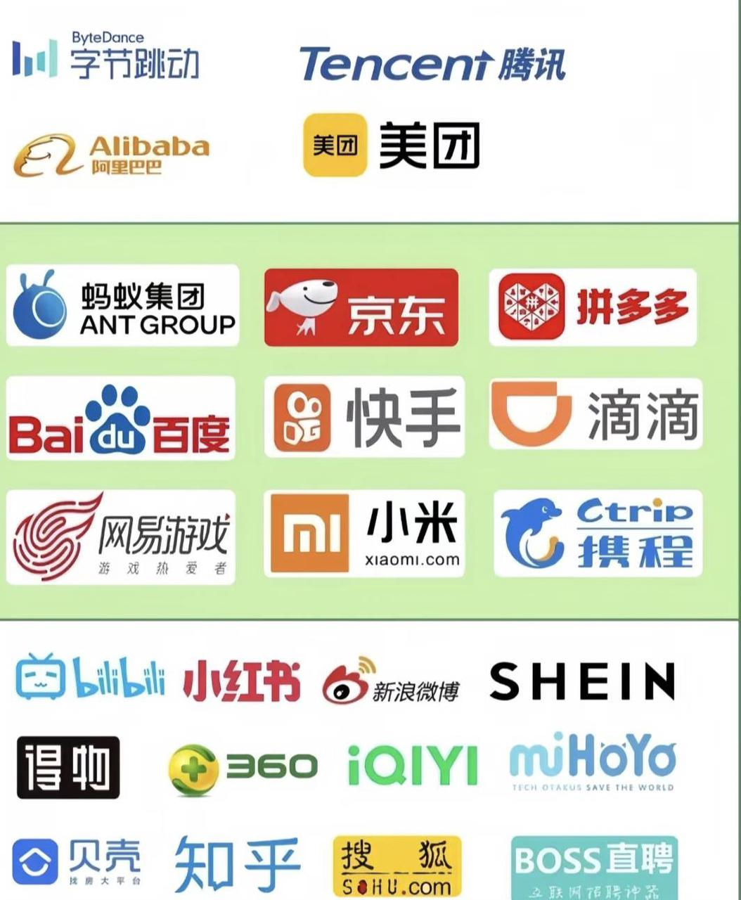

如果穿越回一年前我会...

# 1. 主流大厂

# 2. 方向

从就业难度，岗位数量，薪资水平，就业前景对不同岗位进行分析。

## 2.1 大模型 （应用） 算法

<table>
<thead>
<tr>
<th><strong>夯</strong></th>
<th><ul>
<li><strong>真搜推大模型</strong>（端到端搜推=大模型结构+搜推特征 / 岗位数量不多 / 挺多的 / 未来的趋势，要是能落地就起飞）</li>
</ul></th>
</tr>
</thead>
<tbody>
<tr>
<td><strong>还行</strong></td>
<td><ul>
<li><strong>多模态大模型</strong>（啥是VLM？ / 电商治理+内容治理，整体岗位丰富 / 字节电商治理80 / 跳槽相对简单，需要有业务积累）</li>
<li><strong>领域大模型</strong>（全链路训练 / 场景很多，岗位丰富 / 不太了解 / 业务相关，对业务理解有积累）</li>
</ul></td>
</tr>
<tr>
<td><strong>NPC</strong></td>
<td><ul>
<li><strong>图片/视频生成</strong>（要求论文 / 岗位少 / 不错 / 目前的整体岗位比较少，需要实验室研究方向相关）</li>
<li><strong>AI客服+智能助手</strong>（SFT+RAG / 各个厂都会有 / 还行 / 电子客服，模型效果和公司内部语料相关）</li>
</ul></td>
</tr>
<tr>
<td><strong>拉</strong></td>
<td><ul>
<li><strong>数据标注</strong></li>
</ul></td>
</tr>
</tbody>
</table>

## 2.2 大模型+训练/推理+算法/工程师

<table>
<thead>
<tr>
<th><strong>夯</strong></th>
<th><ul>
<li><strong>Seed / qwen /...</strong>（进不去 / 岗位数量不多 / 挺多的 / 跳槽去哪都行）</li>
</ul></th>
</tr>
</thead>
<tbody>
<tr>
<td><strong>还行</strong></td>
<td><ul>
<li><strong>其他</strong>（需要有相关工程知识，熟悉开源框架 / 岗位数量多 / 挺多的 / 跳槽去哪都行）小红书/字节/腾讯..</li>
</ul></td>
</tr>
<tr>
<td><strong>NPC</strong></td>
<td></td>
</tr>
<tr>
<td><strong>拉</strong></td>
<td><ul>
<li><strong>数据标注</strong></li>
</ul></td>
</tr>
</tbody>
</table>

## 2.3 搜广推算法

<table>
<thead>
<tr>
<th><strong>夯</strong></th>
<th><ul>
<li><strong>AI搜索</strong>（主要是大模型+部分搜索背景 / 岗位不多但是都是比较新的业务 / 挺多 / 后续感觉会干掉传统搜索引擎）</li>
</ul></th>
</tr>
</thead>
<tbody>
<tr>
<td><strong>还行</strong></td>
<td><ul>
<li><strong>搜广推</strong>（机器学习内容 / 岗位多但是结构比较垂直 / 没大模型多 / 尝试结合大模型，但是短期落地困难）</li>
</ul></td>
</tr>
<tr>
<td><strong>NPC</strong></td>
<td></td>
</tr>
<tr>
<td><strong>拉</strong></td>
<td></td>
</tr>
</tbody>
</table>

# 3. 准备

### 一、大模型应用算法岗

#### 1. 真搜推大模型（端到端搜推）

* **核心准备**：

  * 基础：Transformer 架构、GQA 注意力机制、双塔 / DSSM 模型、对比学习。

  * 业务：用户行为序列建模、搜推特征融合（文本 + 点击日志）。

#### 2. 多模态大模型（VLM）

* **核心准备**：

  * 模型：CLIP、Qwen-VL、BLIP 系列原理，InfoNCE 损失函数，模态对齐方法、多模态数据清洗、幻觉问题解决方案。

#### 3. 领域大模型（全链路训练）

* **核心准备**：

  * 流程：预训练（领域数据筛选）→SFT→RLHF 全链路逻辑。

#### 4. 图片 / 视频生成

* **核心准备**：

  * 基础：Stable Diffusion 扩散模型原理、去噪过程，时空注意力机制、生成模型评估（FID/LPIPS）。

#### 5. AI 客服 + 智能助手（SFT+RAG）

* **核心准备**：

  * 技术：LoRA 微调、RAG 全流程（文档切割 + 向量存储）。

### 二、大模型训练 / 推理工程师岗

#### 1. 基础模型开发（Seed/Qwen 等）

* **核心准备**：

  * 架构：MoE 混合专家模型、Transformer 并行（张量 / 序列并行）。

  * 训练：DeepSpeed ZeRO 显存优化、梯度累积、超参数调优。

  * 工具：Megatron-LM、Hugging Face Trainer。

#### 2. 推理优化与工程落地

* **核心准备**：

  * 优化：INT8 量化、结构化剪枝、知识蒸馏、VLLM、SGLang。

  * 部署：ONNX Runtime、Triton 推理服务、K8s 集群调度。

### 三、搜广推算法岗

#### 1. AI 搜索（大模型 + 搜索背景）

* **核心准备**：

  * 基础：BERT 意图识别、ColBERT 向量检索、BM25 算法。大模型改写 query、多模态召回逻辑。

#### 2. 传统搜广推（机器学习 + 大模型结合）

* **核心准备**：

  * 机器学习基础知识，各种loss和emb。

  * 经典模型：DeepFM、DIN、FM 特征交叉。

  * 融合：BERT 生成用户 Embedding、多任务学习。

# 4. 时间

暑期前攒一段 - 4月暑期 - 8月秋招 - 11月补录 - 2月春招

暑期前攒一段：推荐字节，攒一段大厂实习暑期的录取概率会高很多。

暑期推荐：腾讯，淘天，小红书。淘天和腾讯的秋招hc少，基本都是暑期转正。

秋招：早投。淘天和腾讯基本都留暑期实习了。

