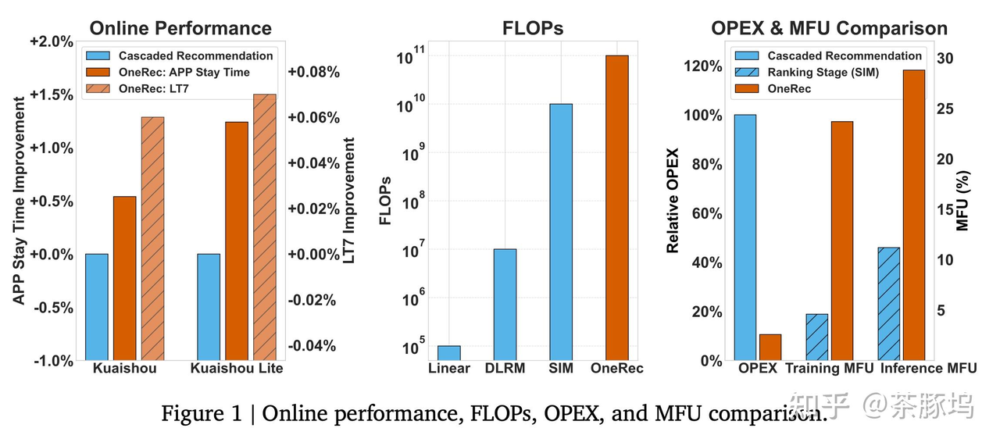
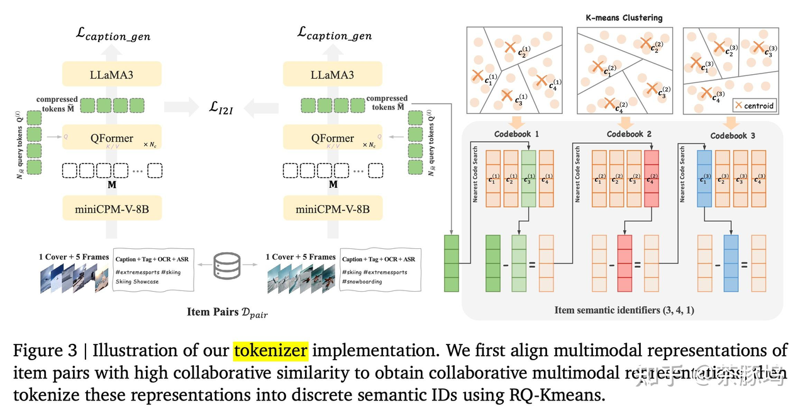
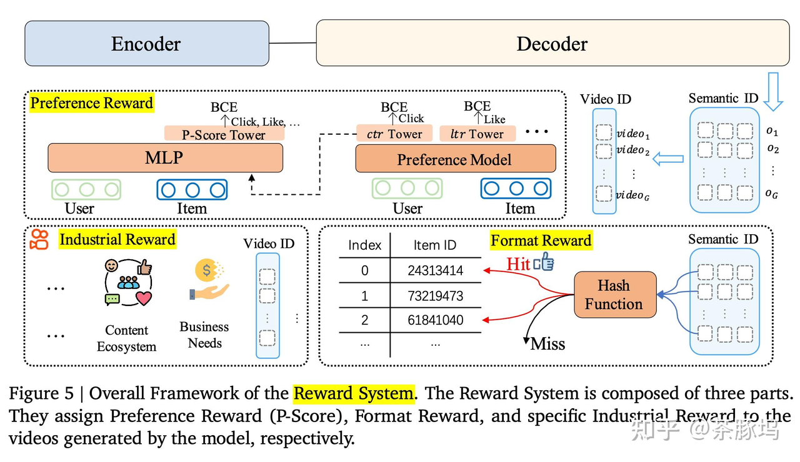

### 1. 论文简介

**论文标题：**&#x4F;neRec: Unifying Retrieve and Rank with Generative Recommender and Preference Alignment
**发表时间：**&#x32;025-02
**论文地址：**[https://arxiv.org/abs/2502.18965](https://link.zhihu.com/?target=https%3A//arxiv.org/abs/2502.18965)
**核心逻辑：**&#x4F20;统推荐级联（召回->粗排->精排）复杂且存在目标不一致 -> 提出端到端生成式框架，采用Session-wise生成策略替代逐点预测，并结合RL对齐用户偏好 -> 在快手主站落地，用户观看时长提升1.6%。
**关键词：**`[End-to-End Generative]` `[Session-wise Generation]` `[Preference Alignment]`

### 2. 摘要

推荐系统多年来已被广泛应用于各种大型面向用户的平台。在过去十年中，推荐技术已从传统的基于启发式规则的方法发展到深度学习模型，显著提高了推荐的准确性。然而，与人工智能领域的快速发展相比，推荐系统近年来并未实现突破性进展。例如，它们仍然依赖于多阶段级联架构，而非[端到端方法](https://zhida.zhihu.com/search?content_id=259883838\&content_type=Article\&match_order=1\&q=%E7%AB%AF%E5%88%B0%E7%AB%AF%E6%96%B9%E6%B3%95\&zhida_source=entity)，导致计算碎片化和优化不一致。此外，这种级联结构也阻碍了人工智能领域关键突破性技术在推荐场景中的有效应用。**&#xA;**&#x4E3A;了解决这些问题，提出了 OneRec，通过端到端的生成式方法重塑推荐系统。在此新架构下，我们取得了令人瞩目的成果。首先，我们将当前推荐模型的计算 FLOPs 提升了 10 倍，并在一定边界范围内识别出了推荐系统的扩展规律。其次，原本难以应用于优化推荐的强化学习（RL）技术在此框架中展现出显著潜力。最后，通过基础设施优化，我们在旗舰级 GPU 上训练和推理期间分别实现了 23.7% 和 28.8% 的模型 FLOPs 利用率（MFU），与大语言模型（LLM）社区的水平相当接近。该架构显著减少了通信和存储开销，使得运营成本（OPEX）仅为传统推荐流水线的 10.6%。OneRec 已部署于快手/快手轻量版 APP 中，处理25%的QPS，分别提升了整体 App 使用时长 0.54% 和 1.24%。此外，我们还观察到诸如 7 天留存时间（LT7）等关键推荐体验指标的显著提升。我们还提供了在开发、优化和维护具有重大现实影响的大规模推荐系统过程中获得的实践经验与洞察。

### 3. 引言

传统的推荐模型仍然依赖于多级级联架构 (参见图2的顶部)，而不是端到端的方法。它们面临着几个限制，这些限制阻碍了它们的最佳性能:

碎片化的计算。级联结构存在计算效率低的问题。我们对资源分布的综合分析，以Kuaishou为案例研究，揭示了服务期间超过50% 的资源被分配给通信和存储，而不是高精度计算。这种对非计算任务的显著分配凸显了当前架构中根本的低效率。此外，专门用于计算的资源，特别是对于计算密集型排名模型，表现出明显的低利用率。特别是，该模型的训练和推理MFU在旗舰GPUs上分别仅为4.6% 和11.2%，大大低于在大型语言模型 (LLMs) 中观察到的效率。其中H100上的MFU约为40%。这种差异强调了推荐系统中计算任务资源利用的低效率。此外，由于高QPS要求 (大于400k) 和低延迟要求 (小于500ms)，推荐模型通常局限于在较小的规模上运行，并且不需要计算密集型。这种操作约束进一步限制了高精度计算的潜力，从而影响推荐系统的整体性能和可扩展性。

目标碰撞。什么样的优化目标对应于“好的”推荐结果没有明确的定义，这导致了以下冲突： 1）目标冲突：除了点击率和观看时间等常见的优化目标之外，用户、创作者和平台生态系统之间还有竞争的目标（快手有数百个目标）。这些目标在系统各个阶段相互干预，逐渐破坏了系统的连贯性，并增加了复杂性和操作效率低下。 2）跨阶段建模冲突：即使在模拟相似目标时，由于各个阶段模型的结构和大小不同，也会产生冲突。例如，检索阶段的有效性可能会受到排序模型限制的影响，而排序模型又可能受上游结果次优的影响。这凸显了在整个推荐系统中需要更统一的优化目标和模型结构以确保一致性和效率的重要性。 落后于AI进化。尽管在LLM和视觉语言模型 (VLM) 领域取得了显著进展。scaling law，强化学习等，现有的级联推荐框架对采用这些经过验证的技术有基本的架构障碍。这种结构不匹配在推荐系统和主流人工智能进步之间造成了越来越大的差距，限制了最先进方法的潜在性能提升。

为了解决传统级联推荐架构面临的挑战，我们提出了OneRec（见图2的底部部分），这是一种新型的推荐系统，通过将检索和排名过程集成到一个统一的框架中来克服级联排序系统的局限性。

级联方法系统通常涉及诸如检索、预排序和排序等阶段，每个阶段都可能采用多个策略或模型。相比之下，OneRec采用编码器-解码器架构，在奖励模型的指导下以端到端的方式生成用户首选的视频。

单级编码器-解码器生成框架。这种方法具有以下特点：

* 端到端优化：该系统的设计既具有端到端的特性，又足够简单，能够直接针对最终目标进行优化。

* 计算效率：该方法以计算强度为重点，严格优化训练和推理阶段的计算利用率，从而充分利用计算能力提升带来的好处。 我们的新框架产生了几个重要的发现：

* 通过广泛的基础设施优化，我们在训练和推理期间在旗舰gpu上实现了23.7% 和28.8% 的MFU，分别代表原始排名模型的5.2倍和2.6倍改进，显著缩小了与LLM社区的差距。更重要的是，这种端到端的架构大大减少了不必要的通信和存储开销，导致其OPEX仅为传统复杂推荐管道的10.6%。目前，它在Kuaishou/[Kuaishou Lite](https://zhida.zhihu.com/search?content_id=259883838\&content_type=Article\&match_order=1\&q=Kuaishou+Lite\&zhida_source=entity)应用程序的主要场景中的部署管理了大约25% 的总QPS，在应用程序停留时间上提供了0.54% 和1.24% 的改进，同时改善所有核心指标 (包括用户参与度、视频冷启动和分发平衡)，展示全面的性能提升。

* 我们将当前推荐模型的计算FLOPs提高了10倍。通过这个过程，我们确定了推荐系统的缩放规律。这一发现为如何提高推荐系统性能提供了宝贵见解 优化模型大小和计算资源，确保在各种操作环境中高效、有效地部署。

* 强化学习（RL）技术在传统架构中曾表现出有限的影响，现在却在我们的框架内展现出巨大的潜力。我们进行了广泛的离线和在线性能比较实验，并开发了特定的应用实践以满足现实工业迭代需求。这些实施使系统能够利用RL，从而提高了适应性和性能。

### 4. 架构

#### 4.1. 分词器

##### 4.1.1 多模态表示

对齐的协同感知的多模态表示（Aligned Collaborative-Aware Multimodal Representation）

我们通过将协作相似物品对的多模态表示进行对齐，来整合多模式内容和协作信号，如图3（左）所示。因此，我们需要准备多模式表示、物品对以及对齐策略：

* 多模态表达。我们为每个视频整合了多模态输入: 标题、标签、ASR (语音到文本) 、OCR (图像到文本) 、封面图像、和5个均匀采样帧。

* Item pairs。我们通过以下方式构建高质量的物品对数据集Dpair：1）用户到物品的检索：对于每个用户，我们将积极点击的目标物品与该用户最新历史正向点击中协作相似度最高的物品配对；2）物品到物品的检索：我们将具有高相似性分数（例如Swing相似性）的物品进行配对。

* 物品到物品损失和标题损失(Item-to-Item Loss and Caption Loss)。我们引入了双重训练目标：1）物品到物品的对比损失对协作相似的视频对(i, j)∈Dpair的表示进行对齐，捕捉行为模式，2）标题损失通过使用LLaMA3作为解码器对视频标题进行下一个令牌预测来防止幻觉，从而保留内容理解能力。

##### 4.1.2 Tokenization

我们利用RQ-Kmeans(Luo et al., 2024)进行标记化，该方法采用残差量化以粗到细的方式生成语义ID。这种方法通过直接在残差上应用K-means聚类来构建代码本。图3（右）提供了RQ-Kmeans过程的说明。

#### 4.2. 编码器Encoder

ncoder的核心任务是将用户庞杂、多尺度、长周期的行为历史，压缩成一个固定维度的、信息丰富的用户兴趣表示，作为后续Decoder生成推荐内容的上下文。为此，OneRec设计了一个精巧的多尺度特征工程体系。

* 多尺度特征工程：用户的行为被分为四个不同的通路进行处理，每个通路捕捉不同时间尺度和互动深度的用户偏好：

  * 静态通路（User Static Pathway） ：包含用户ID、年龄、性别等基本不变的画像特征。

  * 短期通路（Short-term Pathway） ：处理最近的次互动，捕捉用户即时的、上下文相关的兴趣。

  * 正反馈通路（Positive-feedback Pathway） ：处理最近的次高价值互动（如点赞、关注等），聚焦于用户明确表达的强偏好。

  * 生命周期通路（Lifelong Pathway） ：这是最具挑战性的部分，旨在处理长达10万次的用户历史行为。直接对如此长的序列使用注意力机制是不可行的。OneRec采用了一种分层压缩策略：首先对用户的超长历史物料表示进行层次化K-means聚类，将海量行为压缩为约2000个聚类中心代表；然后，再使用一个[QFormer](https://zhida.zhihu.com/search?content_id=259883838\&content_type=Article\&match_order=1\&q=QFormer\&zhida_source=entity)结构将这2000个代表性行为序列进一步压缩为个向量。

#### 4.3. 解码器

Decoder接收Encoder输出的用户表示，并以自回归的方式，逐个生成目标推荐视频的语义ID序列。

* point-wise生成范式：对于一个待预测的视频，其真实的语义ID序列前加上一个特殊的起始符，构成Decoder的输入和目标。Decoder通过层Transformer结构，在每一步预测下一个语义ID。其核心结构包括：

* 因果自注意力（Causal Self-Attention） ：使得当前Token的预测只能依赖于已经生成的Token。

* 交叉注意力（Cross-Attention） ：将Encoder输出的用户表示作为Key和Value，融入到解码的每一步，从而使生成过程受到用户兴趣的引导。

* MoE前馈网络：使用混合专家（MoE）进行扩展：为了在不显著增加单次推理计算量的前提下，大幅提升模型的容量和表达能力，OneRec在Decoder的前馈网络（FFN）部分采用了MoE（Mixture of Experts）层。

#### 4.4. 奖励系统

预训练模型仅通过下一个token预测来拟合已曝光物品空间的分布，而这些曝光物品是来自过去传统的推荐系统。这导致模型无法突破传统推荐的上限。为了解决这一问题，我们引入了基于奖励系统的偏好对齐方法，使用基于策略的强化学习在生成的物品空间中训练模型。通过奖励机制，模型能够感知更细粒度的用户偏好信息。我们引入了三种奖励：偏好奖励用于对齐用户兴趣，格式奖励用于确保生成结果的格式尽可能合法，特定行业奖励用于满足某些特殊行业场景的需求。

##### 4.4.1 用户偏好对齐

> 问题：传统方法通过人工设定权重来融合点击、时长、点赞等多个目标，这种方式既不精确也缺乏个性化，且常常导致目标间的冲突。
> 解决方案（P-Score） ：OneRec设计了一个专门的“偏好模型”（Preference Model），它不再预测单个指标，而是学习一个综合性的、个性化的“偏好分数”（P-Score）。该模型以一个多目标排序模型（SIM）为基础，将各子目标的隐状态与用户、物料特征融合，最终输出一个能整体衡量用户满意度的分数。这个P-Score被用作RL中的核心奖励信号。
> 优化算法（[ECPO](https://zhida.zhihu.com/search?content_id=259883838\&content_type=Article\&match_order=1\&q=ECPO\&zhida_source=entity)） ：为了使用P-Score奖励来稳定地优化生成模型，OneRec提出了一种名为ECPO（Early Clipped Group Relative Policy Optimization）的算法。它是对[GRPO](https://zhida.zhihu.com/search?content_id=259883838\&content_type=Article\&match_order=1\&q=GRPO\&zhida_source=entity)的改进，核心思想是通过“提前裁剪”那些具有负优势（negative advantage）且策略比率过大的样本，来防止梯度爆炸，从而增强训练的稳定性。

在推荐系统中，定义一个 “好的推荐” 比确定一个数学解决方案的正确性更具挑战性。传统方法 (Chang等人，2023; Wang等人，2024) 通常定义多个目标，例如点击、喜欢、评论和观看时间。然后通过对每个目标的预测值 (xtr) 进行加权融合，将它们组合成分数。然而，手动调整这些融合权重具有挑战性，不仅缺乏准确性，而且缺乏个性化，并且经常导致目标之间的优化冲突。

为了解决这些限制，我们建议使用神经网络来学习个性化的融合评分，称为p-score (偏好评分)(Cao等人，2025)。这个模型的整体框架如图5 (中间) 所示。该模型的基础架构基于基于搜索的兴趣模型 (SIM)(Pi等人，2020)。它包括多个塔，每个塔专用于学习特定目标。在训练期间，这些塔使用相应的目标标签作为辅助任务计算二进制交叉熵 (BCE) 损失。

##### 4.4.2 生成格式规范化

> 问题（“挤压效应”） ：一个在实践中发现的微妙问题是，当RL通过负向奖励来惩罚“坏”的生成结果时，可能会导致模型概率分布的“挤压效应”（Squeezing Effect）。模型为了避开受惩罚的区域，会把概率质量过度集中在少数几个它认为“好”的区域，这反而会压低其他“合法但次优”的Token的概率，导致模型生成大量无法映射回真实视频的非法ID序列，生成合法率一度低于50%。
> 解决方案（格式奖励） ：为了解决这个问题，OneRec引入了一个简单而高效的“格式奖励”。对于模型生成的样本，如果是合法的（可以映射到视频ID），就给予一个固定的正向优势（advantage=1）；如果是非法的，则直接丢弃，不参与梯度更新。这个机制直接鼓励模型在合法的ID空间内进行探索，避免了挤压效应。

在生成推荐中，合法性比例是指可以映射到实际物品ID的生成语义ID序列的比例。这个指标对于评估生成的稳定性至关重要。实际上，语义ID序列Nt Lt的基数远大于视频的基数。这确保了所有物品的覆盖，并且更大的词汇表引入了更多的参数，从而提高了性能。然而，这也可能导致在推理过程中生成没有对应物品ID的语义ID序列，即非法生成。

##### 4.4.3 工业场景对齐

在工业场景中，推荐系统不仅需要考虑用户的偏好，还需要考虑其他各个方面。例如，在Kuaishou，视频社区的生态系统、商业化需求以及冷启动和长尾视频的交付。传统的推荐系统试图通过在推荐管道的某个阶段应用算法或策略来解决这些问题。由于不同阶段的不一致性，这很容易导致意想不到的问题交替出现的循环。工程师被迫通过修补不断进行调整，导致系统随着时间的推移变得臃肿，阻碍迭代。在OneRec中，我们只需要将优化目标纳入奖励系统，并采用强化学习来执行有针对性的优化。这种方法不仅方便，而且允许端到端实施，维护系统的一致性。
