# Awesome-Cloud 周刊（第 3 期）：顶刊顶会-EuroSys

这里简单记录每周分享的前沿内容，不定期发布。

## 目录
- [Awesome-Cloud 周刊（第 3 期）：顶刊顶会-EuroSys](#awesome-cloud-周刊第-3-期顶刊顶会-eurosys)
  - [目录](#目录)
  - [封面](#封面)
  - [EuroSys概述](#eurosys概述)
    - [EuroSys基本信息](#eurosys基本信息)
    - [ASPLOS基本信息](#asplos基本信息)
  - [EuroSys会议分析](#eurosys会议分析)
    - [疑问1：投稿难度](#疑问1投稿难度)
    - [疑问2：覆盖面与侧重点](#疑问2覆盖面与侧重点)
    - [其它-EuroSys认可度](#其它-eurosys认可度)
  - [EuroSys论文分析（近五年论文）](#eurosys论文分析近五年论文)
    - [EuroSys重点研究领域](#eurosys重点研究领域)
      - [按征稿领域分类](#按征稿领域分类)
      - [按关键词分类](#按关键词分类)
      - [本小组相关文献分类](#本小组相关文献分类)
    - [EuroSys重点论文](#eurosys重点论文)
  - [问答环节记录](#问答环节记录)

---

## 封面

## EuroSys概述

### EuroSys基本信息
- 会议等级：CCF-A 顶级会议。*【疑问 1：CCF-A 难吗？有多难？】*
- 会议主题：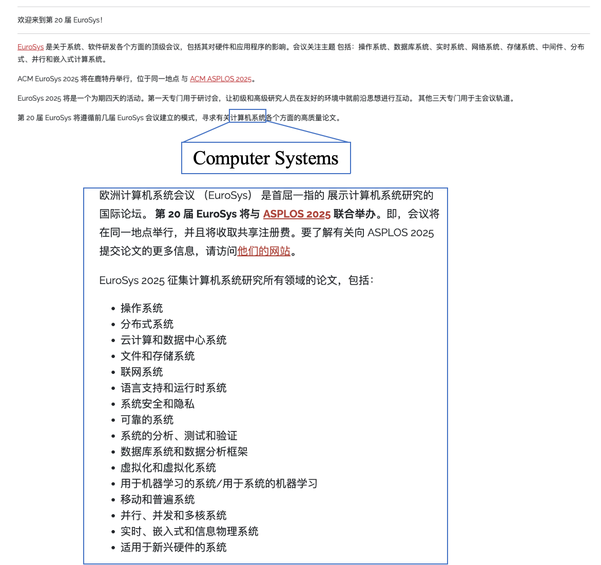
- 会议投稿时间：一年两次，春季与夏季。2025年与ASPLOS联合举办。
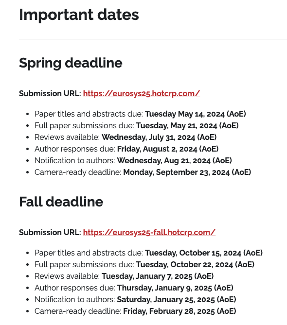

### ASPLOS基本信息
- 会议等级：CCF-A 顶级会议。
- 会议主题：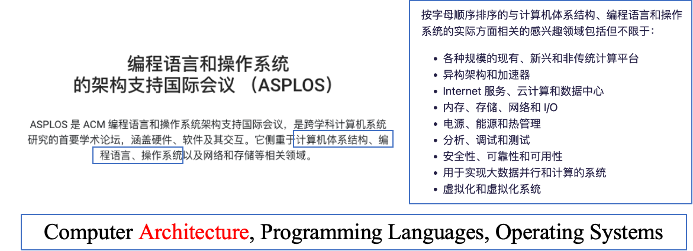*【疑问 2：看起来主题覆盖计算机全领域？到底侧重点是什么？】*

## EuroSys会议分析

### 疑问1：投稿难度
- 系统领域顶会 vs AI领域顶会
  - EuroSys投稿与录用情况 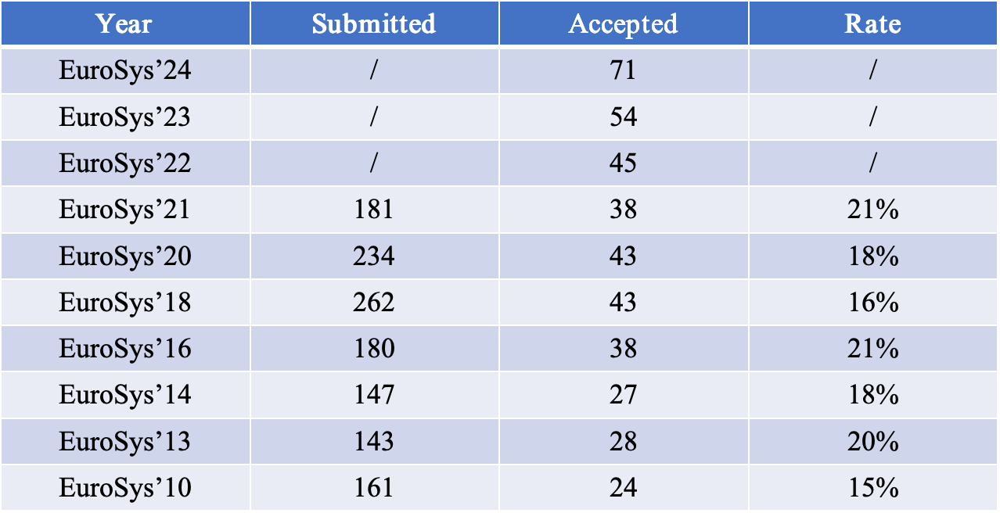
  - CVPR投稿与录用情况 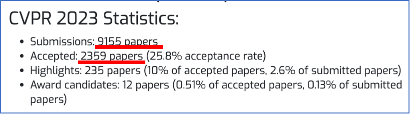
  - ICCV投稿与录用情况 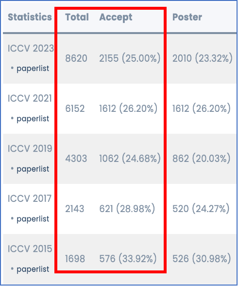

### 疑问2：覆盖面与侧重点
- **疑问：**看起来EuroSys和ASPLOS两个会议的投稿主题覆盖计算机全领域，但实际上到底有什么侧重点？
- **材料1：**由多次担任编委的 Timothy Roscoe 提出的[观点](https://www.sigarch.org/reflections-on-eurosys-2020/)： 
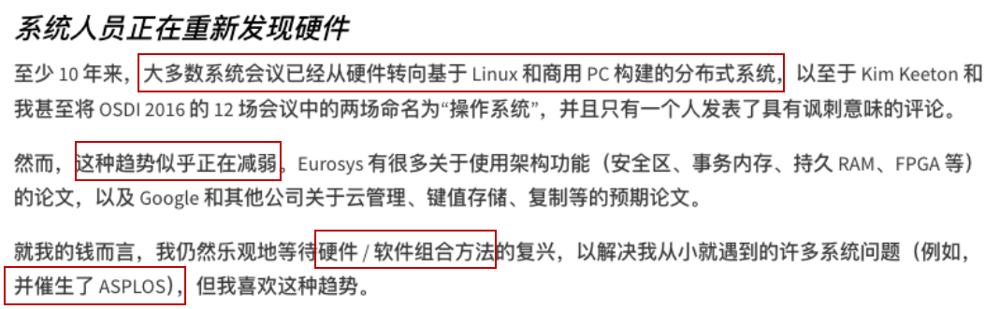
  - 1.系统研究涵盖硬件与软件。 
  - 2.过去十多年来更偏向软件领域。
  - 3.存在软硬件协同的研究趋势。 
  - 4.ASPLOS重在狭义的“计算机架构 Computer Architecture”对其它内容的支撑。 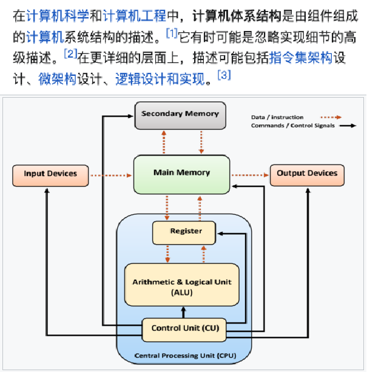
- **材料2：**CCFRank中关于[“在OS领域恢复EuroSys和ATC顶会称号的倡议”](https://github.com/emeryberger/CSrankings/issues/638)
  - 1.ASPLOS重在狭义的“计算机架构 Computer Architecture”对其它内容的支撑。 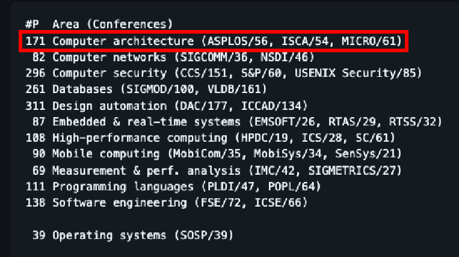
  - 2.EuroSys属于OS领域，但更通用、涵盖领域更广。 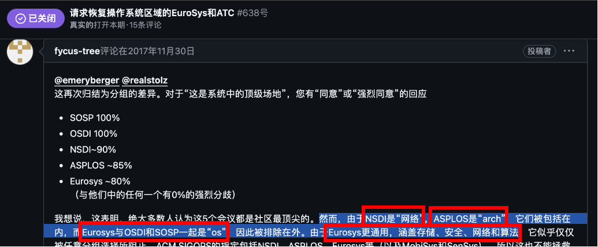

### 其它-EuroSys认可度
- 被业界认可的情况：
    - 阿里云 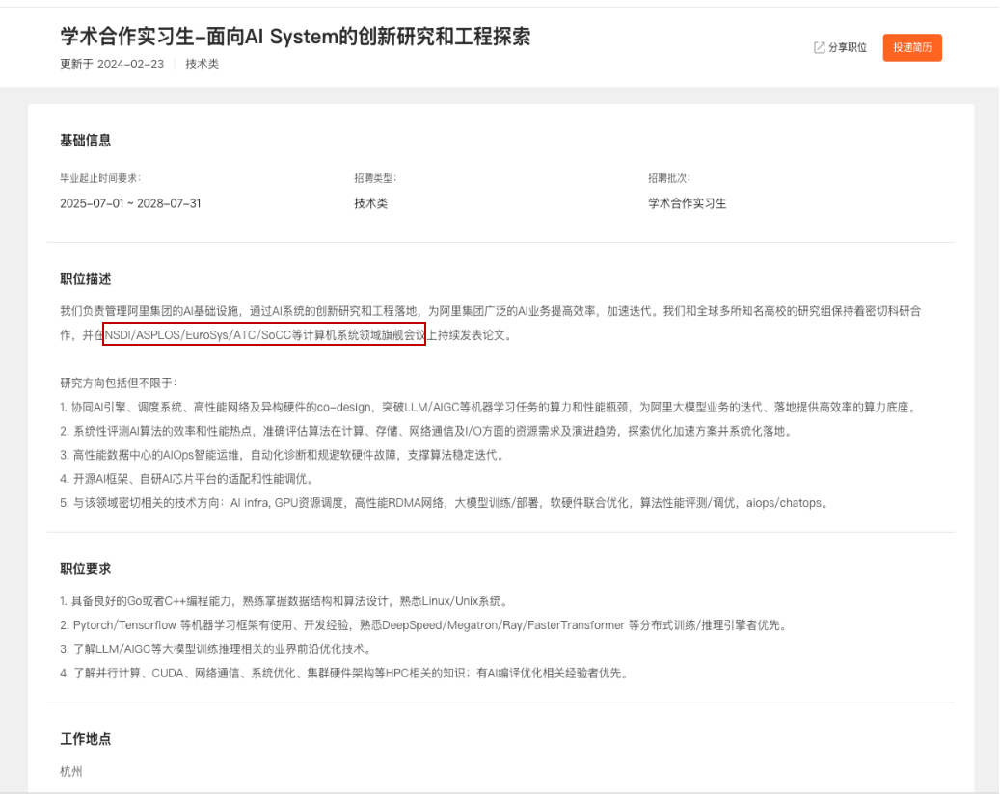
    - 中国移动云 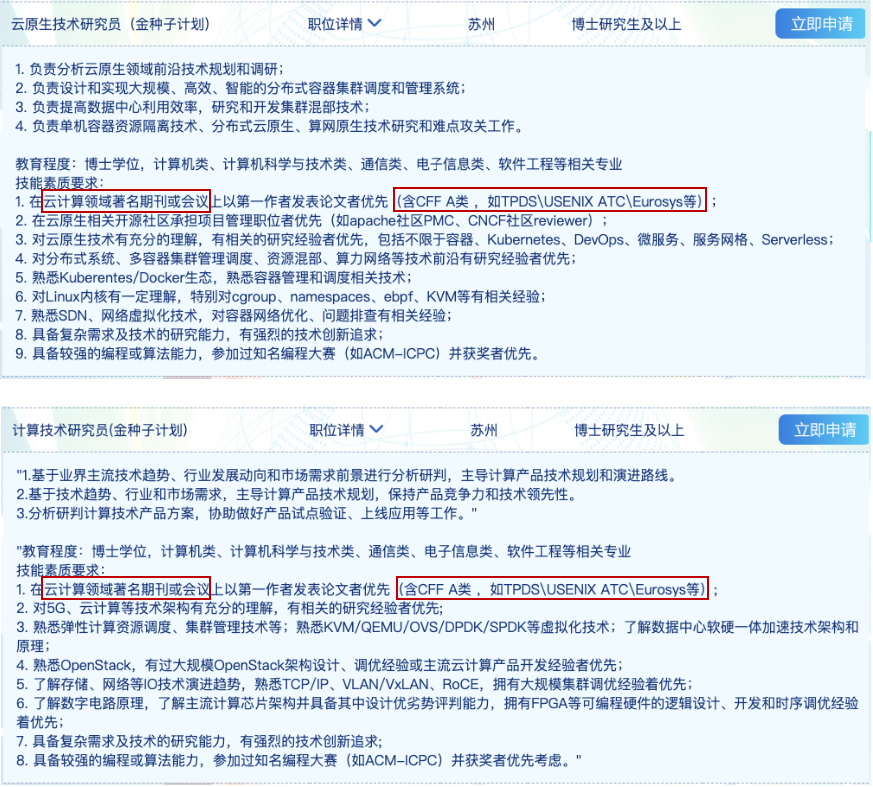
- 被学界认可的情况：
  - 学术组织（CCF评级：A 类） 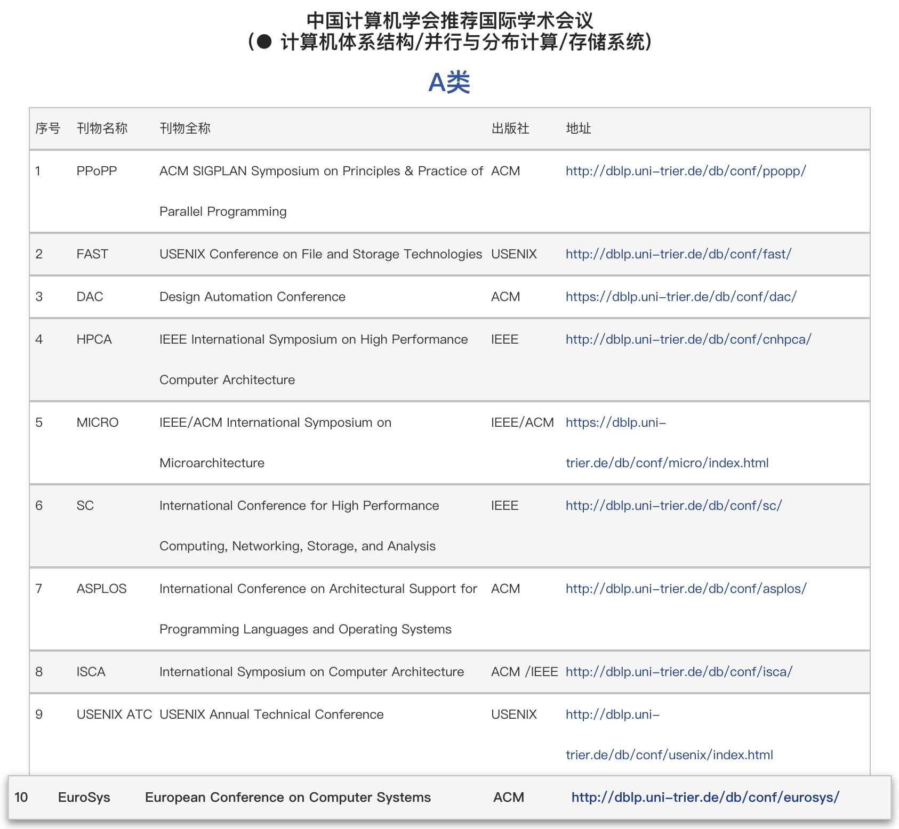
  - 民间组织（论坛：CS 领域最负盛名的会议之一） 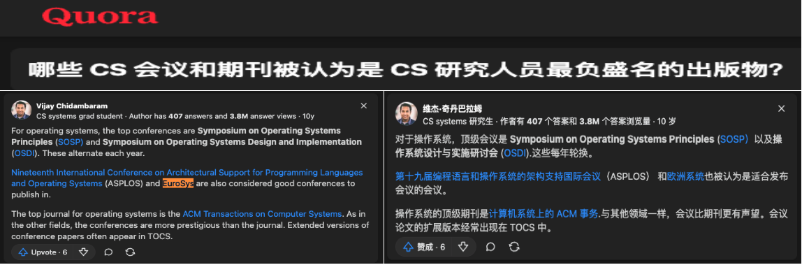

## EuroSys论文分析（近五年论文）

### EuroSys重点研究领域

#### 按征稿领域分类
* 分类： 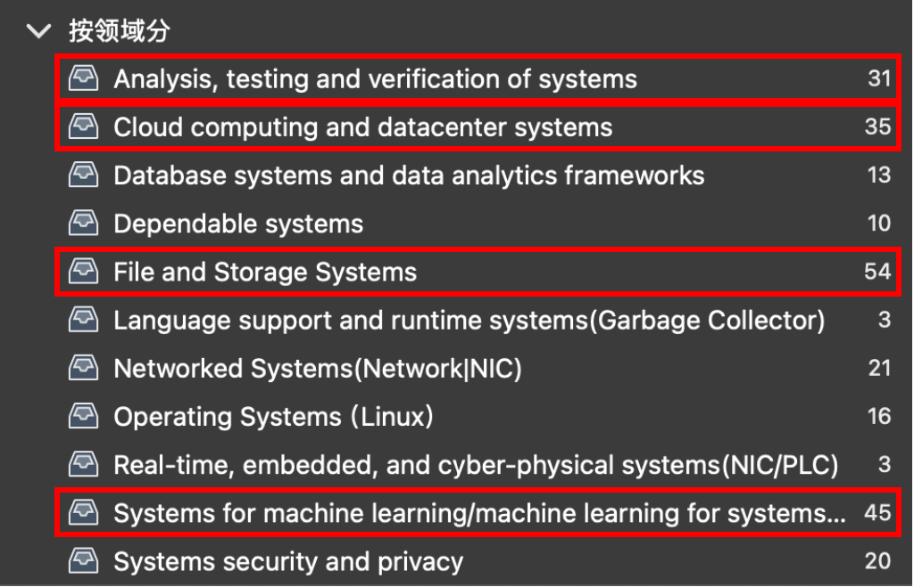
* 结论： 最热门的四大领域为 - 存储与数据、AL、云与分布式、系统分析检测。

#### 按关键词分类
* 分类： 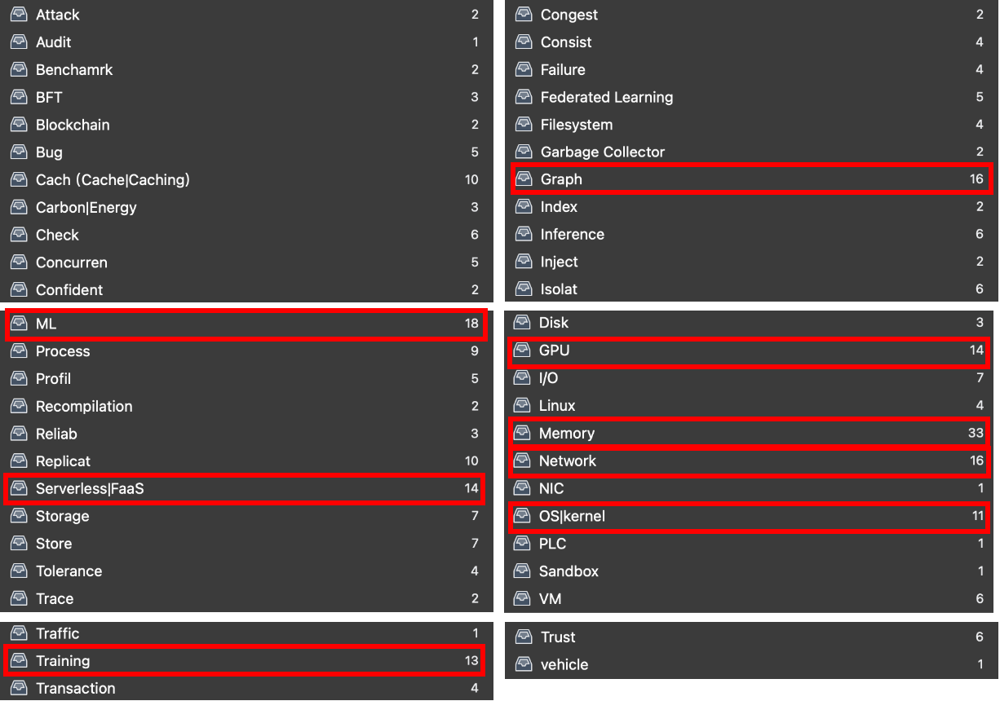
* 结论： 标题中的关键词非常零散，与内存、GPU相关的论文最多。

#### 本小组相关文献分类
- 将与本小组相关的论文进行分类： 
  - **按任务特点划分：** 
    - 异构任务混合（如 ForML、渲染、视频流、车联网等）。
    - 特殊任务（如超参数调优、虚拟机无感更新、Serverless 函数扩展）。
  - **按资源特点划分：** 
    - 异构资源混合。
    - 大规模资源管理。
    - 跨地域/混合云资源及存算联合优化。
  - **按问题领域划分：** 
    - 预测/评估：如异构张量的性能预估、API 流量的资源需求预测。
    - 动态伸缩/迁移：如跨地域迁移的碳排放优化、复杂微服务的伸缩。
    - 静态部署/调度：如集群级混合调度。

### EuroSys重点论文
- 将与本小组相关的论文中，与ML相关的7篇论文进行了略读与总结：
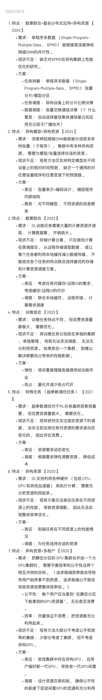

---

## 问答环节记录

1. 看现有重点文献基本都是对特点很鲜明的任务，是不是面向通用任务的研究很少？
   - 确实有这个趋势，一方面是具体到渲染、视频流、车联网、ML训练或推理之类的特殊任务，另一方面对于通用任务也是有特点的任务例如在离线任务混合。
2. 云计算领域有没有专门的顶级会议？和我们最相关的就是系统吗？
   - 根据正文中的分类，其它领域和我们的相关性都不够大，系统已经是和我们最相关的领域了。 
   - 会议方面，有一小部分[和云计算领域相关会议](https://stefan-kolb.github.io/cloud-conferences/)，但其中与“云计算”紧密相关的一小部分会议中，评级最高的也只有 [SoCC（CCF-B）](https://acmsocc.org)。
   - 期刊方面，有一些和云计算领域相关的顶级Trans系列汇刊，例如 [TPDS（CCF-A）](https://ieeexplore.ieee.org/xpl/RecentIssue.jsp?punumber=71)、[TSC（CCF-A）](https://ieeexplore.ieee.org/xpl/RecentIssue.jsp?punumber=4629386)、[TCC（CCF-C）](https://ieeexplore.ieee.org/xpl/RecentIssue.jsp?punumber=6245519)。