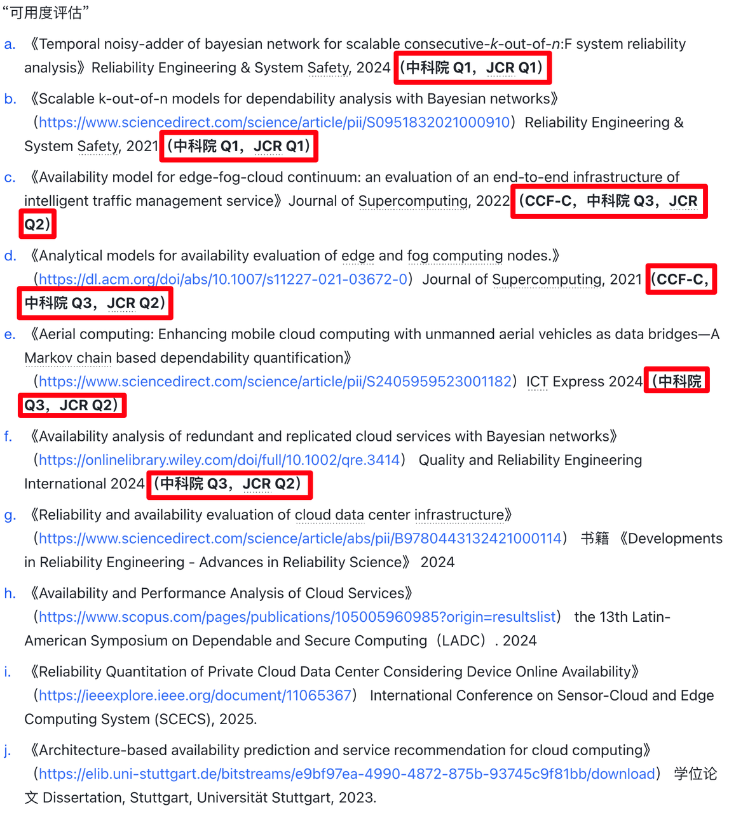
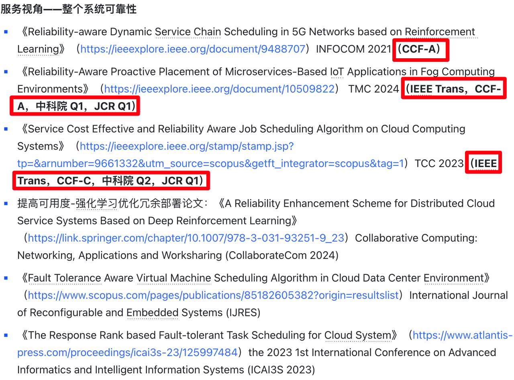
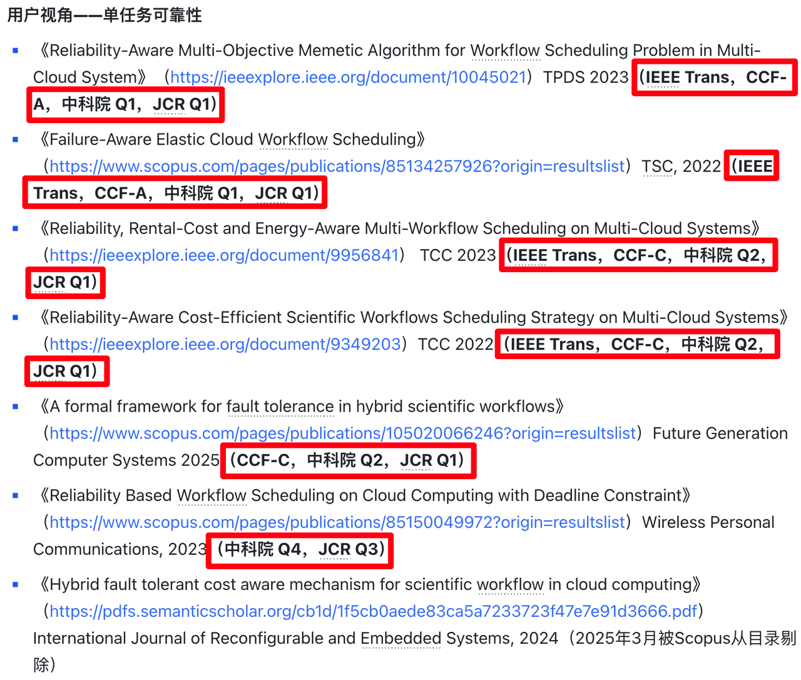
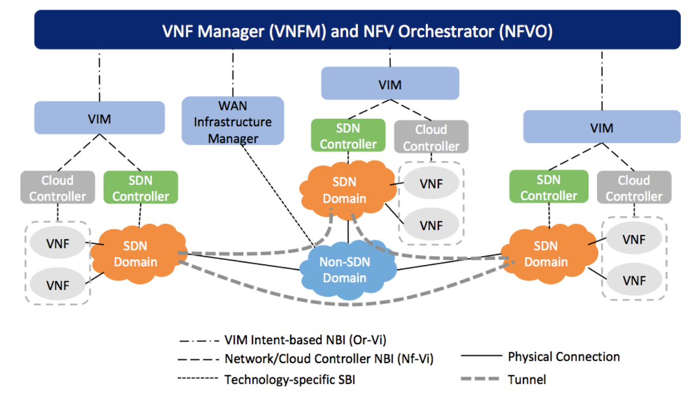
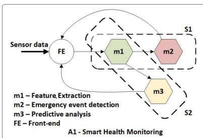
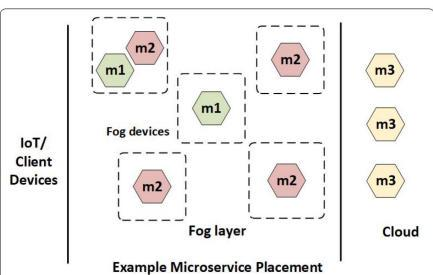
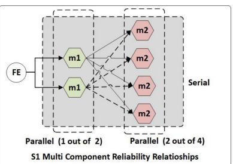
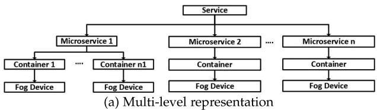
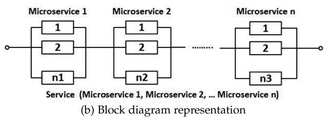

# Awesome-Cloud 周刊（第 30 期）：前沿论文-可靠性感知调度部署

这里简单记录每周分享的前沿内容，不定期发布。

## 1. 学界可靠性领域现状

* **仅“可靠性评估”问题，少有顶刊顶会，且与工业界脱离：**

  

* **在“可靠性评估”问题下游的“可靠性优化”（部署、调度）问题反倒被关注更多，不过同样与工业界脱离：**

  

  

## 2. 可靠性感知及服务部署——3篇顶刊顶会典型代表

* **网络**：《Reliability-aware Dynamic Service Chain Scheduling in 5G Networks based on Reinforcement Learning》INFOCOM 2021 **（CCF-A）**

* **云端：**《Service Cost Effective and Reliability Aware Job Scheduling Algorithm on Cloud Computing Systems》TCC 2021 **（IEEE Trans，CCF-C，中科院 Q2，JCR Q1）**

* **边缘：**《Reliability-Aware Proactive Placement of Microservices-Based IoT Applications in Fog Computing Environments》 TMC 2024 **（IEEE Trans，CCF-A，中科院 Q1，JCR Q1）**

### 2.1 网络

#### 📚 **《Reliability-aware Dynamic Service Chain Scheduling in 5G Networks based on Reinforcement Learning 基于强化学习的5G网络中可靠性感知动态服务链调度》**

2021 年 华南理工大学、香港理工大学团队 发表于 CCF-A 类会议 infocom。

#### 🎯需求

* **传统网络架构：**&#x7F51;络功能是通过**专用硬件设备（中间盒 middle boxes）**&#x5B9E;现的。

  * 这增加了网络服务提供商的资本和运营成本，同时引发了网络耦合问题。

  * **当出现一种新的服务时**，必须按照某种顺序**部署和连接**相关硬件设备。这种**手动操作**非常耗时、昂贵且容易出错，阻碍了服务增加和网络升级的运营。

* **现代网络架构：**&#x4E3A;了应对这一挑战，软件定义网络（Software Defined Networking，SDN）和网络功能虚拟化（Network Function Virtualization，NFV）在网络架构演变中扮演了重要角色。

  * **SDN：灵活的网络连接**

  * **NFV：灵活的网络功能**

    * **具体组成**：由一系列具体功能**虚拟网络功能（Virtual Network Functions，VNF）**&#x7EC4;成**服务功能链（Service Function Chain，SFC）**&#x4EE5;转发流量，提供网络服务的灵活性。通过不同的VNF序列的流量将建立多个SFC，可以支持各种网络服务，如防火墙、负载均衡器、深度包检测（DPI）、入侵检测系统（IDS）等。

    * **好处 1 —— 通用：**&#x4E;FV将网络功能的实现从专用硬件转移到基于软件的组件（即虚拟网络功能VNF）。VNFs是在**通用商品服务器**（例如，基于x86的系统）上运行的抽象网络功能，**无需特定硬件设备**。

    * **好处 2 —— 灵活：**&#x4E;FV使SFC中使用的软件实现的网络功能**虚拟化**。SFC采用NFV以提供高效有效的网络功能**部署和编排**。IETF SFC工作组（RFC 7665）和开放网络基金会（ONF）提出了SFC架构规范，展示了在运营商网络、移动网络和数据中心网络中的用例。

  

  * VIM ：虚拟基础设施管理器（Virtualized Infrastructure Managers）。

* **现代网络架构下挑战**：在SFC中，最重要的一个问题是在计算节点之间**部署VNF**并**调度到达的请求**，以实现低延迟和高可靠性。

  * SFC调度问题在许多研究中已被广泛讨论，但由于5G网络对**低延迟和高可靠性**的要求，执行SFC调度具有挑战性。

  * **矛盾**：SFC调度器必须更加智能，以在延迟和可靠性之间取得平衡。

    * 为了提高网络服务的**可靠性**，SFC执行需要额外的**冗余VNF实例**。

    * 这些冗余实例占用更多计算资源，从而增加了其他网络服务的**等待时间**。

#### 🧱现状

* 现有工作考虑的是**静态网络**，并假设所有SFC请求都提前已知，这是不切实际的。

  * **需求**：考虑在动态网络环境中，SFC请求随机到达的在线调度问题。

    * 计算节点应**切换其部署**的VNF**类型**以满足 incoming SFC请求中的新类型VNF。

      * 然而，在计算节点上重新部署各种VNF并非无**成本**；节点必须**关闭之前的**VNF并**设置新的**VNF，这引入了额外的**重新部署时间**。

  * **现有研究问题1**：现有网络模型假设节点在整个时间槽中**只能托管单一类型**的VNF。它们没有考虑计算节点上VNF的**重部署**。

    * 这种静态部署策略导致在动态变化的SFC请求下网络资源利用效率低下。

  * **现有研究问题2**：此外，一些现有研究考虑了计算节点上的重新部署，但**忽略**了**重新部署的时间成本**。如果重新部署频繁发生，将花费大量时间在重新部署上，增加请求的延迟。因此，解决方案应平衡延迟和重部署。

#### ✈️创新

* 为了解决上述问题，本文提出了一种通过将**冗余部署数量决定**与**SFC调度**分离的高效方法。

  * 对于前者，本文提出了一种启发式算法来决定VNF的冗余性，同时最小化延迟。

  * 对于后者，本文开发了一种基于策略梯度的强化学习方法，旨在将这些VNF放置在计算节点上，以最大化SFC请求的成功率。

  * 进一步地，本文设计了一种不同于现有研究的RL方法，学习SFC调度策略，以提高SFC请求的成功率。

    * 在相关工作中，动作确定哪个节点应该部署VNF，动作空间的大小固定为计算节点的数量。我们方法中的RL动作是简单地决定是否推迟VNF的执行。因此，我们的RL模型可以扩展到任意数量的计算节点，而无需修改RL网络模型。

#### 🚑可靠性

* **可靠性是5G网络的关键性能指标，定义如下：**

  * VNF的执行可能会因硬件或软件故障（例如，物理机器的意外重启/关闭、网络断开、软件错误等）而中断。本文考虑采用主动-主动冗余方案来提高可靠性，该方案部署了多个同一VNF的实例同时运行。

  * 根据现有研究ETSI定义的可靠性模型，VNF的可靠性是**至少一个冗余子组件可用的概率**。

    * 定义θ为**每个计算节点的可靠性**，它指定了在节点上成功完成VNF的概率。

    * 然后，**VNF的可靠性**定义为：

      $$r _ {f} = 1 - \prod_ {i} ^ {R _ {f}} (1 - \theta) \tag {1}$$ 
      其中 $r_f$ 是 VNF $f$ 的可靠性， $R_f$  是  $f$  的冗余。

    * 对于一个**端到端服务SFC**，可靠性是构成SFC的VNF可靠性的乘积。因此，SFC的可靠性是：

      $$R _ {i} = \prod_ {v \in s} \left[ 1 - \prod_ {j} ^ {R _ {v}} (1 - \theta) \right] \tag {2}$$

      $v$ 指定SCF $s$ 中的VNF之一，$R_{v}$ 是 $v$ 的冗余度。在这种情况下，实例化的冗余实例越多，SFC的可靠性越高。

    * 然而，网络中VNF实例数量过多会导致日志队列时间增加（costs a log queue time），由于网络资源的限制，导致端到端延迟更大。因此，平衡冗余和延迟之间的权衡非常重要。

* **理想化假设：**

  * 在这篇论文中，本文将**虚拟机（VM）**&#x89C6;为一个**计算节点**，它可以在**物理服务器**上运行。

  * 为了简化，本文假设每个**计算节点**一次只能托管一个**VNF**。

  * 此外，本文假设**所有计算节点**具有相同的可靠性 **θ**。

* **可靠性目标：**

  * 当一个SFC请求到达时，本文的问题是决定每个VNF的冗余度，并将这些VNF实例放置在节点上。一个节点可以通过 redeployment 延迟 Δ 来切换其 VNF 类型（即重新部署）。为了提高VNF的可靠性，我们可以部署多个称为冗余VNF的VNF实例。冗余VNF可以在不同的节点上运行，或者在同一节点上重新运行。

#### 📊效果

* 通过广泛的模拟评估了我们方法的有效性。结果表明，提出的RL解决方案相比Baseline可以将成功率提高18.7%。

#### ⛳️未来机会

* 目前模型过于简化，考虑多资源网络环境（即带宽、CPU和内存），并在这一现实模型中解决SFC调度问题。

### 2.2 云端

#### 📚《Service Cost Effective and Reliability Aware Job Scheduling Algorithm on Cloud Computing Systems 云计算系统上的服务成本效益和可靠性感知作业调度算法》

2021 年（21年投稿+录用，23年正式发表） 长沙理工大学、新加坡科技研究局（A\*STAR）、新加坡国立大学团队 发表于 CCF-C 类期刊 TCC。

#### 🎯需求

* 如今，越来越多的服务通过云计算系统以按使用付费的模式提供给个人和组织。这种业务服务范式面临着几个云服务质量（QoS）挑战，如可靠性、成本和响应时间。

  * 随着按需虚拟化IT基础设施（如服务器、存储和数据库）的快速部署，越来越多的云服务通过有线和无线互联网以按使用付费的模式提供给个人和组织。

  * 得益于云计算这种资源交付模式，其中所有资源，如机器、网络、应用、软件、平台，都可以作为服务提供。

  * 类似于社会经济服务，云服务质量（QoS）要求，如安全性、可靠性、能耗和成本，是云服务提供商面临的关键挑战，这些挑战吸引了企业和学术界越来越多的关注。

* 在这些挑战中，**可靠性和成本**是云用户和提供商的两个关键关注点。

  * 有几种类型的意外事件可能会影响云服务的可靠性，包括服务延迟、服务中断、服务错误、数据丢失和长时间响应时间。

  * 这些事件不仅会影响云计算供应商的服务可靠性，还可能导致重大经济损失和某些有害的社会影响，例如Netflix、AWS、华为、Twitter、腾讯和Facebook最近的故障。Ponemon研究所报告称，**2016年IT计算系统故障的平均成本约为740,357美元**。

  * 这主要是因为云计算系统面临着不可避免的风险和故障，如软件故障、硬件故障、虚拟机（VM）故障。这些故障反过来可能会延迟或导致云服务级别协议（SLA）违规，并损害整个云服务处理系统。此外，某些云服务由成千上万的细粒度任务组成，任何这些任务的失败都可能影响整个云服务的可靠性。

  

#### 🧱现状

* 提高云服务可靠性的最常见机制是**主/备份（PB）容错技术**。然而，这种可靠性增强技术不可避免地导致多次复制，从而导致高服务成本。

  * 解决云服务可靠性问题的著名技术之一是容错技术，该技术通过在发生故障时利用一个或多个备份来确保云服务连续性。通过将服务（或作业）调度到不同的虚拟机（VM）上，可以实现云系统的容错。

    * 云服务可能有多个副本；因此，它对少数故障具有容错性。传统的容错机制是主/备份（PB）方法，其中每个云服务都调度在一个主虚拟机和备份虚拟机上。

    * 然而，基于多个副本的可靠性增强技术需要利用更多的冗余系统虚拟机，这不可避免地导致高云服务成本。

  * 一个有效降低成本的方法是在主/备（PB）方法中**仅备份部分服务**。从实际角度来说，现代云计算系统的可靠性相对较高，大多数云服务请求通常可以成功完成。

    * 因此，我们只需要分析和预测由云虚拟机处理的**低可靠性**云虚拟机服务，并将这些服务备份到其他虚拟机上。在这种情况下，我们可以确保云服务的可靠性，并尽可能大幅度降低相应的服务成本。

    * 这个问题的关键在于**准确分析云计算系统中虚拟机的物理资源可靠性**，并**预测虚拟机的软件故障**。

1. 大部分研究在**优化 QoS**，没有考虑优化可靠性

   * 最近，云用户以及云服务提供商对云计算系统的服务质量(QoS)问题，如能耗、安全性、成本、响应时间、资源利用率和可靠性等，给予了越来越多的关注。这些QoS问题对云计算系统的性能有重要影响。

     * 在论文A中，作者提出了多准则决策模型，用于对云服务的多个QoS属性进行排序，以辅助系统选择。在大多数情况下，我们只关注这些QoS属性中的一部分。

     * G. L. Stavrinides和H. D. Karatza提出了一种节能、QoS感知且成本有效的调度策略，旨在通过节能的方法降低云用户成本，从而提升云计算系统提供商的性能。

     * 在论文C中，作者介绍了一种方法，将相同服务类型的云请求打包到同一个虚拟机(VM)中，这种方法可以在保证QoS的前提下提高资源利用率和降低能耗。

     * G. Xie等人则专注于云系统中时间消耗和可靠性相关的QoS感知任务调度。

     * 在论文E中，针对响应时间的QoS约束，S. Long等人提出了一种最佳响应算法(BRA)，用于优化协作边缘和云系统中的总成本。

     * P.K. Sahoo等人设计了一种基于链路的虚拟资源管理(LVRM)算法，根据可用和所需资源将虚拟机映射到物理机上。

     * H. Xu等人则关注恶意攻击和安全保护机制，以提升云系统的安全性QoS。

   * 这些研究成果表明，QoS感知的方法可以有效提升云计算系统的性能，并满足云用户的多样化需求。因此，提升云服务的QoS是一项有意义的研究工作。

2. 小部分研究在**优化可靠性**，但是是粗粒度地优化

   * 作为云计算系统服务质量的重要组成部分，云服务可靠性也受到学术界和工业界的关注。

     * **检查点技术**是提高服务可靠性的一种方法，它定期将执行状态保存为镜像文件。然而，由于云计算系统中虚拟机规模庞大，这种方法会消耗大量的存储空间。

     * 另一种有效的可靠性保障机制是**基于复制的容错技术**，它试图将每个主虚拟机映射到一个或多个备份虚拟机。

       * 在论文F中，作者提出了一种根据应用服务性能需求的最优虚拟机放置方法；此外，这种方法还能容忍k个主机服务器故障。

       * X. Zhu等人根据云特性扩展了传统的PB技术，并构建了一个实时工作流容错模型。

       * 与上述PB方法不同，A. Zhou等人提出了一种OPVMP策略，以提高云服务执行可靠性并提供k-容错保障。

     * 这些不考虑刻画可靠性的容错策略不可避免地导致更高的计算成本。事实上，大多数云服务能够成功完成，这是由于实际云计算系统的高可靠性，只有少数需要容错。

     * 相比之下，本文提出的调度策略试图分析和预测云服务的执行可靠性，**仅备份低可靠性服务**。因此，我们只需要备份少数云服务，从而提高服务可靠性并降低整个系统的计算成本。

3. 为了**细粒度优化可靠性**，需要**评估并预测可靠性**，已有研究对物理资源分析、但缺乏对软件故障分析

   * 为优化可靠性，一个好的方法是分析并预测云服务的执行可靠性，并将备用虚拟机分配给可靠性低的服务。

   * 计算系统可靠性分析，尤其是物理资源，是一个经典的研究课题。

     * A. Dogan和F. Özgüner正式分析了异构计算系统的可靠性，并提出了一个可靠性感知的动态级别调度算法。这项研究为在物理资源上对云服务执行可靠性分析提供了一个重要的研究方向。

     * Z. Wen等人使用指数分布来在联邦云上构建工作流可靠性模型。

     * 在本文前的工作中，我们采用了威布尔分布来构建异构集群应用程序可靠性分析模型。

     * X. Li等人使用排队论和图论在云数据中心上构建了一个服务可靠性模型。

     * H. Balla等人提出了一种可靠性增强的资源分配策略，该策略可以有效地适应云系统中的动态变化。

   * 然而，上述策略主要关注**物理资源分析**，没有考虑**虚拟机软件故障**。这项工作不仅关注虚拟机物理资源的可靠性，还关注虚拟机软件故障。

#### ✈️创新

* 为了解决这些挑战，

  * 我们首先构建了一个云计算系统资源管理架构。

  * 然后，我们分析了**云服务在虚拟机物理资源上的执行可靠性**，并使用了一个CUDA（计算统一设备架构）启用的并行二维长短期记忆神经网络来**预测云虚拟机的软件故障**。

  * 第三，我们提出了一种有效的**主/备份云服务成本计算**方法。为了克服云服务响应时间约束，我们将响应时间松弛因子整合到这种方法中。

  * 第四，我们提出了一个云服务可靠性和成本感知作业调度问题，旨在最小化总云服务成本和拒绝率，并提高系统可靠性。

  * 第五，提出了一种启发式贪婪可靠性和成本感知作业调度（RCJS）算法。

#### 🚑可靠性

##### **云服务可靠性定义总览**

是指云计算系统在规定条件下，**在可接受的时间内**成功向云用户请求提供正确反馈的能力。这种可靠性是云服务质量保证的重要组件；此外，它被视为用户和云计算提供商的关键关注点。实际上，许多云服务由于**云物理资源故障**、**虚拟机软件执行错误**和**网络通信延迟**而未能履行其服务保证。

* 在本文的架构中，首先使用服务可靠性分析模块来计算**虚拟机服务可靠性**。然后，资源管理和调度模块试图提高**云系统的QoS**，也就是**服务可靠性**。

##### 💻物理资源可靠性

* 云计算系统的物理资源是异构的；此外，它们中的大多数基于一个非常大规模的集成芯片。这类高密度电路容易因电路串扰和延迟而导致瞬时故障。其次，高集成电路容易发生热载流子退化、电子迁移和栅极氧化分解，这会导致永久性故障。因此，物理资源故障发生伴随着磨损、老化、随机故障和寿命故障。在本文模型中，这些故障被假定为遵循泊松过程。

* 云计算系统中的虚拟机VM  $vm_{i}$ 主要由一组 $A$ 个物理服务器组成，其中$PS = \{ps_1, ps_2, \ldots, ps_A\}$ ，存储  $pt$ 和网络  $pn$ 。我们假设每个资源都与一个恒定的故障率 $\lambda$ 相关联，物理服务器、存储和网络分别的故障率为  $\lambda_{ps_a}$ 、 $\lambda_{pt}$ 和  $\lambda_{pn}$ 。

* 在这里，物理资源（如对于故障率为 $\lambda_{ps_a}$ 的物理服务器）的指数型概率密度函数是 $f_{ps_a}(t) = \lambda_{ps_a} e^{-\lambda_{ps_a} t}$ 。因此，该资源的可靠性函数 $P_{ps_a}(t)$ 可以表示为

  $$\begin{array}{l} P _ {p s _ {a}} (t) = 1 - \int_ {0} ^ {t} f _ {p s _ {a}} (t) d t \\ = e ^ {- \lambda_ {p s _ {a}} t}. \tag {2} \\ \end{array}$$

* 对于由虚拟机 $vm_j$ 处理的云服务 $s_i$ ，其开始执行时间 $ES(s_i, vm_j)$ 是云服务到达时间 $ar(s_i)$ 和虚拟机可用时间 $availvm_j$ 中的较晚时间，表示为

  $$E S \left(s _ {i}, v m _ {j}\right) = \operatorname {M a x} \left\{a r \left(s _ {i}\right), a v a i l \left(v m _ {j}\right) \right\}. \tag {3}$$

* 因此，对于在虚拟机 $vm_j$ 上运行的服务 $s_i$ ，运行时间是开始执行时间、服务处理时间和虚拟机运行时间的总和，可以定义为

  $$R T \left(s _ {i}, v m _ {j}\right) = E S \left(s _ {i}, v m _ {j}\right) + s t \left(s _ {i}, v m _ {j}\right) + r u n T i m e \left(v m _ {j}\right). \tag {4}$$

* 云服务的物理资源可靠性$PR_{s_i,vm_j}$，具有以下推论：

  * 推论1. 云服务$s_i$在虚拟机$vm_j$上的物理资源可靠性$PR_{s_i,vm_j}$为：

    $$P R _ {s _ {i}, v m _ {j}} [ R T (s _ {i}, v m _ {j}) ] = e ^ {- \left(\sum_ {a = 1} ^ {A} \lambda_ {p s _ {a}} + \lambda_ {p t} + \lambda_ {p n}\right) R T (s _ {i}, v m _ {j})}. \tag {5}$$

    其中$A$是物理资源的数量。

    * 证明：对于虚拟机 $vm_{j}$ 的每个物理资源，例如物理服务器 $ps_{a}$，其中 $a \in \{1,2,3,\ldots,A\}$，对云服务 $s_{i}$ 的可靠性是$P _ {s _ {i}, p s _ {a}} \left[ R T \left(s _ {i}, v m _ {j}\right) \right] = e ^ {- \lambda_ {p s _ {a}} R T \left(s _ {i}, v m _ {j}\right)}$。

    * 在异构物理资源中集成数十亿个晶体管，其故障是相互独立的，因此其可靠性 $PR_{s_i,vm_j}$ 可以表示为

      $$\begin{array}{l} P R _ {s _ {i}, v m _ {j}} [ R T (s _ {i}, v m _ {j}) ] = \Pi_ {a = 1} ^ {A} P _ {s _ {i}, p s _ {a}} [ R T (s _ {i}, v m _ {j}) ] \\ \times P _ {s _ {i}, p t} \left[ R T \left(s _ {i}, v m _ {j}\right) \right] \times P _ {s _ {i}, p n} \left[ R T \left(s _ {i}, v m _ {j}\right) \right] \\ = e ^ {- \Sigma_ {a = 1} ^ {A} \lambda_ {p s _ {a}} R T (s _ {i}, v m _ {j})} \times e ^ {- \lambda_ {p t} R T (s _ {i}, v m _ {j})} \\ \times e ^ {- \lambda_ {p n} R T (s _ {i}, v m _ {j})} \\ = e ^ {- (\Sigma_ {a = 1} ^ {A} \lambda_ {p s _ {a}} + \lambda_ {p t} + \lambda_ {p n}) R T (s _ {i}, v m _ {j})}. \\ \end{array}$$

##### 软件执行可靠性

* 软件执行可靠性确保在特定操作条件下提供正确的服务。

  * 与云中物理资源可靠性不同，软件故障是由与用户服务请求相关的**设计、编码和固有逻辑问题**引起的。

    * 本质上，虚拟机软件执行故障主要是由于云服务、系统维护和云计算环境随时间的变化。许多研究工作，已经表明软件执行故障是**时间序列事件**。

    * 此外，大多数云服务请求具有**随机二维时间序列的特征**。例如，在工作日，在线办公请求高频云服务的时间在8:10和11:50之间，周末的云服务请求数量相对较小。总的来说，系统工作量越高，软件故障的概率越高。因此，由于云系统工作量的**日和时二维特征**，云虚拟机中的软件故障也是二维的。

  * 在本文中，我们使用基于日和时的二维离散时间序列，时间间隔为$30\mathrm{min}$，来表示云软件执行故障。表3列出了**2019年4月6日至2019年4月9日10:00至14:00**之间一个二维离散时间序列软件执行故障的例子。在这里，我们假设$x^{d,t}$表示根据日$d$和时$t$的软件执行故障。进一步地，我们让$x^{d,t} = 0$表示虚拟机有故障，无法有效提供云服务。否则，$x^{d,t}$设置为1。

    * 在我们的解决方案中，我们采用了现有研究中采用的TDLSTM神经网络来预测云虚拟机未来的软件执行故障$x^{d,t + 1}$。

  | **表3：时间序列软件执行故障示例** |       |       |       |       |       |       |       |       |
  | ------------------- | ----- | ----- | ----- | ----- | ----- | ----- | ----- | ----- |
  | Day/time            | 10:00 | 10:30 | 11:00 | 11:30 | 12:00 | 12:30 | 13:00 | 13:30 |
  | 4-6-2019            | 1     | 1     | 1     | 1     | 1     | 1     | 1     | 1     |
  | 4-7-2019            | 1     | 0     | 1     | 1     | 1     | 1     | 1     | 1     |
  | 4-8-2019            | 1     | 1     | 1     | 1     | 1     | 1     | 1     | 1     |
  | 4-9-2019            | 1     | 1     | 0     | 1     | 1     | 1     | 1     | 1     |

##### 约束函数

* 我们的云服务调度策略采用PB方法来提高服务可靠性。因此，对于在虚拟机$vm_j$上调度的云服务$s_i$，我们考虑一种情况，其中云服务物理资源可靠性$PR_{s_i,vm_j}$和软件故障预测$SR_{s_i,vm_j}$满足以下方程：

  $$\left\{ \begin{array}{l} P R _ {s _ {i}, v m _ {j}} \leq p r T r \left(v m _ {j}\right) o r, \\ S R _ {s _ {i}, v m _ {j}} = 0. \end{array} \right. \tag {15}$$

  * 在这种情况下，本文将云服务 $s_i$ 安排到另一个备份虚拟机，例如 $vm_k$ 上，并且 $X_{i,k}$ 也被设置为 $X_{i,k} = 1$ 。相反，我们不需要其他虚拟机来执行服务 $s_i$ 。

#### 📊效果

* 本文进行了性能评估，实验结果表明，我们提出的RCJS算法在平均服务成本和拒绝率方面显著优于最优冗余虚拟机放置（OPVMP）、MIN-MIN算法。与另外两种算法相比，该算法在可靠性方面也表现出良好的权衡，适用于对可靠性和低成本要求较高的云服务。

#### ⛳️未来机会

* 未来关于可靠性及成本意识云服务调度方法的研究可以从以下四个方向进行。

  1. 首先，随着能耗的增加，云系统的可靠性将降低。因此，考虑云系统的能耗将是一项有趣的工作。

  2. 其次，系统可靠性分析和云服务成本计算的有效性显示出显著的改进空间。

  3. 第三，如果服务的响应时间满足要求，可以重新安排被拒绝的任务。在这里，我们可以从其虚拟机中移除一些具有长响应空闲时间的任务。因此，云系统有容纳被拒绝任务的余地。在重新调度阶段，我们可以将这些被拒绝的任务分配更高的重新调度优先级以降低拒绝率。

  4. 第四，采用其他平台如谷歌云或微软Azure是一项非常有趣的比较工作，我们计划在未来工作中扩展它。

### 2.3 边缘

#### 📚《Reliability-Aware Proactive Placement of Microservices-Based IoT Applications in Fog Computing Environments 基于雾计算环境的微服务物联网应用可靠性感知主动部署》

2024 年 墨尔本大学团队（buyya） 发表于 CCF-A 类 期刊 TMC。

#### 🎯需求

* **趋势：雾计算**范式因其在延迟关键和带宽需求大的物联网应用部署中的快速普及而备受关注。同时，由于其高可扩展性和可扩展性，**微服务架构（MSA）**&#x8D8A;来越多地被用于开发物联网应用。

  * 雾计算范式通过利用位于网络边缘和云之间的分布式、异构和资源受限的计算资源，在网络边缘提供类似云的服务，同时保持它们之间的无缝连接。因此，雾计算已成为部署延迟关键和带宽需求大的物联网应用的可行解决方案。

* **弱点：**&#x5728;雾计算中的任务关键型物联网服务中，由于**雾资源的可靠性较低**，可靠性仍然是QoS要求中最关键的因素之一。

  * **业务需求**：由于物联网应用包括高度安全关键和任务关键的服务（例如，智能医疗保健、智能交通、工业物联网（IIoT）等），高可靠性是一个关键要求。

  * **资源供给**：此外，雾资源的异构性以及它们的资源受限和地理分布式特性，与强大的、稳健的集中式云服务器相比，导致可靠性较低。

  * 因此，在雾计算环境中部署应用应纳入可靠性意识，以最小化由雾设备故障（例如，硬件、软件、电源、网络等）引起的应用不可用性，同时满足多个其他服务质量（QoS）要求，如截止日期、预算和吞吐量。

* **机会**：具有独立部署和扩展的细粒度**微服务**在利用资源受限的**雾资源**通过**冗余放置**来提高可靠性方面具有巨大潜力。

  * 多年来，为了维护应用程序的可靠性，引入了**两种主要方法**：**主动避免故障**和**反应式故障恢复**技术。

    1. 对于具有严格延迟要求的物联网服务，专注于**故障事件后修复的反应式算法**不足以确保满足低延迟和超低延迟期望所需的高级可用性，这些期望在毫秒级截止期限限制内。

    2. 因此，由**冗余放置驱动的主动方法**被确定为可行的解决方案。在云环境中，冗余放置受到部署应用程序多个副本所产生的高成本的限制。在雾环境中，这进一步受到计算资源有限性的制约。

  * 在这样的挑战下，物联网应用开发**从单体架构转向微服务架构**，有望因微服务的**细粒度设计**而提高在雾环境中的主动冗余部署。

    * 根据微服务架构（MSA），复杂应用被设计和发展为一系列称为“微服务”的小型模块化组件集合，这些组件通过轻量级通信协议相互通信，以提供最终用户服务。微服务是**独立部署和可扩展**的单位，使用如Docker等轻量级容器技术打包。

    * 微服务的这些特性使它们成为在分布式、异构和资源受限的雾设备中部署的最合适的应用模型。它们支持独立可伸缩性，包括垂直和水平可伸缩性，增强了在资源有限的雾设备（例如，树莓派、小基站、纳米数据中心、边缘服务器等）中具有异构故障特性的吞吐量和可靠性感知冗余部署的机会。

#### 🧱现状

* **问题**：然而，当前关于服务放置的研究**缺乏对可靠性感知的整体方法**，这些方法结合了**MSA特征**和**雾资源在独立和相关故障下的故障特征**。

  * 尽管MSA为物联网应用的可靠性感知主动放置提供了潜在改进，但它们也引入了在设计放置策略时必须解决的**临界挑战**。

    * 具有良好定义的业务边界的微服务粒度导致微服务之间产生**复杂的交互**以创建“服务”。在这里，我们使用“服务”一词表示由最终用户访问的业务功能，这些功能由一个或多个相互连接的微服务组成，从而产生复合服务。

    * 此外，这导致基于每个微服务的应用程序成为由具有**异构QoS要求**（即，延迟关键、延迟容忍、高带宽消耗等）的多个服务组成的组合，其中一些微服务被各种服务共享。这使得可以针对每个服务定义QoS，可以与批量放置一起使用，以平衡方式利用边缘和云资源。

  1. 基于微服务应用部署 属&#x4E8E;**&#x20;雾服务部署问题**（Fog Service Placement Problem，FSPP），其中每个应用服务被部署以提供对大量用户的共享访问。因此，如**吞吐量感知**服务**可扩展性**和**负载均衡**等概念是FSPP的重要方面，使其与现有文献中研究的**基于DAG的工作流调度**和任务卸载问题相区别。

  2. 现有的FSPP研究**主要关注QoS参数**，如延迟、成本和吞吐量。因此，**可靠性感知**部署有很大的改进空间，尤其是对于使用MSA开发的物联网应用。现有工作**缺乏**对基于微服务的物联网应用架构潜力进行适当分析，以引入新的放置算法，实现主动**冗余放置**，提高雾资源独立和相关性故障下服务的可靠性。因此，有研究空间专注于这些特性，并利用它们从联邦边缘和云环境中获得最佳效果，在满足其他QoS参数（如延迟、成本和吞吐量）的同时提高可靠性。

* **案例**：为了进一步强调这一想法，我们提出一个使用MSA建模的物联网用例，并检查其可靠性感知放置。

  * 我们考虑一个智能健康监测应用程序的使用案例（见图1），以展示如何在雾计算应用中利用MSA功能实现高可靠性。

    * 图1. 智能健康监测背景下的用例场景

  * **子图 1 - 微服务架构**：由于微服务的粒度，QoS需求可以在组合服务级别定义。因此，$A1$ 可以表示为两个组合服务的组合：

    1. 一个由微服务$m1$和$m2$组成的**延迟关键**紧急事件检测服务（服务$S1$）

    2. 和一个**延迟容忍、计算密集型**分析服务（由微服务$m1$和$m3$组成的服务$S2$）。

    

  * **子图 2 - 部署位置**：微服务的松散耦合特性使得微服务可以在QoS感知的方式下，在**雾层资源和云资源之间动态部署（有点像大规模场景）**。在我们的示例场景中，

    * $m1$和$m2$部署在雾层以满足S1的低延迟需求，

    * 而仅对延迟容忍的服务$S2$做出贡献的$m3$则放置在云数据中心。

    * 这提高了雾资源利用率，从而允许为具有严格延迟要求的服务分配更多的雾资源。

    

  * **子图 3 - 主动冗余放置**：作为**延迟关键型服务**，$S1$ 对可靠性有很高的期望，以便在紧急情况下，应用程序能够满足服务严格的延迟期望。

    * 由于像$S1$这样的服务对延迟的要求在**毫秒级别**，如果仅采用**反应式容错**方法，在雾资源故障的情况下，对服务的影响将是负面的。因此，此类应用程序服务可以从冗余放置确保的**主动可靠性**中受益。

    * 然而，这受到雾设备异构性和资源受限特性的限制。**微服务**的独立部署和可扩展特性可以用来克服这一挑战。为此，作为轻量级Docker容器的微服务实例可以以吞吐量和可靠性感知的方式进行横向或/和纵向扩展。

    * 示例用例表明，

      * **基础部署方案**：为了支持用户请求，至少需要一个$m1$实例和两个$m2$实例。

      * **冗余放置方案**：雾设备的故障特性可以用来进一步改进这种放置，以便部署冗余的微服务实例以提高服务可靠性。例如，如果其部署的设备可靠性低（根据雾设备的故障特性，需要四个$m2$实例和两个$m1$实例），则可以增加冗余放置的数量。

      * **容错保障原理**：因此，使用MSA，每个复合服务都表示为一个串行-并行混合系统，其中每个横向扩展的微服务是最终用户服务的$k$个$n$负载均衡子系统之一。

        * 在这里，$k$是能够满足传入用户请求量的最小微服务实例数，以吞吐量感知的方式确定，

        * 而$n$通过整合雾设备的故障特性（即独立和关联故障）的知识动态确定，以确保在应用程序运行时至少有$k$个实例可用。

    

  * 以上用例表明，通过&#x5728;**“可靠性和吞吐量感知”**&#x7684;方式下，**主动和动态地冗余放置**微服务，适当**利用MSA特征**有可能提高关键任务物联网服务的可靠性。

* **现状**：对于这些特征的研究仍处于早期阶段，有很大的改进空间。现有研究在多个领域存在不足，例如

  * **利用微服务功能**（即，细粒度设计、独立部署和可伸缩性、雾计算和云之间的平衡部署、按服务QoS感知性），

  * **克服MSA的挑战**（即，微服务之间的复杂交互模式），将应用批量放置以优先考虑关键任务服务，

  * **考虑多种故障类型**（即，独立故障、相关故障）

  * 以及微服务的**动态冗余放置**。

#### 🚑可靠性

* 多项工作考虑在**云环境**中部署**工作流**时的**可靠性**，其中大多数关注**科学工作流**。

  * Rehani等人提出了一种DAG工作流调度算法，该算法考虑了可修复云资源的可靠性，以将任务分配给虚拟机。他们使用威布尔分布来模拟云故障和修复，并使用蒙特卡洛故障估计来准确计算每个云资源的故障时间和修复时间。

  * Tang等人考虑了多云场景，以提高基于DAG的科学工作流的可靠性，通过使用虚拟机的风险率和它们连接的链路之间的权衡来达到成本和可靠性之间的平衡。

  * Zhu等人还通过提出每个任务部署一个副本作为备份的原始-备份复制放置（PB）来展示一种容错DAG放置。他们的工作假设设备之间没有同时故障，并且只考虑一次只有一个主机故障。

  * 还有论文将上述工作扩展到考虑可能导致主机同时故障的网络故障，并提出了一种放置算法，将主副本及其备份副本放置在不同的子网中，以克服此类故障。

* 还有部分研究聚焦于**边缘计算**环境中的**可靠性感知调度**。

  * Yao 等人 \[18]和 Liu 等人 \[19] 考虑了边缘虚拟机故障情况下的任务卸载问题。

    * \[18] 考虑的是独立任务，而 \[19] 将应用程序数据流建模为有向无环图（DAGs）。

    * 这两项工作都假设虚拟机故障是可修复的，并且彼此独立。

    * \[18] 试图在成本和可靠性之间取得平衡，而 \[19] 则旨在平衡可靠性和网络使用。

  * Aral 等人 \[20] 引入了一种基于贝叶斯网络的方法，用于建模和检测边缘节点之间的相关故障，并将其与链路故障概率结合，计算边缘设备的联合故障概率。当为每个单组件服务提供最小所需副本数量作为输入时，\[20] 输出一种冗余放置方案，以最小化副本的联合故障概率。

  * \[11]、\[12]、\[21]、\[22] 和 \[5] 探索了副本放置对提升雾应用服务性能的影响。

    * \[21] 和 \[22] 考虑的是单体应用，而 \[5]、\[11] 和 \[12] 则按照微服务架构（MSA）对应用程序进行建模。

    * \[21]、\[22] 和 \[11] 仅放置满足服务吞吐量需求的最小数量的微服务副本，但**没有考虑冗余放置**以应对不确定性。

    * \[5] 试图克服某些微服务有多个候选时的服务吞吐量不确定性，而 \[12] 提出了一种方法，将微服务均匀地分布在雾资源上，以提高服务可用性。

* **定性比较**：

  * **管理视角：用户的角度 -> 应用供应商的角度**

    * 云中的DAG工作流调度\[14]，\[15]，\[16]，\[17]和边缘物联网应用卸载\[18]，\[19]，都考虑了**具有短暂生命周期的作业负载**，从**用户的角度**解决问题，使得DAGs/任务被部署供特定用户使用，执行后，每个任务从环境中移除，为队列中的下一个任务让路。

    * 相比之下，我们的工作考虑了在许多先前工作中描述的**雾服务放置问题**（FSPP）\[5]，\[11]，\[12]，其中放置是从**应用提供商的角度**解决的，应用被大量用户使用并处理连续请求，使它们的生命周期永久化。这使得将以前的方法适应可靠性感知的FSsP变得不可行。

  * **管理方法：微服务感知 + 冗余部署**

    * 此外，**吞吐量感知、水平/垂直扩展和负载均衡**成为FSPP的基本方面，在\[14]，\[18]，\[19]等中未考虑。

    * 此外，MSA创建了具有微服务之间**复杂交互模式**的复合服务。现有工作如\[18]，\[20]，\[21]，\[22]考虑了独立任务或单个组件服务，因此未能捕捉到建模系统可靠性中的这种依赖关系的影响。

  * **管理对象：雾环境下相关故障**

    * \[5]，\[12]考虑了微服务之间的复杂交互以及微服务的冗余放置，但没有考虑边缘/雾节点的**故障特性**以提高放置的可靠性。

    * 在考虑雾环境中故障的工作中，一些考虑了独立故障\[14]，\[16]，而像\[20]这样的工作考虑了相关故障。

    * \[17]考虑了独立和相关故障，但将其限制在可以在子网级别隔离的网络故障。

* 在本节中，我们分析基于微服务架构和雾环境的可靠性模型。

  1. 微服务应用可靠性分析：

     * **故障**是导致**系统无法可靠执行预定任务**的事件。系统可以由一个或多个组件组成，其中系统可靠性取决于这些组件的故障和维修特性。因此，对于基于微服务的应用部署，我们确定系统边界，将系统分解以识别其组件及其故障特性，然后建模它们对系统性能的影响。图4(a)描述了系统的多层次表示。

       

     * 对于基于微服务的雾计算应用的可靠性建模，我们将**每个终端用户服务**视为一个独立的系统，其可靠性需求在服务级别实现。每个服务由一个或多个可以独立部署和扩展的微服务组成，这些微服务之间存在数据依赖关系。因此，我们制定系统的块表示（图4(b)）来分析组件故障对系统性能的影响。对于一个服务$S$，其包含$\overline{M}^s$个关键微服务$(\overline{M}^s \subset M^s)$，每个微服务$m \in \overline{M}^s$可以通过利用资源受限的雾资源进行水平和垂直扩展，以满足用户需求。当服务由于其所属的一个或多个微服务实例发生故障而无法维持预期的QoS水平（即截止时间和吞吐量）时，服务故障就会发生。

       

     * 如果微服务 $m$ 需要至少 $k$ 个实例来支持预期的吞吐量需求，那么当部署的 $n$ 个实例中至少有 $k$ 个实例正常运行且无故障时，$m$ 被认为是按预期运行的。此外，为了保持服务可用性，服务中的所有关键微服务都应正常运行且无故障。对于第三部分A节中讨论的链式、聚合器和混合交互模式，这会导致服务中的关键微服务之间形成串行关系，其中任何一个或多个关键微服务的故障都会导致服务性能下降或服务不可用，直到系统恢复。

       * 第三部分 A 节：

         * 基于微服务的应用程序可以使用有向无环图（DAG）进行建模，其中顶点表示微服务，边表示微服务之间的交互，方向从调用者微服务指向被调用的微服务（图2）。每个应用程序，$a \in A$，被表示为一组微服务、它们之间的数据流以及一组组合服务，这些组合服务提供最终用户请求的功能，记作 $< M_a, df^a, S_a >$。每个微服务根据其资源需求进行定义；$< \Gamma_m, r_m >$，其中 $\Gamma_m$ 可以是多种资源的组合，如微服务 $m \in M_a$ 的CPU、RAM和存储需求，以支持请求率 $r_m$。这作为每个微服务的基本部署单元，可以独立地进行扩展（横向和纵向）。

         * MSA的粒度支持复杂的交互，从而创建了各种具有不同数据流表示的组合服务模式（例如，链式模式、聚合器模式和混合模式等）。这些数据流特性会影响组合服务的端到端延迟。因此，我们用包含服务中所有微服务以及服务中所有可能的数据路径的元组来表示每个服务 $s \in S_{a}$：$< M^{s}, P^{s}>$。

     * 因此，对于基于微服务的物联网应用，可以通过将服务建模为其关键微服务和它们的副本的串行-并行混合系统来分析每个复合服务的可靠性。遵循此模型，我们分析了底层雾资源可靠性对服务在两种主要资源故障类型（独立和关联）下的可用性的影响。

  2. 独立故障：

     * 在分布式计算环境中，**独立故障**包括由于**硬件故障（例如，磁盘故障）**&#x548C;**软件/操作系统故障（例如，内核故障、固件故障等）**&#x5BFC;致的服务器/节点故障，这些故障在节点之间单独且独立地发生。在文献中，这类故障使用每个节点独立定义的故障概率密度函数（例如，威布尔分布、对数正态分布、泊松分布等）进行分析。利用这些信息，可以根据时间至故障（TTF）和可用性等指标分析多组件系统的可靠性。

     * 在雾和云环境中，计算节点在故障后可以修复，或者部署的容器可以在当前节点故障后重新部署或迁移到工作节点。因此，在分析此类系统的可靠性时，**TTF（Time To Failure）**&#x53EF;以被视为一个关键指标。通过最大化服务的TTF，我们可以最小化微服务实例需要重新部署或迁移的次数，以维持服务质量（QoS），从而在关键任务场景中提高服务的可靠性。同时，服务的**服务水平协议（SLA）**&#x5305;括服务在**预期平均可用时间**方面的可靠性。对于基于微服务的物联网应用，这可以在复合服务级别进行定义。因此，在这项工作中，我们创建了同时考虑TTF和可用性的可靠性模型。

       1. TTF 计算：

          * 基于所提出的串并混合可靠性模型，服务 $S$ 的时间到故障（TTF）可以定义为，

            $$T T F (S) = \min  [ T T F (m); \forall m \in \bar {M} ^ {s} ] \tag {1a}$$

          * 对于每个微服务，其$TTF$由其实例所代表的k-out-of-n负载均衡系统决定。对于微服务$m \in \overline{M}^s$，如果$I_{m}$是$|I_{m}| = n_{m}$个实例的集合，则$m$的$TTF$定义为，

            $$T T F (m) = \min  \left[ T T F \left(I _ {m} ^ {\prime}\right); \forall I _ {m} ^ {\prime} \subset I _ {m} \right] \tag {1b}$$
            其中  $|I_m'| \geq (n_m - k_m + 1)$ 。

          * 在考虑由于底层主机故障导致的每个微服务实例故障时，当托管该微服务 $m$ 的雾设备中有 $n_m - k_m + 1$ 个或更多实例的设备发生故障时，$m$ 就会发生故障。

          * 如果 $f[d_{m_i}]$ 表示设备 $d \in D$ 上运行的微服务 $m$ 的实例 $m_i$ 的故障事件，$T(\bigcap_{m_i \in I_m'} f[d_{m_i}])$ 将表示所有微服务实例 $(m_i)$ 在 $I_m'$ 中发生联合故障的时间。因此，$TTF(m)$ 就可以被简化为以下这些设备的最小联合故障时间：

            $$T T F \left(I _ {m} ^ {\prime}\right) = \min  \left[ T \left(\bigcap_ {m _ {i} \in I _ {m} ^ {\prime}} f \left[ d _ {m _ {i}} \right]\right) \right] \tag {1c}$$

       2. 可用性计算：

          * 基于所提出的可靠性模型，服务$S$的可用性可以定义为，

            $$\operatorname {A V} (S) _ {t 1, t 2} = \frac {1}{(t 2 - t 1)} \int_ {t 1} ^ {t 2} A v _ {S} (t) d t \tag {2a}$$

            $$A v _ {S} (t) = \left\{ \begin{array}{l l} 1 & \operatorname {U p} \left(I _ {m, t}\right) \geq k _ {m}; \forall m \in \overline {{M}} ^ {s} \\ 0 & \text {o t h e r w i s e} \end{array} \right. \tag {2b}$$

          * (2a) 以**服务的运行时间**来定义服务 $S$ 在\[t1,t2]时间段内的平均可用性。函数 $Av_{S}(t)$ 表示在时间 $t$ 时服务处于运行或故障状态。

          * 在(2b)中，函数 $\mathrm{Up}(I_m, t)$ 计算在时间 $t$ 时微服务 $m$ 的运行实例数。

          * 上述两个方程共同计算了在 $k$ out of $n$ 负载均衡模型下服务 $S$ 的平均运行时间可用性。

  3. 相关故障：

     * 相关或依赖性故障，也称为共同原因故障（Common Cause Failures，CCF），表示由于共同原因，系统的一个或多个组件同时发生故障。在分布式计算环境中，这可能是由于共享电源、虚拟网络、网络组件故障、软件更新等引起的。

     * 此类故障会影响冗余放置决策，因为在同一共同原因故障组（Common Cause Failure Group，CCFG）的多个服务器组中部署冗余实例会降低其有效性。考虑到这一点，我们为每个微服务提出以下去相关性指数（DI）：

       $$D I (m) = \frac {\sum_ {\forall g \in G} \min  \left[ \frac {\left| I _ {m} \backslash F _ {G} (g , I _ {m}) \right|}{k _ {m}} , 1 \right]}{| G |} \tag {3a}$$

     * (3a)认为每个子系统（微服务）的组件（微服务实例）之间具有并行关系。在这里，$F_{G}(g, I_{m})$ 返回属于同一CCFG（$g \in G$）的实例，并计算在CCF下的$k$ out of $n$实例满意度。基于此，每个服务$S$的计算可以表示如下：

       $$D I (S) = \frac {\sum_ {\forall m \in \bar {M} ^ {s}} D I (m)}{| \bar {M} ^ {s} |} \tag {3b}$$

* 吞吐量感知的最小实例数量计算定义：

  * 在为每个微服务推导的$k$ out of $n$并行模型中，$k$可以通过考虑吞吐量需求的方式确定（每个服务的吞吐量需求定义为$r_s$）。我们采用在应用模型（第III-A节）中提出的微服务定义，其中微服务的资源需求被定义为支持一定的请求速率。我们将此视为要部署为Docker容器的基本微服务实例，并计算支持传入请求量所需的实例数量。对于DAG表示中的每个微服务，其预期的传入请求速率$(r_m')$是通过以下公式计算的：

    $$r _ {m} ^ {\prime} = \sum_ {\forall m ^ {\prime} \in C M (m)} R _ {m ^ {\prime} m} \tag {4a}$$

    $$R _ {m ^ {\prime} m} = \left\{ \begin{array}{l l} r _ {s} & \mathrm {m} ^ {\prime} \text {i s C l i e n t M o d u l e} \\ \alpha . r _ {m ^ {\prime}} ^ {\prime} & \text {o t h e r w i s e} \end{array} \right. \tag {4b}$$

  * 微服务 $m$ 的访问率是通过识别 $m$ 的所有入边并将其请求率相加来计算的（4a）。为了实现这一点，函数 $CM(m)$ 基于应用程序的DAG表示输出 $m$ 的客户端微服务。$\alpha \in [0,1]$ 表示 $m'$ 的入请求率和出请求率之间的差异。之后，微服务 $m$ 的最小实例数计算为，

    $$k _ {m} = \frac {r _ {m} ^ {\prime}}{r _ {m}} \tag {4c}$$

* 总体问题定义

  * 基于系统模型，我们将可靠性感知的放置问题表述为多目标优化问题。由于在雾环境中，微服务的主动冗余放置受资源分配成本和资源可用性的限制，放置问题旨在在最大化可靠性（7）和最小化成本（8）之间达到权衡。根据提出的可靠性模型，服务的可靠性表示为三个指标的综合：TTF、可用性和DI。此外，放置旨在满足三个约束：资源约束（9a）、服务截止时间（9b）和服务的吞吐量需求（9c）。

    $$\max  \mathrm {P} \left(A _ {s}\right) = \sum_ {\forall S \in A _ {s}} \left[ T T F (S), A V (S), D I (S) \right] \tag {7}$$

    $$\min  C = \sum_ {\forall S \in A _ {s}} C (S) \tag {8}$$

    约束：

    $$\sum_ {\forall a \in A \forall m \in M _ {a}} \sum_ {\forall m _ {i} \in I _ {m}} x _ {m _ {i}} ^ {d} \Gamma_ {m} \leq \gamma_ {d}; \forall d \in D \tag {9a}$$

    $$V _ {S} ^ {l} = 0; \forall S \in A _ {s} \tag {9b}$$

    $$n _ {m} \geq k _ {m}; \forall m \in M _ {a}; \forall a \in A \tag {9c}$$

    * 由于在雾环境中部署应用需要利用有限的雾资源，并在雾层资源使用和云资源使用之间实现适当的平衡，因此批量部署应用有助于根据异构的QoS需求对服务进行优先级排序。因此，我们将部署问题建模为支持一组应用 $A$ 的部署，其中所有可用的服务都由 $A_{s}$ 表示。

#### ✈️创新

* 本工作旨在通过提出一种综合放置方法来解决这些不足，该方法在多个与可靠性相关的指标（如可用性和首次故障时间）下提高服务的可靠性。本文分析了MSA，并通过将复合服务建模为在吞吐量感知方式下k-out-of-n串行-并行系统，在雾资源故障下的放置中提出可靠性感知放置问题。关键贡献是：

  1. 为了捕捉MSA特征，我们将基于微服务的应用程序服务**建模**为**k/n 串行-并行**系统，并将放置问题制定为在复合服务级别捕捉可靠性、吞吐量意识和成本。问题制定捕捉了可修复雾环境中独立和相关的故障，并动态地主动计算和放置冗余的微服务实例。

  2. 基于问题表述，我们提出一种**分层放置算法**，以主动地在雾环境中放置微服务副本。我们提出的算法在两个层面上运行；

     1. 基于吞吐量感知的可扩展放置（TSP），

     2. 基于遗传算法的可靠性感知冗余放置（RRP），

     * 它们共同提供了一种在雾资源故障下的鲁棒放置方法。此外，还引入了一种基于蒙特卡洛的方法来计算与可靠性相关的参数。

  3. 我们通过引入多个新颖的过程来**提高算法的性能**：

     1. 为TSP引入一个可用性感知的适应度函数，

     2. 为RRP初始化引入一个可用性感知的启发式冗余放置，

     3. 以及为RRP引入一个可靠性感知的主导选择方法。

#### 📊效果

* 我们使用iFogSim2 模拟雾环境来实施我们的政策，并基于可靠性满意度、首次故障时间和部署成本对多个基准进行评估。

* 性能结果表明，与基准相比，我们的算法在可靠性满意度（高达25%）和首次故障时间（高达40%）方面显示出显著的改进，从而提供了一种稳健的放置方法。

#### ⛳️未来机会

* 在未来的工作中，我们计划在一个**现实世界的雾计算测试平台**上实施我们的方法。

* 此外，我们计划扩展我们的方法，以纳入**基于机器学习**的处理方法，以处理雾环境的过去故障数据，从而推导出与独立和相关性故障相关的参数。

* 我们还计划探索获得**主动和被动放置方法之间权衡**的方法，以进一步降低部署成本，同时不损害可靠性。

