# Awesome-Cloud 周刊（第 31 期）：基础概念-Flash Attention

这里简单记录每周分享的前沿内容，不定期发布。


> **核心思想：在保证计算结果正确的前提下，通过IO优化的方式来加快速度、减小显存占用**

# 背景

## GPU显存

以A100 GPU为例，其架构如下图所示。

* 其两侧的HBM2代表的是对外连接的显存，有40GB和80GB两种类型

* 而在内部存在全局级别的L2缓存、SM级别的L1缓存、SP级别的L0指令缓存

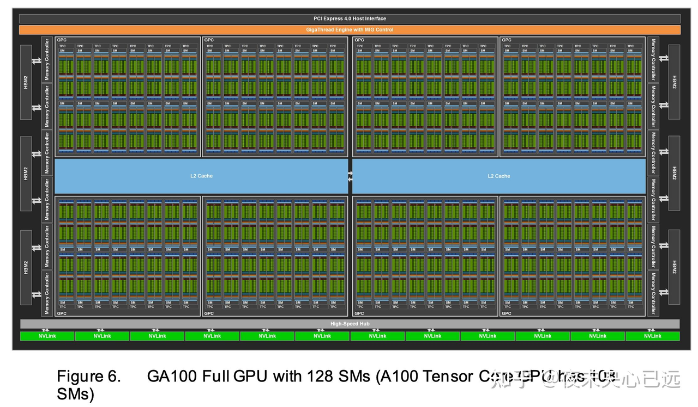

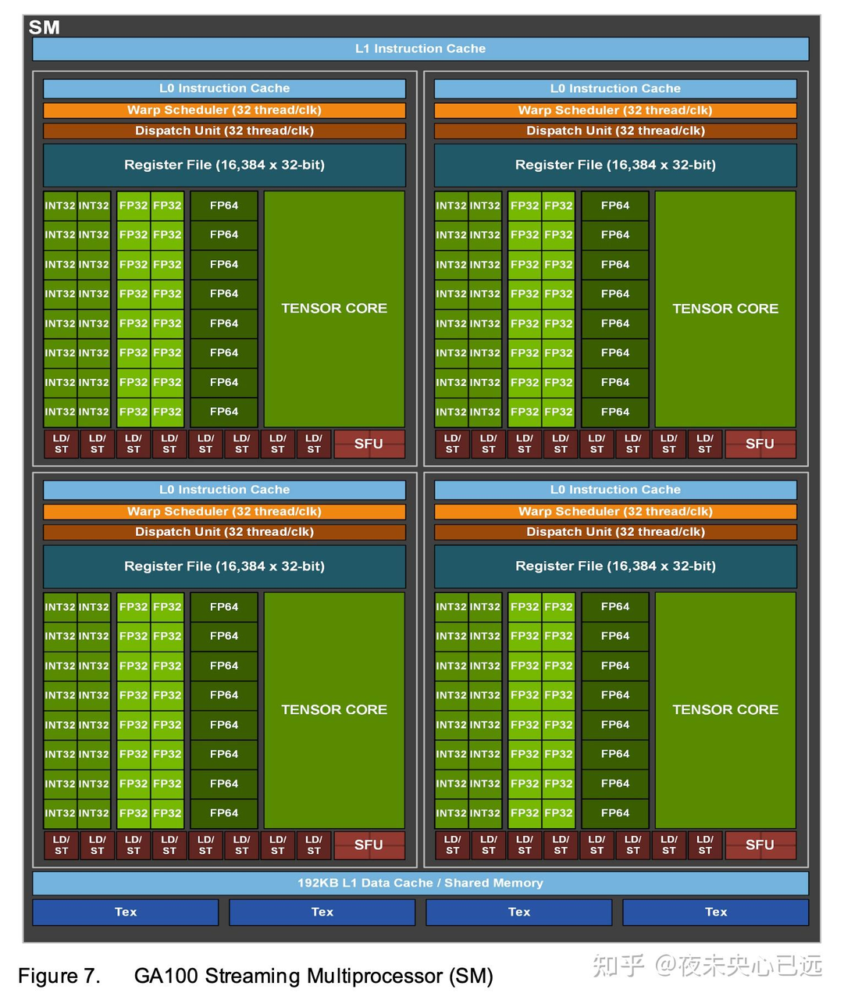

各级显存之间的读取能力存在差异，如下图所示：

* HBM：一般说的GPU显存

* SRAM：L2级别的缓存

随着内存越靠近计算单元，其访问速度越快，其可用内存也越少

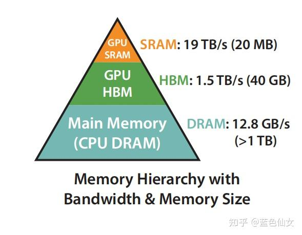

***

## Attention计算

原始Attention计算公式如下：

$$\mathrm{Attention}(Q, K, V) = \mathrm{softmax}\left( \frac{QK^{\top}}{\sqrt{d_k}} \right) V$$

假设取dim为4、序列长度为6进行举例，得到的Attention计算步骤如下

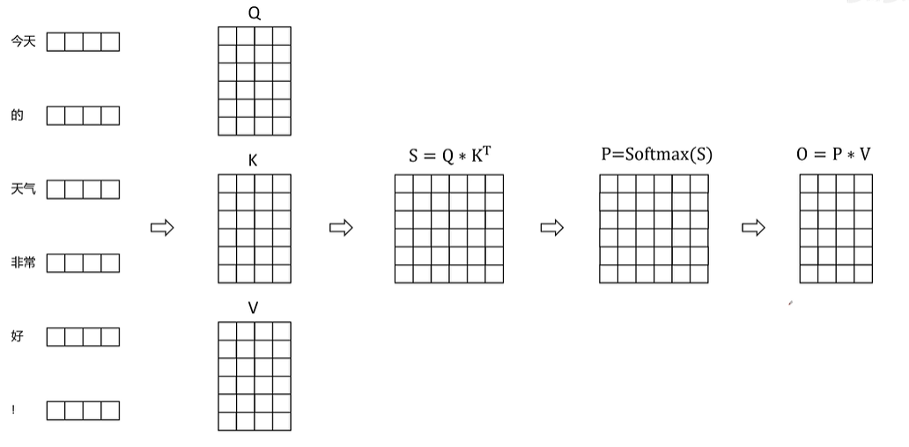

从访存的角度来看，其过程如下：

1. 计算出的Q、K、V存储到HBM中

2. 从HBM中加载Q、K到SRAM中

3. 计算 $$S=Q*K^T$$

4. 将S写到HBM中

5. 从HBM中加载S到SRAM中

6. 计算 $$P=softmax(S)$$

7. 将P写到HBM中

8. 从HBM中加载P和V到SRAM中

9. 计算 $$O=PV$$

10. 将O写到HBM中

11. 返回 $$O$$


上述整个过程中可以看到其存在多次的访存与计算，而根据占用耗时的长短，我们一般将这些操作划分为下面两类：

* Compute-Bound

* Memory-Bound

而根据统计可以看到在GPT-2中的Attention计算的类型更多的是Memory-Bound，单纯的Matmul计算并没有耗费太多时间。

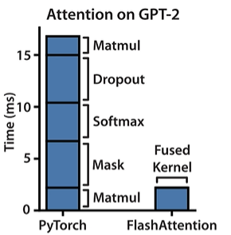

所以Flash Attention整体优化的目标也就是减少访存开销。其主要操作为：

1. 通过分块计算，融合多个操作，减少中间结果缓存。

2. 反向传播时，重新计算中间结果。

这是原始论文里的优化效果对比图：

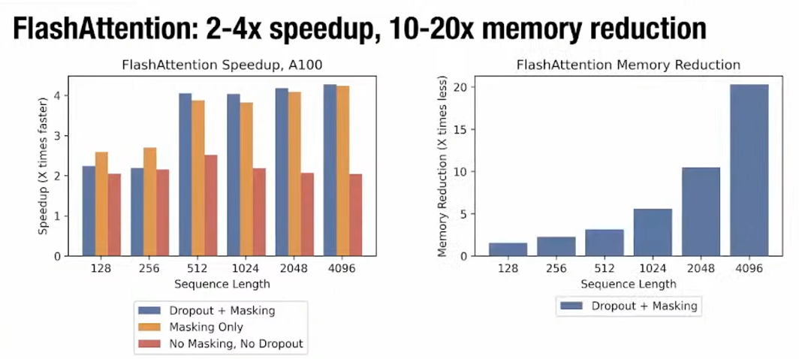

# 分块计算

## 朴素矩阵乘分块计算

先忽略Softmax计算，我们着重于看矩阵计算的分块计算优化（Tiling）。分块计算其核心原理是，通过将矩阵分块，使得计算过程中需要用到的数据能够被加载到 GPU 的共享内存中，减少对全局内存的频繁访问，从而提高计算效率。&#x20;

下图是朴素矩阵乘的计算过程：

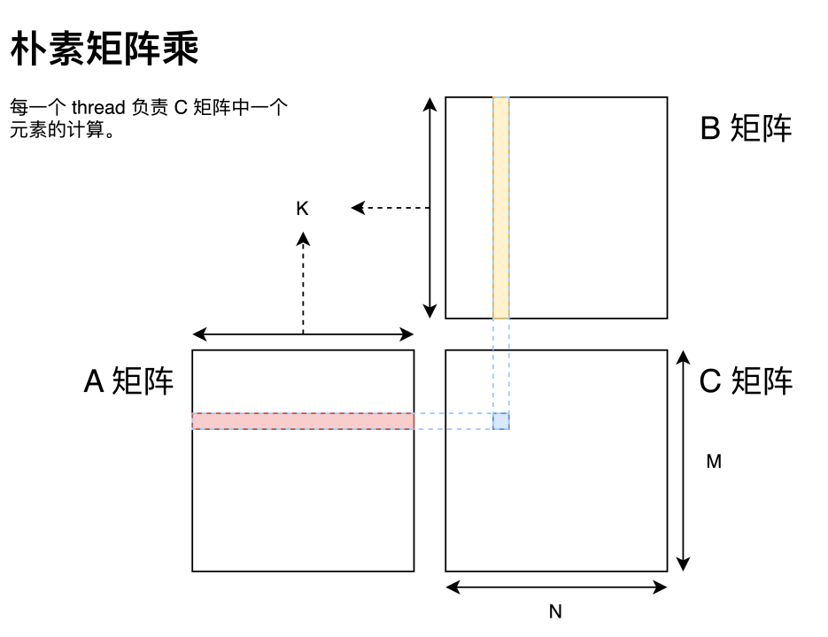

```c++
# 数组 A：M 行 K 列的行主序矩阵
# 数组 B：K 行 N 列的行主序矩阵
# 数组 C：M 行 N 列的行主序矩阵
# alpha：一个标量
# beta：一个标量
# 计算方法：
#    c=alpha*A*B+beta*C;

__global__ void matrixMul(const float *A, const float *B, float *C,

                          int M, int N, int K, float alpha, float beta)
{
    int tx = blockIdx.x * blockDim.x + threadIdx.x;
    int ty = blockIdx.y * blockDim.y + threadIdx.y;
    int baseX = blockIdx.x * blockDim.x;
    int baseY = blockIdx.y * blockDim.y;
    float c = 0;

    if (tx < M && ty < N)
    {
        for (int i = 0; i < K; i++)
        {
            c +=A[tx * K + i]  * B[i * N + ty];
        }
        C[tx * N + ty] = beta * C[tx * N + ty] + alpha * c; // we multiply alpha here to reduce the alpha cal num.
    }
}
```

> 总的来说，CUDA 可以分为 Grid，Block 和 Thread 三个层次结构：
>
> * 线程层次结构Ⅰ-Grid：Kernel 在 device 上执行时，实际上是启动很多线程，一个 Kernel 所启动的所有线程称为一个网格（grid），同一个网格上的线程共享相同的全局内存空间，grid 是线程结构的第一层次。
>
> * 线程层次结构Ⅱ-Block：Grid 分为多个线程块（block），一个 block 里面包含很多线程，Block 之间并行执行，并且无法通信，也没有执行顺序，每个 block 包含共享内存（shared memory），可以共享里面的 Thread。
>
> * 线程层次结Ⅲ-Thread：CUDA 并行程序实际上会被多个 threads 执行，多个 threads 会被群组成一个线程 block，同一个 block 中 threads 可以同步，也可以通过 shared memory 通信。
>
> 

在此过程中，计算C中的一个元素的结果就需要访问A中的K个元素以及B中的K个元素。C总共需要计算N\*M个元素，所以一共需要访存 $$2 \times N \times M \times K$$。

我们注意到在此过程中存在大量对于A、B矩阵元素的重复访问，处于同一行的 thread 总是会同样的读取 A 矩阵的同一行数据；同一列的 thread 总是会读取 B 矩阵的同一列数据。

那么一个非常自然的想法则是对于每一个 Block，我们将数据移动到这个 Block 共享的一块高速存储区 shared memory 上，从而减少与全局内存交互的次数。同时我们考虑到 shared memory 的容量有限，因此可以一次只取一部分 k，然后通过循环迭代的方式完成这个 Block 所负责的矩阵乘区域，其流程如下：

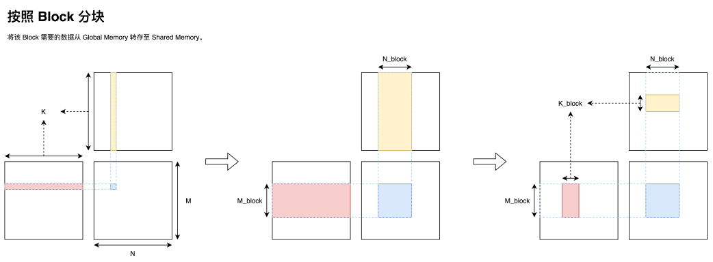

在将一个大型矩阵乘划分为一个个由 Block 负责的小型矩阵乘之后，我们接下来还需要把一个 Block 负责的矩阵乘分配给 Block 内部的 warp；分配到 warp 之后我们还需要把一个 warp 负责的矩阵乘分配给 warp 内部的 thread。经过这么一步一步的划分，我们便可以把一个巨大的矩阵乘任务高效的分配到各级速度不一的存储器上，最终尽可能打满硬件峰值性能，实现高效矩阵乘。有了前面划分 Block 的经验，我们也就可以依葫芦画瓢，实现大矩阵的拆分（Tiling），在此就不过多赘述，最终整体流程图如下。

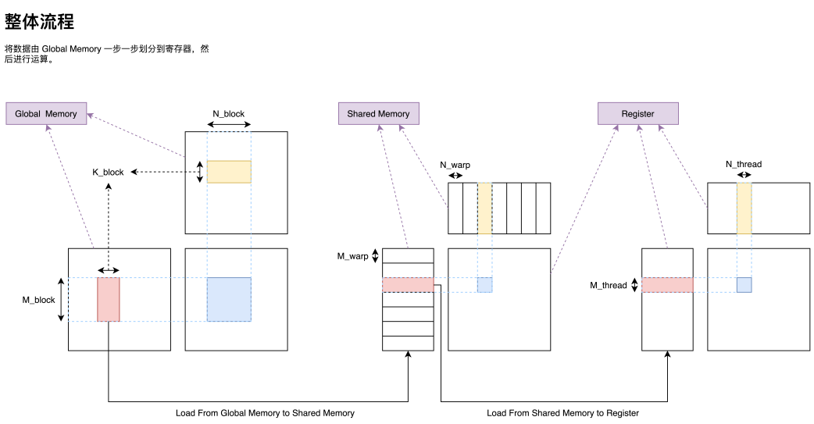

## Attention矩阵乘分块计算

先忽略Softmax，我们来看单纯的 $$O=Q \times K^T \times V$$如何进行分块计算，如下图所示：

1. 部分行的$$Q$$与部分列的$$K^T$$矩阵相乘得到S的部分结果，这里$$S$$的每个元素就是最终结算结果$$S$$中的元素

2. $$S$$的部分最终结果与V计算，得到$$O$$的部分结果，但是注意这部分结果中的各元素并不是最终$$O$$中的元素，而是需要进行累加才行

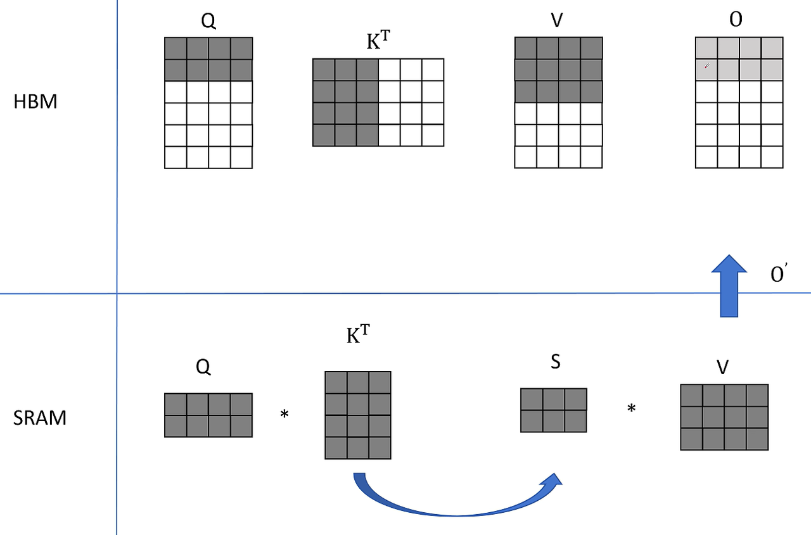

https://www.bilibili.com/video/BV1UT421k7rA?t=471.1


这么做确实已经能节省很多访存了，但是存在一个不太妙的地方，就是S需要进行softmax计算。

# Softmax优化

## 朴素Softmax

Softmax的计算公式如下：

$$\text{softmax}(z_i) = \frac{e^{z_i}}{\sum_{j=1}^{K} e^{z_j}}$$

这里的一个大问题就是计算softmax的时候需要整行的数据，而像上述的 $$O=Q \times K^T \times V$$计算中得到的中间结果S只有一列中的部分行。

## Safe Softmax

此外在正式计算时，为了避免数值溢出，使用的是safe softmax，其计算流程如下：

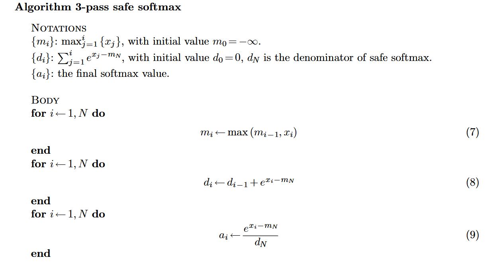

可以看到这里在计算一列的softmax值的时候需要遍历3轮，并且每轮都涉及到对一列的完整遍历。

## Online Softmax

在进行分块计算的时候，我们只能拿到前面的部分数据，所以我们需要改变我们的计算公式，能够支持我们在只获取到前面的数据的时候也能开始计算softmax。主要一个方法就是使用Online Softmax，如下所示：

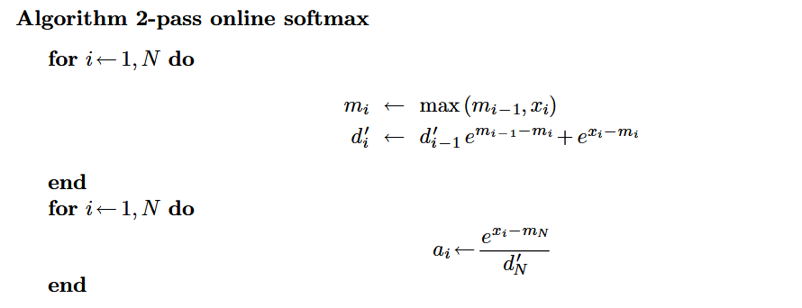

借助Online Softmax，我们就可以在分块计算过程中动态地使用前面已经计算出来的S的值来计算其Soft max结果

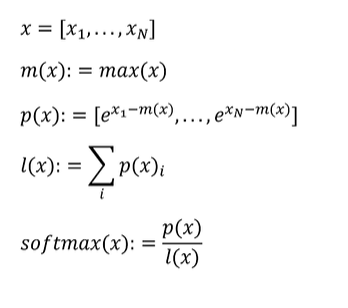

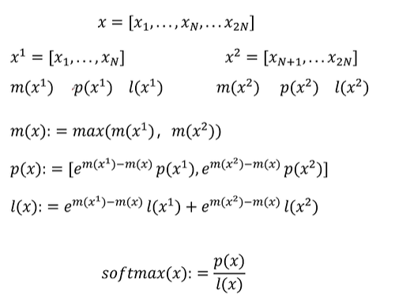

# Flash Attention 1

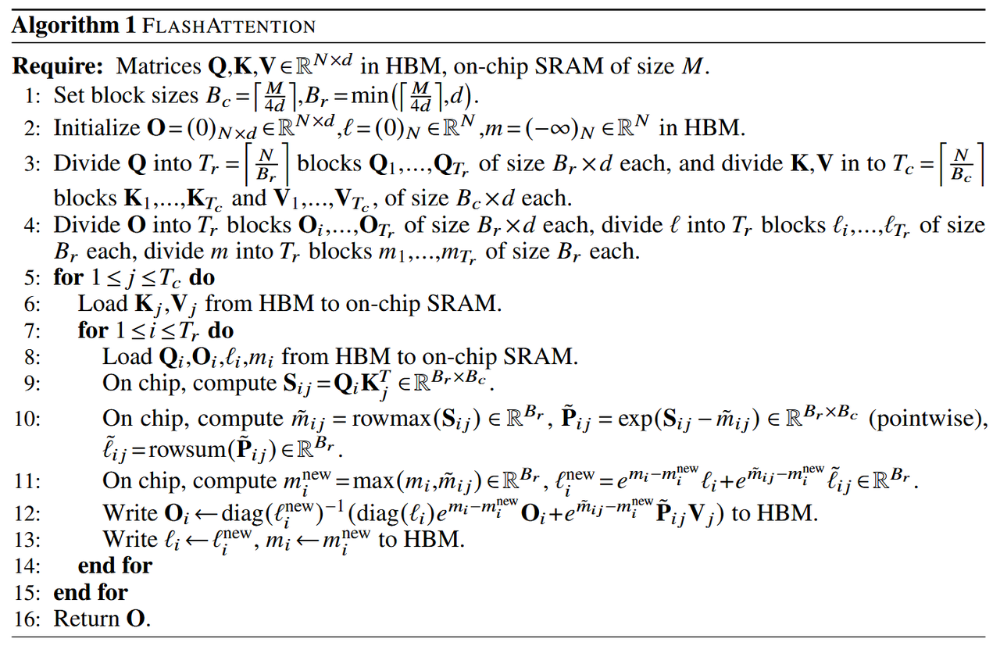

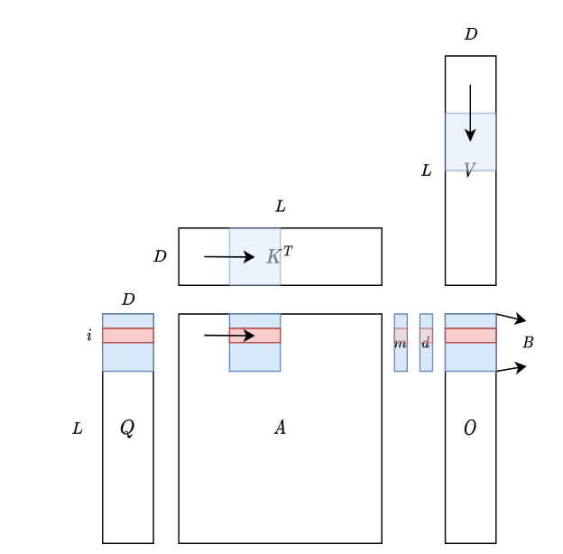

# 反向传播重计算

一般为了反向传播，我们需要保存下激活值，而Attention计算中的S是sequence length的平方倍，其如果要保存会很耗费显存，所以Flash Attention提供的思路是使用重计算，在反向传播的时候再计算一遍S。

而为了更快地计算S，它会保留softmax中S每行的最大值和计算和l。

# Flash Attention 2

Flash Attention 2相比Flash Attention 1做了这些优化：

1. 减少了非矩阵乘法计算，可以利用TensorCore加速。

2. 调整了内外训练，Q为外层训练，KV为内层循环。减少HBM读写。

3. 如果一个Block处于矩阵上三角部分，不进行attention计算。

# Flash Attention 3

首先相比 A100 80%-90% 的利用率，FA2 GPU 利用率在 H100 上仅为 35%-40%，存在着一定优化空间。

FA3 的优化主要围绕两个方向：

## 1. **充分利用 Hopper 新硬件特性，极限挖掘异步性**

核心是使用 **Tensor Memory Accelerator（TMA）**，它允许在 *不占寄存器* 的情况下，在全局内存与共享内存之间做高效异步拷贝，相当于 GPU 上的 DMA。

* **TMA 作为生产者**：异步加载 Q/K/V 到 Shared Memory

* **WGMMA Tensor Core 作为消费者**：执行 GEMM 计算

* 通过 TMA + Tensor Core 实现高度重叠，显著减少指令与寄存器压力

这类优化被称为 **warp specialization**（部分 warp 负责加载、部分 warp 负责计算）。

此外，FA3 还利用 **WarpGroup（4 个连续 warp）** 同时重叠 GEMM（Tensor Core）与 Softmax（Multi-Function Unit）：

* 资源互不抢占，可完全并行

* 使用 `bar.sync` 精确控制依赖

* 作者称之为 **ping-pong scheduling**

***

## 2. **利用 FP8 推动 Attention 低精度化**

FA3 让 Attention 计算首次真正跑上 **FP8 Tensor Core**，突破了之前 FP8 只能加速线性层而无法用于长序列 Attention 的瓶颈。

> **低精度中的Outlier问题: 量化过程中，极端大或极端小的数值（outliers）对量化精度造成的负面影响**
>
> 1. 在大模型的 Q、K、V 矩阵中，大部分元素的值比较集中，但会出现少量特别大的值或特别小的值，这些值被称为 **outliers（离群点）**。
>
>    * 示意例子（数值分布）：
>
>      * 大部分值在 −1 到 1
>
>      * 有几个值突然是 20 或 −15
>        &#x20;→ 这些特别大的 20、−15 就是 outliers
>
> 2. **Outlier 为什么会影响量化？**
>
> FP8 量化需要把浮点数映射到更小的取值范围。
>
> &#x20;如果量化时出现 outlier，会出现两个坏处：
>
> **(1) 为了容纳 outlier，需要放大 scale，导致大部分正常值变粗糙**
>
> ***
>
> **(2) 如果不放大 scale，outlier 会被截断（overflow/clamp）**
>
> 这会直接破坏 Attention 的计算。这叫 **clipping**。

主要技术包括：

#### **(1) in-kernel transpose**

对 V 做内核级转置，使其更适配 FP8 Tensor Core 的计算布局。

#### **(2) block quantization**

Q/K/V 分块量化，每块一个 scaling factor，使得某个 block 有 outlier也只影响当前 block。

#### **(3) Incoherent Processing**

借鉴 *QuIP* 技术（ [QuIP: 2-Bit Quantization of Large Language Models With Guarantees](https://link.zhihu.com/?target=https%3A//arxiv.org/abs/2307.13304)）：
&#x20;对 Q、K 分别乘一个随机正交矩阵，使 outlier 数显著减少且不改变最终计算结果。


# 参考资料

* https://www.bilibili.com/video/BV1UT421k7rA/

* https://zhuanlan.zhihu.com/p/676655352

* https://zhuanlan.zhihu.com/p/17533058076

* https://courses.cs.washington.edu/courses/cse599m/23sp/notes/flashattn.pdf

* https://zhuanlan.zhihu.com/p/668888063

* https://zhuanlan.zhihu.com/p/17533058076

* https://www.zhihu.com/question/661395457/answer/3559517523

