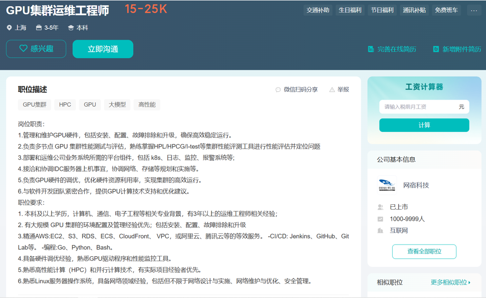

# Awesome-Cloud 周刊（第 4 期）：求职信息-云计算领域就业情况整理

这里简单记录每周分享的前沿内容，不定期发布。

注意本内容整理于2024年12月，其中存在许多个人的主观看法，仅供参考。

## 目录
- [Awesome-Cloud 周刊（第 4 期）：求职信息-云计算领域就业情况整理](#awesome-cloud-周刊第-4-期求职信息-云计算领域就业情况整理)
  - [目录](#目录)
  - [有哪些相关的就业岗位及相关企业](#有哪些相关的就业岗位及相关企业)
    - [1. 云计算厂商](#1-云计算厂商)
    - [2. 大厂的基础架构部门](#2-大厂的基础架构部门)
    - [3. 新能源车企自动驾驶相关部门](#3-新能源车企自动驾驶相关部门)
    - [4. 量化公司](#4-量化公司)
    - [5. AI公司](#5-ai公司)
    - [6. 游戏公司](#6-游戏公司)
    - [7. 国企、银行](#7-国企银行)
    - [8. 普通公司](#8-普通公司)
    - [9. 人才计划](#9-人才计划)
  - [今年整体就业情况如何](#今年整体就业情况如何)
    - [大模型算法大赢特赢](#大模型算法大赢特赢)
    - [云计算平平无奇](#云计算平平无奇)
    - [为什么传统云原生开始式微？](#为什么传统云原生开始式微)
    - [破局之路](#破局之路)
  - [2024年找工作时间线参考](#2024年找工作时间线参考)
  - [需要准备什么](#需要准备什么)
    - [项目](#项目)
    - [八股文](#八股文)
    - [比赛](#比赛)
    - [力扣](#力扣)
    - [实习](#实习)
    - [论文](#论文)
  - [问答环节记录](#问答环节记录)

---

## 有哪些相关的就业岗位及相关企业

  注意：这里就业整体讨论的关键词是云计算、集群、调度、任务编排等相关的岗位。

### 1. 云计算厂商

* **企业**：阿里云、腾讯云、华为云、UCloud等
* **主要内容**：涉及到虚拟化、网络、分布式存储、计算任务编排、安全等等。核心思路是将服务器能力虚拟化出来进行售卖，不仅卖算力也卖平台和服务等。是为数不多的盈利而非成本部门，同时也是公司的核心业务之一
* **岗位示例：** 

### 2. 大厂的基础架构部门

* **企业**：阿里系、腾讯系、字节系、美团系、百度系、拼多多、快手、京东等
* **主要内容**：为公司内部业务提供基础能力，直接面向公司内的业务需求
* **岗位示例：** 

### 3. 新能源车企自动驾驶相关部门

* **企业**：蔚来、Momenta等
* **主要内容**：为自动驾驶场景下的模型训练、系统仿真、车云协同等提供支持
* **岗位示例：** 

### 4. 量化公司

* **企业**：幻方、九坤、灵均、明汯等
* **主要内容**：量化公司往往采用深度学习模型来进行量化决策的训练，会存在大量的GPU卡需要进行统一管理，同时还需强基础架构来保障系统的稳定性。但是需要注意其往往是强业务导向的，且在公司中处于边缘部门
* **岗位示例：** 

### 5. AI公司

* **企业**：商汤、智谱、MiniMax、月之暗面等
* **主要内容**：目前大模型作为绝对的主流，需要解决大模型训练稳定性、推理任务优化等问题，尤其是目前已经到了大模型训练基本结束的阶段，需要更加精细地管理算力降本增效。
* **岗位示例：** 

### 6. 游戏公司

* **企业**：网易、米哈游、叠纸等
* **主要内容**：为游戏服务器提供运维管理，保障其高可用性，可能是对接其他云厂商服务
* **岗位示例：** 

### 7. 国企、银行

* **企业**：中国电信、中通、招商银行、农业银行等
* **主要内容**：不仅总行会有相关算力管理、平台搭建的需求，其各子公司、研究院也会有相关的岗位
* **岗位示例：** 

### 8. 普通公司

* **主要内容**：整体还是偏运维，保障公司的服务稳定性以及对接公司所租用的云服务厂商等，也会有一些小创业公司，期望将算力更加高效低管理并出售方案
* **岗位示例：** 

### 9. 人才计划

* **企业**：小红书 redStar、字节-Seed or 筋斗云、腾讯-青云计划等
* **主要内容**：目前各人才计划主要还是围绕算法展开，机器学习系统相关的也有一些（这里就会嵌套一些K8s的岗位），小红书 redStar有面向纯云原生岗位的人才计划（但是据说最后没开出来）
* **岗位示例：** 

## 今年整体就业情况如何

### 大模型算法大赢特赢

在OfferShow上整理的大模型算法相关的开奖情况如下：

### 云计算平平无奇

在OfferShow上整理的云计算相关的开奖情况如下：

### 为什么传统云原生开始式微？

* 目前云原生的发展个人认为高度依赖开源社区，而整个开源社区在过去十年的发展中已经日益完善，基本可以覆盖当前公司业务的主要需求，主要需要做一些融合适配与应用，然后运维。（我打干了七八年的老东西？？？🤔😱）
* 从互联网行业的角度来看目前传统业务已经基本进入存量阶段，技术路线稳定且并没有出现需求井喷的现象。

### 破局之路

如何破局？最简单的是直接跑路。

如果不跑路的话，未来的发展方向我们也可以从[Kubernetes官方的十周年回顾](https://kubernetes.io/zh-cn/blog/2024/06/06/10-years-of-kubernetes/)中窥探一二：

  十年过去了，Kubernetes 的未来依然光明。社区正在优先考虑改进用户体验和增强项目可持续性的变革。 应用程序开发的世界不断演变，Kubernetes 正准备随之变化。
  2024 年，人工智能的进展将一种曾经小众的工作负载类型变成了一种非常重要的工作负载类型。 分布式计算和工作负载调度一直与人工智能、机器学习和高性能计算工作负载的资源密集需求密切相关。 贡献者们密切关注新开发的工作负载的需求以及 Kubernetes 如何为它们提供最佳服务。新成立的 Serving 工作组 就是社区组织来解决这些工作负载需求的一个例子。未来几年可能会看到 Kubernetes 在管理各种类型的硬件以及管理跨硬件运行的大型批处理工作负载的调度能力方面的改进。

可以看到主要还是在推崇向AI靠齐。因为最新大模型的快速发展带来了一系列的改变：
* **从K8s的角度来说**：AI特别是大模型带来了新的挑战，对于大模型训练推理来说，用k8s已经基本是标配，k8s用的好不好不仅会关系到能不能训出来，也会关系到整个大规模集群下的成本问题。并且作为一些新问题，是有机会和干了七八年的老东西碰一碰的。
* **从行业的角度来说**：目前大模型的投资依据还是比较火热，是一个新的增长点。
* **从个人求职的角度来说**：出现了一些AI x k8s或者GPU x k8s的岗位，这部分岗位往往需要交叉背景，竞争的人数会较少，如果说我们能够去学习一些AI相关的知识将能够大大提升个人竞争力，有机会低成本达到同届的顶端。

## 2024年找工作时间线参考

参考今年2024年整体找工作的时间线，得到如下图所示：

所以一定要提前准备，提前准备，提前准备！早投往往能够拿到更多的机会！

## 需要准备什么

### 项目

* 普通项目：
  - 自己平常大作业的项目
  - 实验室的一些项目
  - 找公开的优秀课程中的作业来做，推荐：https://csdiy.wiki/
* 开源项目：
  - 自己去Github上找感兴趣项目直接参加
  - 参加开源活动

这里着重推荐两个开源活动：

1. **[谷歌之夏](https://summerofcode.withgoogle.com/)**

* 谷歌举办的开源社区活动，只能学生参加，有大量Kubernetes社区中的项目。
* 学生可以自己去联系并投递感兴趣的选题。
* 中选后可以进行开发并且会分配mentor进行指定。
* 结项后会有奖金，1万~3万不等。
* 可以参考资料：<https://github.com/gsoc-cn/gsoc-cn>
* 今年活动的整体时间线如下：

2. **[开源之夏](https://summer-ospp.ac.cn/)**

* 中科院举办的开源社区活动，只能学生参加，有大量Kubernetes社区中的项目。
* 学生可以自己去联系并投递感兴趣的选题。
* 中选后可以进行开发并且会分配mentor进行指定。
* 结项后会有奖金，一万左右。
* 今年活动的整体时间线如下：

### 八股文

* 计算机基础的八股文例如操作系统、网络、数据库等可以稍微准备一下
* 语言的八股文也可以准备一下
* k8s这边没有很统一的八股文，需要自己结合项目准备

### 比赛

* 除了ACM这种通用性高的比赛外，还可以阿里天池、华为开发者大赛等，他们时不时会有些相关的比赛，可以参加一下。

### 力扣

* 推荐：[代码随想录](https://programmercarl.com/)+[leetcode top 150 liked](https://leetcode.cn/studyplan/top-150-liked/)+ [剑指offer](https://www.nowcoder.com/exam/oj/ta?page=1&tpId=13&type=13) + [codetop](https://codetop.cc/home)

### 实习

* 直接去大厂的官方招聘网站投递
* 还可以去boss直聘或者牛客投递

### 论文

* 个人感觉一般顶会才有用

## 问答环节记录

1. 蔚来的这个车手云系统架构岗位是什么？
   - 看描述是一个预研性质的岗位，涉及到边缘计算、车云协同等等，但是整体来说是一个比较新的岗位，我其实之前都没怎么看见过边缘计算相关的岗位。
2. 现在是研二上期末了，还能准备些什么？
   - 个人感觉可以考虑参加一下谷歌之夏，时间也还比较ok。此外就是去实习了。
3. 如果要跑路可以跑路到哪里？
   - 如果完全跑路的话可以考虑转到搜广推的算法上去，因为这部分岗位往往对论文要求不高，有相关的实习就可以拿到offer，并且offer也是按算法来开的。此外就是考虑尽量贴近AI、大模型这边，这里确实会有一些新的机会。
4. 啥时候去实习比较好？
   - 研二下的暑假肯定是要去实习的，此外的时间就是要看自己的情况了，在保证学业的基础上肯定是越多实习越好。