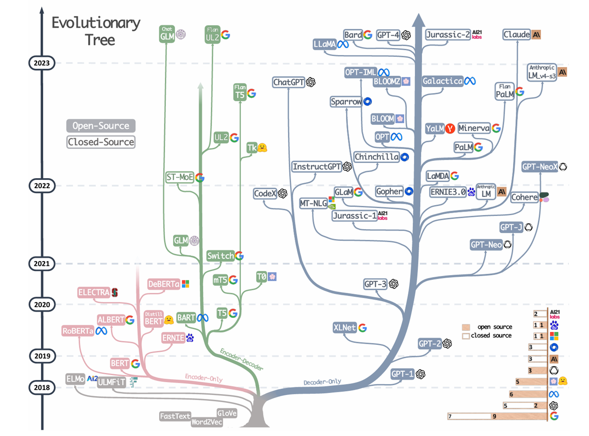
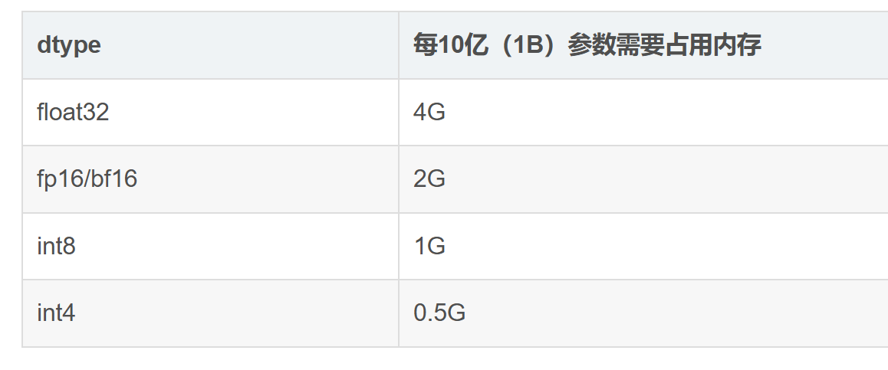

# Awesome-Cloud 周刊（第 5 期）：大模型概览

这里简单记录每周分享的前沿内容，不定期发布。

注意本内容整理于2024年12月，其中存在许多个人的主观看法，仅供参考。

## 目录
- Awesome-Cloud 周刊（第 5 期）：大模型概览
  - [发展历程](#发展历程)
    - [1. 从MLP到transformer](#1-从MLP到transformer)
    - [2. 现有LLM的基础](#2-现有LLM的基础)
    - [3. transformer原理](#3-transformer原理)
    - [4. transformer只是开始](#4-transformer只是开始)

  - [技术方向](#技术方向)
    - [技术图谱](#技术图谱)
    - [微调](#微调)
    - [框架](#框架)

  - [模型现状](#模型现状)

  - [问答环节记录](#问答环节记录)

---

## 发展历程

### 1. 从MLP到transformer

* 多层感知机（MLP）：早期的神经网络模型，通过堆叠多层神经元来实现对复杂数据的非线性建模。
* 卷积神经网络（CNN）：针对图像处理任务设计的神经网络结构，通过卷积层和池化层来提取图像的局部特征，并实现图像分类、目标检测等任务。
* 循环神经网络（RNN）：适用于序列数据处理的神经网络结构，具有记忆功能，可应用于语言建模、机器翻译等任务。
* 深度残差网络（ResNet）：通过引入残差连接解决了深度神经网络训练过程中的梯度消失和梯度爆炸问题，使得可以训练更深层次的网络结构。
* Transformer模型：引入自注意力机制，用于处理序列数据，并在自然语言处理领域取得了显著成果。

### 2. 现有LLM的基础

**论文**：[Attention is all your need](https://arxiv.org/abs/1706.03762)

### 3. transformer原理

**一个很好的学习网站**：[动手学深度学习](https://zh.d2l.ai/index.html)

### 4. transformer只是开始

在encoder-decoder架构的基础上，出现了encoder-only和deocer-only的结构。

## 技术方向

### 技术图谱

### 微调

### 框架

* 推理框架：

* 微调框架
[LLaMA-Factory](https://github.com/hiyouga/LLaMA-Factory)

## 模型现状
可查阅一下在线排行榜：
* [FlagEval](https://flageval.baai.ac.cn/#/leaderboard)
* [Open LLM Leaderboard](https://huggingface.co/spaces/open-llm-leaderboard/open_llm_leaderboard#/)
* [Chatbot Arena](https://lmarena.ai/?leaderboard)

## 问答环节记录

1. 自己玩模型应该用什么样的？
   - 可以看开源的qwen和llama系列之中的模型，以下是显存和模型大小的关系：

2. 推理和微调的开销？
   - 推理的会比微调要快，只要能显卡的显存放得下模型就可以就推理和微调。

3. 微调的类型
   - [参考](https://blog.csdn.net/python123456_/article/details/138955495)
