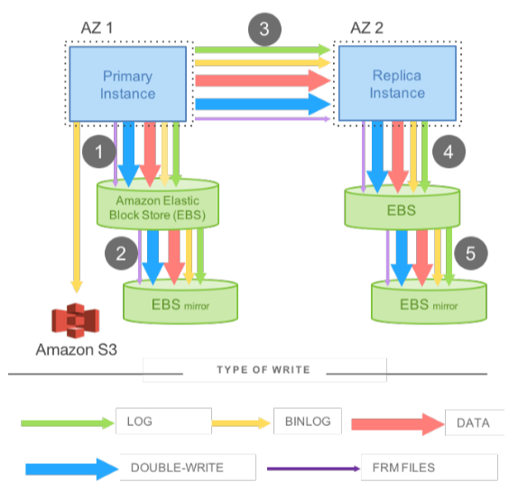
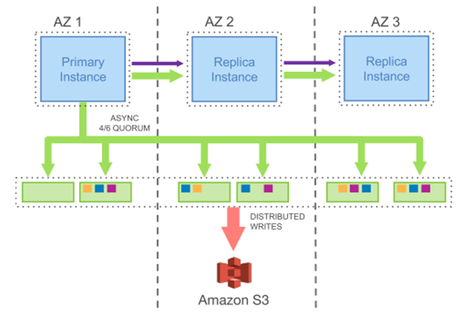
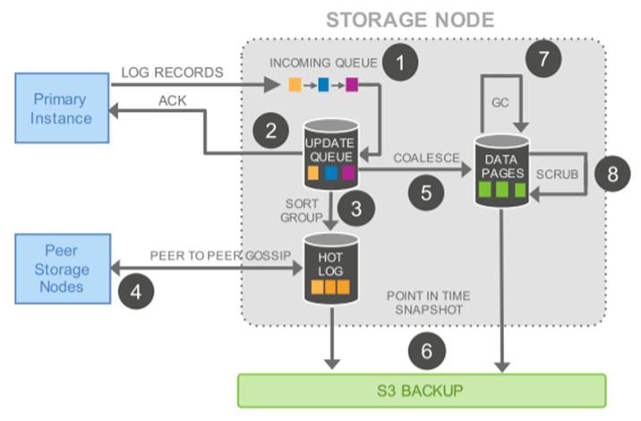
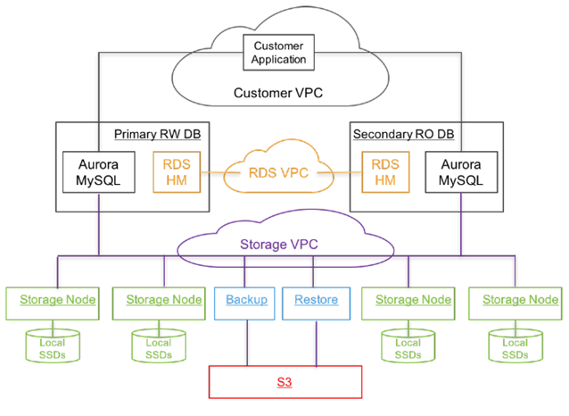

# Awesome-Cloud 周刊（第 6 期）：前沿论文-云原生数据库案例 Aurora

这里简单记录每周分享的前沿内容，不定期发布。

**Amazon Aurora: Design Considerations for High Throughput Cloud-Native Relational Databases**

## 简介

本篇周刊是对于第1期进一步介绍案例的，在前文提到了在线事务处理云原生数据库，并分为了三种架构：计算-存储分解架构、计算-日志-存储分解架构和计算-缓存-存储分解架构，而本文介绍的 Aurora 就是其中的控制-存储分解架构的典型案例。

对比于传统的数据库的控制组件和存储组件是耦合的，Aurora 将控制层和存储层进行了分离，**控制层**负责查询处理器、事务、锁定、缓冲区缓存、访问方法和撤销管理；**存储层**负责重做日志记录、持久存储、崩溃恢复和备份/恢复。

由于这种架构上的拆分结构，Aurora相对于传统数据库有三大**优势：**

- 底层数据库存储是一个分布式存储服务，可以轻松应对故障，方便进行拓展；
- 数据库实例往底层存储层只写redo日志，数据库实例与存储节点之间的网络压力大大减小，为提升数据库性能提供了保障；
- 将部分核心功能(故障恢复，备份还原)下推到存储层，这些任务可以在后台不间歇地异步执行，并且不影响前台用户任务。

## 机制

由于云原生数据库是一个分布式系统，不可避免得需要维护数据的一致性，Aurora 基于 Quorum 协议，实现了两种机制来保证一致性和故障恢复。

#### 复制和容错机制

整个集群中的存储节点总共有$V$个，对于每一个操作这些节点各有1票：

- 读操作必须得到$V_r$个投票才可以读取；
- 写操作必须得到$V_w$个投票才能写入。

参数$V_r$和$V_w$的制定满足以下要求：

- $V_r+V_w>V$，即读、写节点有重合；
- $V_w>V/2$，即前后两次写节点有重合。

例如，对于$V=6$，可以设置$V_r=4,V_w=3$，也就是说如果Aurora的存储节点部署在3个不同可用区，每个可用区包含了2个副本，总共6个副本，那么Aurora可以容忍

- 任何一个可用区出现故障，不会影响写服务；
- 任何一个可用区出现故障，以及另外一个可用区中的一个节点出现故障，不会影响读服务且不会丢失数据。

#### 分片管理机制

上面的机制保证只要不同时发生大规模故障的现象，就不会破坏Quorum协议，而为了降低故障同时发生的概率，Aurora采用的方式是减少故障的修复时间。

具体的解决方案为：Aurora将存储进行分片管理，每个分片10G，6个10G副本构成一个PGs(Protection Groups)。在10Gbps网络下，一个10G的分片可以在10s内恢复，因此当前仅当10s内同时出现大于2个的分片同时故障，才会影响数据库服务的可用性。

## 写入放大问题和日志下放

#### 传统数据库写入放大问题

**说明：**传统数据库中，修改一个数据页，会同步产生对应的redo日志，基于数据页的前镜像回放redo日志可以得到数据页的后镜像。事务提交时，需要事务对应的redo日志都写盘成功后才能返回。

**问题：**图中的1，3，5步骤是顺序的，要进行4次网络IO，且其中3次是同步串行的。从存储角度来看，数据在EBS上存了4份，需要4份都写成功才能返回。 所以在这种架构下，无论是IO量还是串行化模型都会导致性能非常糟糕。

#### 日志处理下放到存储层

Aurora由跨可用区的一个主实例和多个副本实例组成，主实例与副本实例或者存储节点间只传递redo日志和元信息。主实例并发向6个存储节点和副本实例发送日志，当4/6的存储节点应答后，则认为日志已经持久化，对于副本实例，则不依赖其应答时间点。

## 数据更新流程

1. 存储节点接收数据库实例的日志，并追加到内存队列；
2. 将日志在本地持久化成功后，给实例应答；
3. 按分片归类日志，并确认丢失了哪些日志；
4. 与其它存储节点交互，填充丢失的日志；
5. 回放日志生成新的数据页；
6. 周期性地备份数据页和日志到S3系统；
7. 周期性地回收过期的数据页版本；
8. 周期性地对数据页进行CRC校验。

## 整体体系

Aurora的整体架构图如下所示，其中的各个组件含义如下：

- Relational Database Service (RDS)：管理元数据。
- Host Manager(HM)：监控集群的健康状况并确定是否需要做异常切换，或者是一个实例是否需要重建。
- 计算层：由一个写副本，零个或多个读副本组成。所有节点位于一个地域的不同可用区。
- 存储层：由一组EC2集群构成，所有节点同样位于一个地域，至少横跨3个可用区。
- Virtual Private Cloud (VPC) 网络：
- 客户 VPC：用于客户应用与计算节点交互；
- RDS VPC：用于计算节点与控制平面相互交互；
- 存储 VPC：用于计算节点与存储节点交互。
- S3：备份/还原数据备份的存储服务。

## 问答

Q1：一句话说明现状不足。

A1：传统数据库存在写入放大问题，Aurora提出了计算存储分解架构和日志即数据库的思想来解决问题。

Q2：传统的数据库是要将每一个记录都同步？

A2：是的，为了保证数据的一致性，每一个记录都需要同步的。

Q3：这个文献是17年的，有没有“未来工作”，有没有什么已经实现的。

A3：文中没有写“未来工作”。

Q4：数据更新流程中的方块的不同颜色代表不同的类型？

A4：是代表不同的日志，当日志量达到一定量后将更新数据。

Q5：容错机制里节点变多是为了高可用，会不会影响速度。

A5：同步时是所有的节点同时发送，只要达到一定的数值就算成功了，所以只要不故障，时间应该和一个节点差不多。
