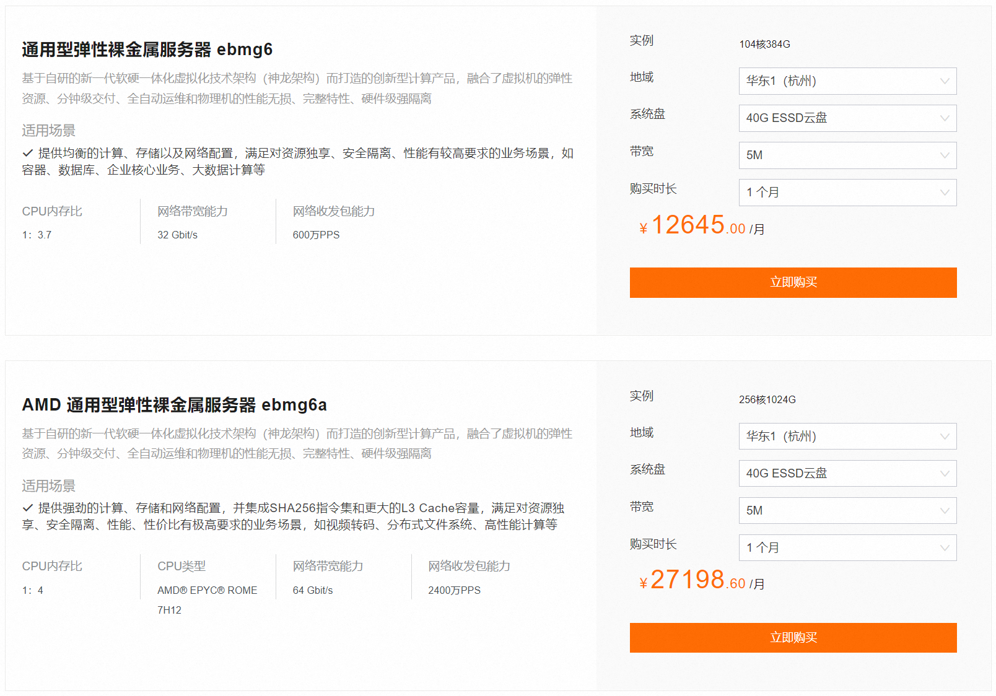
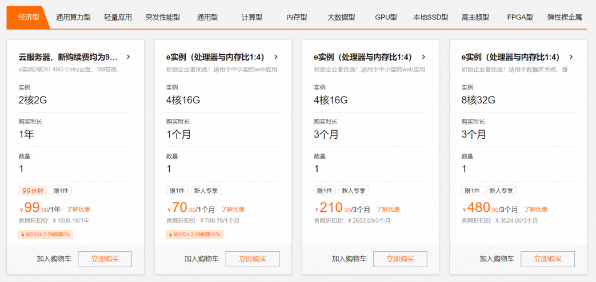
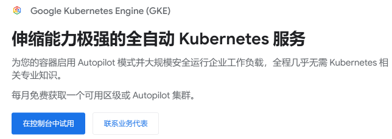
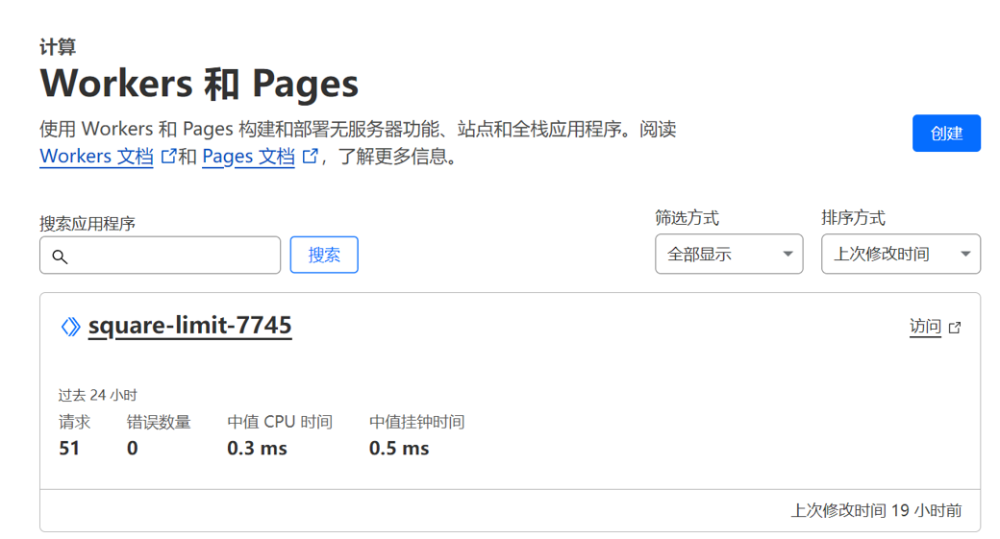
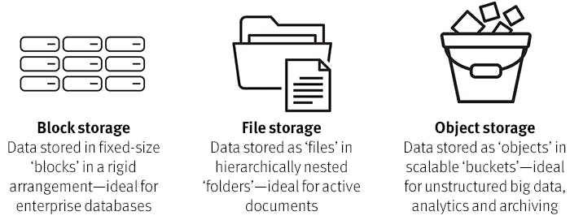
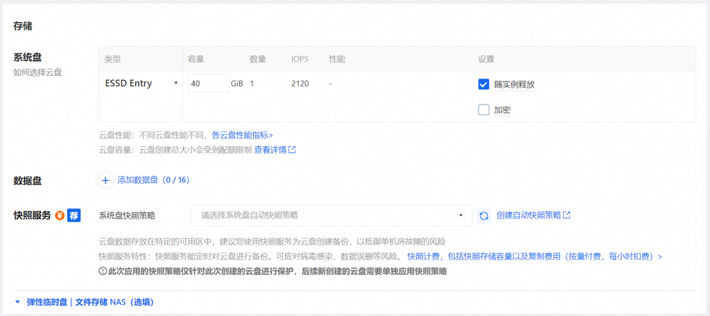
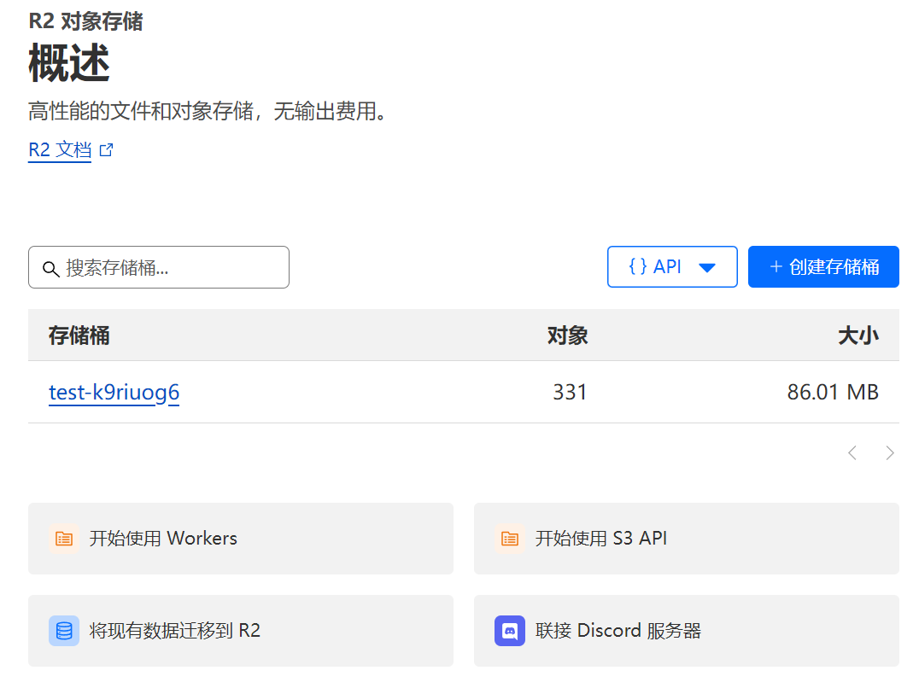
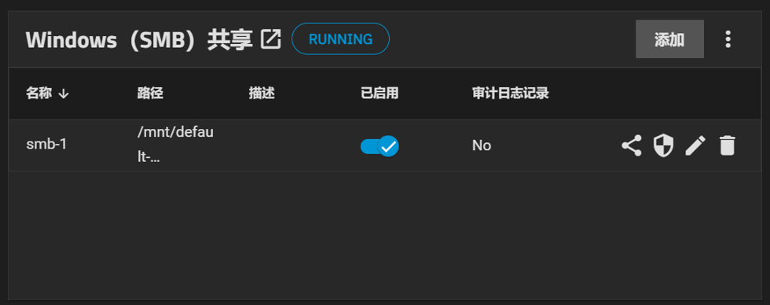
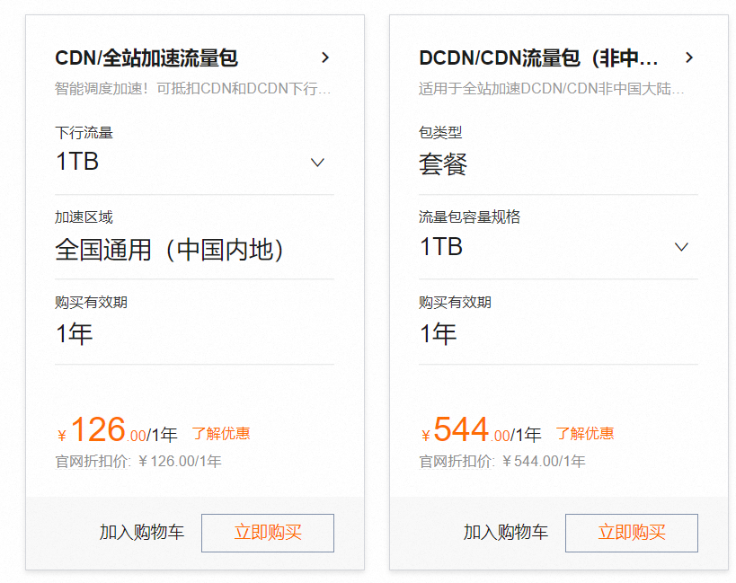

# Awesome-Cloud 周刊（第 7 期）：云服务分类

这里简单记录每周分享的前沿内容，不定期发布。

注意本内容整理于2025年2月，其中存在许多个人的主观看法，仅供参考。

## 目录
- Awesome-Cloud 周刊（第 7 期）：云服务分类
  - [计算产品](#计算产品)
    * [裸机（裸金属）](#裸机裸金属)
    * [虚拟服务器（VPS）](#虚拟服务器VPS)
    * [容器托管](#容器托管)
    * [云函数](#云函数)
  - [存储](#存储)
    * [块存储](#块存储)
    * [对象存储](#对象存储)
    * [文件存储](#文件存储)
  - [网络](#网络)
    * [内容分发网络（CDN）](#内容分发网络CDN)
    * [负载均衡](#负载均衡)
    * [专有网络](#专有网络)
  - [数据库](#数据库)
    * [关系数据库](#关系数据库)
    * [键值数据库](#键值数据库)
  - [专用产品](#专用产品)
  - [问答环节记录](#问答环节记录)
---

## 计算产品

### 裸机（裸金属）
不经过虚拟化，直接访问硬件，获得最高性能.

- 优点：没有虚拟化导致的性能损失，IO快，延迟低
- 缺点：**贵**！！！以及配置不灵活
- 适用场景：高性能计算、量化交易

### 虚拟服务器（VPS）
将物理机虚拟化为多个虚拟机，灵活度高

- 优点：规格灵活，容易缩放，成本低
- 缺点：有一点虚拟化损耗
- 适用场景：基本上没啥特殊需求就用这个

### 容器托管
用户提交容器，系统自动部署和管理

- 优点：自动伸缩，无需自行管理底层结构
- 缺点：对容器所在节点无直接访问权限
- 适用场景：部署微服务

### 云函数
用户提交代码，无需考虑底层服务器

- 优点：自动伸缩，相较于容器托管，伸缩更快更灵活；精准计费，不存在冗余资源
- 缺点：只适合运行简单的代码
- 适用场景：部署微服务

## 存储

### 块存储
相当于一个虚拟磁盘，可以附加到VPS上，作为一块本地磁盘使用

- 优点：表现得像一块磁盘，可以挂载到VPS上，可以随机访问数据块
- 缺点：不支持多机同时读写；容量有限（TB级）；价格高昂
- 适用场景：作为VPS的系统盘

### 对象存储
扁平化存储的一个个的文件，没有文件夹、文件权限等概念

- 优点：高可伸缩性；可无限拓展；价格较低
- 缺点：性能相对较低；文件不可部分修改，只能删了再上传新的
- 适用场景：大数据存储；存储媒体文件等不需修改的文件；传送文件；备份

### 文件存储
支持多机同时读写的文件系统，有文件夹、文件权限等概念

- 优点：贴近用户日常习惯；支持SMB、NFS等标准协议
- 缺点：文件管理复杂；扩容麻烦；不适合存储大量数据
- 适用场景：简单的少量数据存储

## 网络

### 内容分发网络（CDN）
在用户和网站之间缓存静态资源

- 作用：降低资源访问延迟；减少源站压力；提供DDOS防护
- 局限性：动态资源加速效果有限；缓存更新存在延迟
- 适用场景：加速网页访问速度

### 负载均衡
将用户请求分散到多个后端服务
- 作用：便于进行横向扩展；提升系统可用性
- 适用场景：加速网页访问速度

### 专有网络
按需构建一个虚拟网络
虚拟网络之间互相隔离，虚拟网络一系列区域级虚拟子网组成，可在其中设置虚拟交换机和虚拟路由器等。

## 数据库

### 关系数据库
- 用表来存储数据和关系
- 基本上就是传统的SQL数据库的serverless版本

### 键值数据库
- 存储键值对
- 性能高，但无事务保障
- 常用于存储用户配置数据，及内存缓存

_除此之外，还有图数据库、文档数据库、向量数据库等_

## 专用产品

**音视频**：音视频的存储、分发、直播
**物联网**：身份验证、远程配置、消息队列
**人工智能**：算力、向量数据库、现成的api

## 问答环节记录

Q. 块存储和文件存储的区别是什么？
A. 块存储提供对磁盘的原始数据的直接访问，以一块一块（比如512字节为一块）为单位进行读写；文件存储以文件为单位提供访问，用户不用关心也管理不了磁盘底层的原始数据。

---

Q. 假如我用云容器，我放了两个容器，但这两个容器到底被放在哪里是不确定的。它们可能放得很远，这就导致处理起来性能比较差，或者延迟很高之类的问题。
A. 这个问题一般比较简单，可以通过加节点亲和性来解决。比如说，我们可能不希望容器被分配到跨交换机的网络中，而是希望它们都在同一个交换机下。不管是主机还是交换机，都会有 label。你可以指定容器运行在哪些特定的交换机标签下。

---

Q. 在实际生产环境中，企业什么时候选择使用云容器服务？
A. 基本上跑任务都是用的容器，但一般就自己搭个k8s集群，没有怎么用云容器。

---

Q. 文件存储是不是可以给电脑扩容？
A. 可以直接挂载到电脑上，就像一块本地磁盘一样。对于绝大部分程序来说它跟一块真的本地磁盘没区别，只有极少数需要直接访问磁盘数据的程序有问题。

